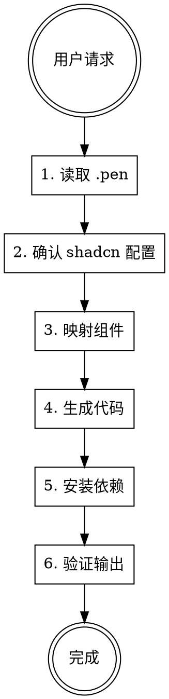

# Pen to React

从 `.pen` 设计文件生成 React 组件，使用 shadcn/ui + Tailwind CSS，遵循 Neon Forge 暗色主题。

## 工作流程



### 1. 读取 .pen 文件

**绝不使用 Read 工具读取 `.pen` 文件**，只能通过 Pencil MCP 工具访问：

- `mcp__pencil__batch_get` — 读取节点结构，搜索可复用组件（`patterns=[{ "reusable": true }]`）
- `mcp__pencil__get_screenshot` — 获取视觉截图参考
- `mcp__pencil__get_variables` — 获取主题变量和设计令牌
- 同时读取 `specs/ui/basic.pen` 和 `specs/ui/style.pen` 获取设计系统

### 2. 确认 shadcn 配置

检查 `frontend/components.json` 是否存在，不存在则初始化。确保 `globals.css` 包含 Neon Forge CSS 变量。详见 [references/setup.md](references/setup.md)。

### 3. 映射 .pen 元素到 shadcn 组件

根据 .pen 节点类型，映射到对应的 shadcn/ui 组件。详见 [references/component-mapping.md](references/component-mapping.md)。

### 4. 生成 React 组件

代码示例详见 [references/examples.md](references/examples.md)。

### 5. 安装 shadcn 依赖

```bash
cd frontend && npx shadcn@latest add [组件名称]
```

可用 `mcp__shadcn__search_items_in_registries` 和 `mcp__shadcn__get_add_command_for_items` 搜索和获取安装命令。

### 6. 验证输出

- **视觉**：`mcp__pencil__get_screenshot` 截图对比
- **构建**：`cd frontend && npm run build`
- **完整性**：所有 .pen 元素都已体现
- **样式**：Neon Forge 颜色、字体、间距匹配

## 生成规则

1. 一个 .pen 文件 = 一个页面组件，放在 `components/pages/`
2. **必须用 shadcn/ui 组件**，禁止在有对应 shadcn 组件时使用原生 HTML
3. **仅用 Tailwind 类**，禁止内联样式
4. **精确匹配设计稿**：文本、图标、间距、颜色
5. 用 **CSS 变量**表示颜色：`bg-[var(--nf-near-black)]`
6. 保留**中英双语标签**（如 "Submit / 提交"）
7. 逐个处理 .pen 文件：分析 → 生成 → 验证
8. 使用 `get_guidelines(topic="code")` 和 `get_guidelines(topic="tailwind")` 获取 Pencil MCP 的代码/样式指南

## 常见错误

| 错误 | 修复 |
|------|------|
| 用 Read 读 .pen | 改用 `mcp__pencil__batch_get` |
| 硬编码颜色 | 用 CSS 变量 `var(--nf-*)` |
| 内联样式 | 用 Tailwind 类 |
| 缺少双语标签 | 保留 .pen 中的中英文 |
| 原生 HTML | 用 shadcn 组件 |
| 图标名错误 | `iconFontName` 映射 Lucide PascalCase |
