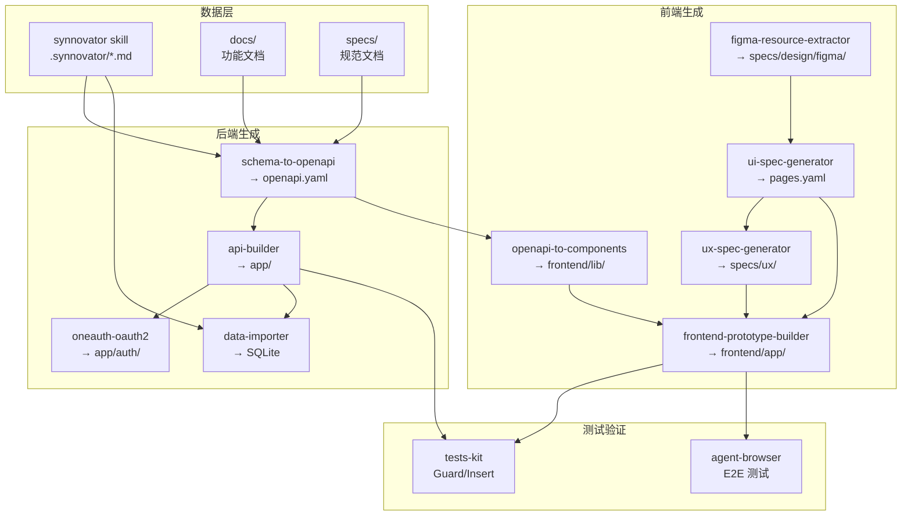

# 完整开发流程

## 概述

从需求设计到前后端实现和测试的完整开发流程。本流程涵盖数据建模、代码生成、数据注入、后端实现、**前端 UI 页面生成**和全栈 E2E 测试。

> **通用性说明：**
> 本工作流适用于任何需要从设计稿生成可测试原型的项目。只需替换：
> - Figma 设计链接
> - 测试用例 (`specs/testcases/`)
> - 数据模型定义 (`docs/`)
>
> 工作流本身保持不变，输出始终是 **70-80% 可部署的原型**，可供 PM/设计师实际点击测试。

> **重要约定：**
> - 后端包名为 `app/`（与 api-builder 模板一致，标准 FastAPI 项目结构）。所有 Python 命令使用 `uv run python` 执行。
> - 本流程较长，建议使用 **planning-with-files** skill 将流程拆分为更小的可管理阶段，防止上下文用尽或意外中断导致进度丢失。
> - 每个阶段开发完成后，使用 **tests-kit** skill 进行增量测试，及时发现和修复问题，不要积压到最后统一测试。

## 完整工作流图

```
═══════════════════════════════════════════════════════════════════
║ 贯穿全流程: planning-with-files skill                           ║
║  - 每个阶段开始前: 更新 task_plan.md (规划当前阶段)               ║
║  - 每个阶段结束后: 更新 progress.md (记录完成情况)               ║
║  - 研究发现时: 更新 findings.md (保存发现和决策)                 ║
║  - 意外中断后: 从文件恢复上下文，继续执行                        ║
═══════════════════════════════════════════════════════════════════

┌────────────────────────────────────────────────────────────────┐
│ 阶段 0: 项目初始化                                              │
│  - 定义技术栈                                                   │
│  - 创建项目结构                                                 │
│  - 配置开发环境 + CI/CD 基础配置                                │
│  - [planning-with-files] 初始化规划文件                         │
└────────────────────────────────────────────────────────────────┘
                            ↓
┌────────────────────────────────────────────────────────────────┐
│ 阶段 1: 需求设计与数据建模                                      │
│  数据源:                                                       │
│      ├─→ synnovator skill (完整原型能力参考)                   │
│      ├─→ docs/ (功能说明文档)                                  │
│      └─→ specs/ (开发规范文档)                                 │
│                                                                │
│  [手工] 创建示例数据                                            │
│      ↓ [synnovator skill]                                     │
│  .synnovator/*.md (测试数据)                                   │
│                                                                │
│  [schema-to-openapi skill] ← 读取 synnovator + docs + specs   │
│      ↓                                                        │
│  OpenAPI 3.x 规范 (.synnovator/generated/openapi.yaml)         │
│                                                                │
│  ✅ [tests-kit] 验证数据模型测试用例                             │
│  ⚠️ 如果失败: 检查 schema 定义，修复后重新生成 OpenAPI           │
└────────────────────────────────────────────────────────────────┘
                            ↓
┌────────────────────────────────────────────────────────────────┐
│ 阶段 2: 后端代码生成                                            │
│  [api-builder skill]                                          │
│      ↓                                                        │
│  FastAPI 后端 (app/)                                           │
│      ├─→ models/ (SQLAlchemy ORM)                            │
│      ├─→ schemas/ (Pydantic 验证)                            │
│      ├─→ routers/ (FastAPI 路由)                             │
│      ├─→ crud/ (CRUD 操作)                                   │
│      └─→ tests/ (pytest 测试)                                │
│                                                                │
│  [api-builder --setup-alembic --run-migrations]               │
│      ↓                                                        │
│  SQLite database (空表结构)                                    │
│                                                                │
│  ✅ [tests-kit] 按模块增量测试后端代码                           │
│  ⚠️ 如果失败: 检查 ORM 模型，修复后重新运行迁移                  │
└────────────────────────────────────────────────────────────────┘
                            ↓
┌────────────────────────────────────────────────────────────────┐
│ 阶段 2.5: 认证集成 (可选但推荐)                                  │
│  [oneauth-oauth2 skill]                                       │
│      ↓                                                        │
│  OAuth2/OIDC 认证集成                                         │
│      ├─→ app/auth/ (认证模块)                                │
│      ├─→ JWT Token 管理                                      │
│      ├─→ 用户会话处理                                        │
│      └─→ 权限中间件                                          │
│                                                                │
│  ✅ 验证登录/登出流程正常工作                                   │
│  ⚠️ 如果失败: 检查 OAuth 配置，确认回调 URL 正确                │
└────────────────────────────────────────────────────────────────┘
                            ↓
┌────────────────────────────────────────────────────────────────┐
│ 阶段 3: 数据注入                                                │
│  .synnovator/*.md                                              │
│      ↓ [data-importer skill]                                  │
│  SQLite database (填充测试数据)                                │
│      ├─→ 按依赖顺序导入 (user → post → relations)             │
│      ├─→ 类型转换 (datetime, JSON, enum)                     │
│      └─→ 跳过重复记录                                         │
│                                                                │
│  ✅ [tests-kit] 验证导入数据与测试用例一致                       │
│  ⚠️ 如果失败: 检查外键约束，确认导入顺序正确                     │
└────────────────────────────────────────────────────────────────┘
                            ↓
┌────────────────────────────────────────────────────────────────┐
│ 阶段 4a: 前端客户端生成                                         │
│  [前置] 安装 Tailwind CSS + shadcn/ui + Neon Forge 主题        │
│                                                                │
│  [api-builder --generate-client]                              │
│      ↓                                                        │
│  TypeScript API Client                                        │
│      ├─→ 类型定义 (从 OpenAPI schemas)                       │
│      ├─→ API 方法 (从 OpenAPI paths)                         │
│      └─→ 错误处理                                             │
│                                                                │
│  集成到 Next.js                                                │
│      ↓                                                        │
│  frontend/lib/api-client.ts + frontend/lib/types.ts           │
│                                                                │
│  ✅ [tests-kit] 验证前端集成测试用例                             │
│  ⚠️ 如果失败: 检查 TypeScript 类型，确认 API 端点匹配           │
└────────────────────────────────────────────────────────────────┘
                            ↓
┌────────────────────────────────────────────────────────────────┐
│ 阶段 4b: Figma 设计提取与 UI 规格生成                           │
│  Figma 设计稿                                                  │
│      ↓ [figma-resource-extractor skill]                      │
│  specs/design/figma/ (设计资源文档)                            │
│      ├─→ icons.md, components.md, layouts.md                │
│      └─→ pages/*.md (按类别分组的页面设计)                   │
│                                                                │
│  [ui-spec-generator skill]                                    │
│      ↓                                                        │
│  specs/design/pages.yaml (页面规格唯一来源)                    │
│                                                                │
│  [ux-spec-generator skill] ← 复杂交互时必需                    │
│      ↓                                                        │
│  specs/ux/ (交互规格：组件、页面、流程、表单、状态)             │
│                                                                │
│  ⚠️ 如果失败: 检查 Figma 权限，确认 node-id 正确               │
└────────────────────────────────────────────────────────────────┘
                            ↓
┌────────────────────────────────────────────────────────────────┐
│ 阶段 4c: 前端页面组件生成                                       │
│  [frontend-prototype-builder skill]                           │
│                                                                │
│  输入:                                                         │
│      ├─→ specs/design/pages.yaml (页面结构 - 必需)             │
│      ├─→ specs/ux/ (交互规格 - 复杂页面必需)                 │
│      ├─→ frontend/lib/api-client.ts (API 客户端)             │
│      └─→ specs/testcases/*.md (测试用例)                     │
│                                                                │
│  输出:                                                         │
│      ├─→ frontend/app/**/page.tsx (路由文件)                 │
│      └─→ frontend/components/pages/*.tsx (页面组件)          │
│                                                                │
│  ✅ 组件与 API 正确连接，事件处理器已绑定                        │
│  ⚠️ 如果失败: 检查 pages.yaml 结构，确认组件映射正确            │
└────────────────────────────────────────────────────────────────┘
                            ↓
┌────────────────────────────────────────────────────────────────┐
│ 阶段 5: 原型验证与 E2E 测试                                     │
│                                                                │
│  5a. 服务健康检查                                              │
│      ├─→ curl localhost:8000/health (后端)                   │
│      └─→ curl -I localhost:3000 (前端)                       │
│                                                                │
│  5b. 视觉验证                                                  │
│      ├─→ [agent-browser] 截图各页面                          │
│      └─→ 对比 Figma 设计稿                                   │
│                                                                │
│  5c. E2E 浏览器测试                                            │
│      ├─→ [agent-browser] 执行用户旅程                        │
│      ├─→ 验证导航、点击、表单提交                             │
│      └─→ 检查 API 调用成功                                   │
│                                                                │
│  5d. 迭代修复                                                  │
│      ├─→ 识别失败点                                          │
│      ├─→ 应用常见问题修复模式                                 │
│      └─→ 重新测试直到通过                                    │
│                                                                │
│  ✅ [tests-kit] 最终 Guard 检查，确保所有测试用例通过            │
│  ⚠️ 如果失败: 参考"常见问题修复模式"章节                        │
└────────────────────────────────────────────────────────────────┘
                            ↓
┌────────────────────────────────────────────────────────────────┐
│ 阶段 6: CI/CD 配置与部署准备                                    │
│                                                                │
│  6a. GitHub Actions 配置                                       │
│      ├─→ .github/workflows/ci.yml (CI 流水线)               │
│      ├─→ 自动运行 pytest + playwright                        │
│      └─→ 代码质量检查 (lint, type-check)                     │
│                                                                │
│  6b. 部署配置                                                  │
│      ├─→ deploy/docker-compose.yml                           │
│      ├─→ 环境变量模板 (.env.example)                         │
│      └─→ 生产数据库迁移脚本                                   │
│                                                                │
│  ✅ CI 流水线绿色，所有检查通过                                 │
└────────────────────────────────────────────────────────────────┘
```

## Skill 依赖关系图



## 使用的 Skills

### 后端开发 Skills

| Skill | 用途 | 阶段 | 状态 |
|-------|------|------|------|
| **planning-with-files** | 文件化规划：创建 task_plan.md / findings.md / progress.md，防止上下文丢失和中断失忆 | 贯穿全流程 | ✅ 可用 |
| **synnovator** | 管理 .synnovator/*.md 文件数据（CRUD），是平台原型能力的完整参考实现 | 阶段 1 | ✅ 可用 |
| **schema-to-openapi** | 从 synnovator skill + docs/ + specs/ 综合生成 OpenAPI 3.0 规范 | 阶段 1 | ✅ 可用 |
| **api-builder** | 从 OpenAPI 生成 FastAPI 后端 + 迁移 + 测试 + TypeScript 客户端 | 阶段 2, 4a | ✅ 可用 |
| **oneauth-oauth2** | OAuth2/OIDC 认证集成：JWT Token、用户会话、权限中间件 | 阶段 2.5 | ✅ 可用 |
| **data-importer** | 从 .synnovator 导入数据到 SQLite | 阶段 3 | ✅ 可用 |
| **tests-kit** | 增量测试管理：Guard 模式验证已有测试用例，Insert 模式添加新测试用例 | 贯穿全流程 | ✅ 可用 |

### 前端开发 Skills

| Skill | 用途 | 阶段 | 状态 |
|-------|------|------|------|
| **figma-resource-extractor** | 从 Figma 设计稿提取资源，生成结构化 Markdown 文档到 `specs/design/figma/` | 阶段 4b | ✅ 可用 |
| **ui-spec-generator** | 从设计资源和测试用例生成页面规格文件 `specs/design/pages.yaml` | 阶段 4b | ✅ 可用 |
| **ux-spec-generator** | 从 UI 设计和测试用例生成交互规格到 `specs/ux/`（复杂交互必需） | 阶段 4b | ✅ 可用 |
| **openapi-to-components** | 从 OpenAPI 生成 TypeScript 类型和 API 客户端，转换页面组件为 Server Components | 阶段 4a | ✅ 可用 |
| **frontend-prototype-builder** | 完整前端原型构建 SOP：服务启动 → 数据验证 → 页面生成 → E2E 测试 | 阶段 4c | ✅ 可用 |
| **agent-browser** | 浏览器自动化：截图、表单填写、E2E 测试、数据提取 | 阶段 5 | ✅ 可用 |

### Skill 输入/输出矩阵

| Skill | 输入 | 输出 |
|-------|------|------|
| synnovator | 用户命令 | `.synnovator/*.md` |
| schema-to-openapi | synnovator + docs/ + specs/ | `.synnovator/generated/openapi.yaml` |
| api-builder | `openapi.yaml` | `app/` (FastAPI 后端) |
| oneauth-oauth2 | `app/` | `app/auth/` (认证模块) |
| data-importer | `.synnovator/*.md` + `app/models/` | SQLite 数据库 |
| figma-resource-extractor | Figma URL | `specs/design/figma/` |
| ui-spec-generator | `specs/design/figma/` + `specs/testcases/` | `specs/design/pages.yaml` |
| ux-spec-generator | `specs/design/pages.yaml` + `specs/testcases/` | `specs/ux/` |
| openapi-to-components | `openapi.yaml` | `frontend/lib/api-client.ts` + `types.ts` |
| frontend-prototype-builder | `pages.yaml` + `specs/ux/` + `api-client.ts` | `frontend/app/` + `frontend/components/` |
| tests-kit | `specs/testcases/` | 测试验证报告 |
| agent-browser | 页面 URL | 截图 + 测试结果 |

---

## 模块开发顺序（底层到上层依赖图）

> **核心原则：从零依赖的底层模块开始，逐层向上开发。每完成一层，立即测试该层对应的测试用例。**
> 本节定义了模块间的依赖关系和推荐开发顺序。具体的执行进度追踪请使用 `task_plan.md`（由 planning-with-files 管理）。

### 依赖关系图

```
┌─────────────── Layer 0: 零依赖基础 ───────────────┐
│   user (用户)          resource (资源)              │
│   零外部依赖            零外部依赖                   │
└──────────┬─────────────────┬──────────────────────┘
           │                 │
           ▼                 │
┌─────────────── Layer 1: 仅依赖 user ──────────────┐
│   rule (规则)   group (团队)   category (活动)     │
│   ← user        ← user        ← user              │
└──────────┬─────────┬──────────┬───────────────────┘
           │         │          │
           ▼         ▼          ▼
┌─────────────── Layer 2: 依赖 Layer 0-1 ───────────┐
│   post (帖子)          interaction (交互)           │
│   ← user, resource     ← user                     │
└──────────┬──────────────┬─────────────────────────┘
           │              │
           ▼              ▼
┌─────────────── Layer 3: 简单关系 ─────────────────┐
│   group_user     user_user      post_resource     │
│   post_post      (无规则引擎, 无复杂校验)           │
└──────────┬────────────────────────────────────────┘
           │
           ▼
┌─────────────── Layer 4: 复杂关系 ─────────────────┐
│   category_rule       target_interaction           │
│   category_post (含规则引擎校验)                    │
│   category_group (含前置条件检查)                   │
└──────────┬────────────────────────────────────────┘
           │
           ▼
┌─────────────── Layer 5: 高级图关系 ───────────────┐
│   category_category                                │
│   (阶段/赛道/前置条件, 含环检测)                    │
└──────────┬────────────────────────────────────────┘
           │
           ▼
┌─────────────── Layer 6: 跨切面功能 ───────────────┐
│   软删除 + 级联删除      权限层                    │
│   声明式规则引擎          缓存字段维护              │
└──────────┬────────────────────────────────────────┘
           │
           ▼
┌─────────────── Layer 7: 集成验证 ─────────────────┐
│   13 个用户旅程端到端测试                           │
│   高级功能: 资源转移、评分排名、证书发放            │
└───────────────────────────────────────────────────┘
```

### 各层详细内容与测试映射

| Layer | 模块 | 依赖 | 测试用例 |
|-------|------|------|----------|
| **0** | user CRUD + 唯一性校验 | 无 | TC-USER-001~020, 900~903 |
| **0** | resource CRUD + 文件存储 | 无 | TC-RES-001~011, 900~901 |
| **1** | rule CRUD + scoring_criteria | user | TC-RULE-001~011, 900~901 |
| **1** | group CRUD + 成员角色定义 | user | TC-GRP-001~011, 900~901 |
| **1** | category CRUD + 状态机 | user | TC-CAT-001~011, 900~902 |
| **2** | post CRUD + 缓存字段 + 状态机 | user, resource | TC-POST-001~076, 900~903 |
| **2** | interaction CRUD (点赞/评论/评分) | user | TC-IACT-001~063, 900~905 |
| **3** | group_user 关系 + 审批流程 | group, user | TC-REL-GU-*, TC-GRP-020~025 |
| **3** | user_user 关系 (关注/屏蔽) | user | TC-FRIEND-001~010, 900~902 |
| **3** | post_resource 关系 | post, resource | TC-REL-PR-* |
| **3** | post_post 关系 (引用/回复/嵌入) | post | TC-REL-PP-* |
| **4** | category_rule 关系 | category, rule | TC-REL-CR-* |
| **4** | target_interaction (多态绑定 + 缓存更新) | interaction, post/category/resource | TC-REL-TI-*, TC-IACT-020~025 |
| **4** | category_post (含规则引擎校验) | category, post, rule | TC-REL-CP-*, TC-RULE-100~109, TC-ENTRY-* |
| **4** | category_group (含前置条件) | category, group | TC-REL-CG-*, TC-PERM-020~025 |
| **5** | category_category (阶段/赛道/前置条件 + 环检测) | category | TC-STAGE-*, TC-TRACK-*, TC-PREREQ-*, TC-CATREL-* |
| **6** | 软删除 + 级联删除 | 全部内容类型和关系 | TC-DEL-001~022 |
| **6** | 权限层 + 可见性控制 | user, 全部类型 | TC-PERM-001~025 |
| **6** | 声明式规则引擎 | rule, category | TC-ENGINE-001~061 |
| **7** | 用户旅程集成测试 | 全部 | TC-JOUR-002~013 |
| **7** | 闭幕规则 | category, rule | TC-CLOSE-001~040, 900~902 |
| **7** | 资源转移 | resource, post | TC-TRANSFER-001~004 |

### 开发节奏

```
每个 Layer 的开发循环:

  1. [planning-with-files] 更新 task_plan.md → 标记当前 Layer
  2. [api-builder 或手工] 开发该 Layer 的模块代码
  3. [tests-kit Guard] 运行该 Layer 对应的测试用例
  4. [planning-with-files] 更新 progress.md → 记录结果
  5. 如有失败 → 修复 → 重新测试 → 记录到 findings.md
  6. 全部通过 → 进入下一个 Layer
```

---

## 详细步骤

### 阶段 0: 项目初始化

#### 0.1 创建项目结构

```bash
# 项目目录结构
SynnovatorZero/
├── app/                  # FastAPI 后端（由 api-builder 生成，包名 app）
├── frontend/             # Next.js 前端
├── .synnovator/          # 文件数据存储 + OpenAPI spec
├── .claude/skills/       # Claude Code skills（synnovator 是原型参考实现）
├── docs/                 # 功能说明文档
│   ├── data-types.md     #   7 种内容类型字段定义
│   ├── relationships.md  #   9 种关系类型定义
│   ├── crud-operations.md #  CRUD 操作与权限矩阵
│   ├── user-journeys.md  #   13 个用户旅程
│   ├── rule-engine.md    #   声明式规则引擎规范
│   ├── examples.md       #   数据操作示例
│   └── development-workflow.md  # 本文档
├── specs/                # 开发规范文档
│   ├── data-integrity.md #   数据完整性约束
│   ├── data-indexing.md  #   数据库索引建议
│   ├── data-normalization.md # 反范式化决策
│   ├── cache-strategy.md #   缓存字段维护策略
│   ├── spec-guideline.md #   AI agent 规范编写指南
│   ├── testcases/        #   246 个测试用例（17 个模块）
│   └── ui/               #   Neon Forge 设计系统
├── deploy/               # Docker & 部署配置
├── pyproject.toml        # Python 依赖
├── uv.toml               # UV 包管理器配置
└── Makefile              # 构建命令
```

> **为什么是 `app/` 而不是 `backend/`？**
> api-builder 的 Jinja2 模板在 17 处硬编码了 `from app.xxx` 的导入路径。
> 使用 `app/` 作为包名可以零修改地使用 api-builder 生成的代码，是原型开发最高效的方案。
> 这也是 FastAPI 官方教程使用的标准命名。

#### 0.2 配置开发环境

```bash
# 安装 Python 依赖管理工具
# curl -LsSf https://astral.sh/uv/install.sh | sh  (已安装则跳过)

# 安装 Node.js (使用 nvm)
nvm install 18
nvm use 18

# 同步所有 Python 依赖
uv sync

# 安装前端依赖
cd frontend && npm install
```

**已安装的 Python 依赖：**
- fastapi, uvicorn, sqlalchemy (后端核心)
- pyyaml, jinja2 (skill 脚本依赖)
- alembic (数据库迁移)
- pytest, httpx (测试)

#### 0.3 初始化开发规划（planning-with-files）

> **每次开始新的开发会话时执行**，确保进度不会因上下文用尽或意外中断而丢失。

使用 **planning-with-files** skill 创建三个规划文件：

```bash
# 初始化规划文件（在项目根目录）
bash .claude/skills/planning-with-files/scripts/init-session.sh SynnovatorZero
```

生成三个文件：

| 文件 | 用途 | 更新时机 |
|------|------|----------|
| `task_plan.md` | 阶段规划与进度追踪 | 每个阶段开始/结束时 |
| `findings.md` | 研究发现与技术决策记录 | 每次有新发现时（2-Action 规则） |
| `progress.md` | 会话执行日志 | 每完成一个操作时 |

**会话恢复（中断后继续）：**

```bash
# 从规划文件恢复上下文
python3 .claude/skills/planning-with-files/scripts/session-catchup.py "$(pwd)"
```

**使用要点：**
- 每个阶段开始前，更新 `task_plan.md` 中的 `Current Phase`
- 每个阶段结束后，标记该阶段为 `complete`，记录到 `progress.md`
- 遇到错误时，记录到 `task_plan.md` 的 `Errors Encountered` 部分
- 3 次尝试失败后升级处理（3-Strike Protocol）

---

### 阶段 1: 需求设计与数据建模

#### 1.1 定义数据模型

数据模型的完整定义分布在三个位置，schema-to-openapi 会综合读取：

| 数据源 | 位置 | 内容 |
|--------|------|------|
| **synnovator skill** | `.claude/skills/synnovator/` | 原型参考实现（SKILL.md + references/ + scripts/endpoints/） |
| **功能说明文档** | `docs/` | data-types.md、relationships.md、crud-operations.md、rule-engine.md 等 |
| **开发规范文档** | `specs/` | data-integrity.md、cache-strategy.md、testcases/ 等 |

> synnovator skill 的能力就是我们想要的原型能力，它包含 7 种内容类型、9 种关系类型、
> 规则引擎、级联删除、缓存维护、权限系统等完整实现。

**7 种内容类型：**
- **user**: 用户账户
- **category**: 活动/竞赛
- **post**: 用户帖子（支持多种 type）
- **rule**: 活动规则（含声明式规则引擎）
- **resource**: 文件资源
- **group**: 团队/分组
- **interaction**: 交互记录（点赞、评论、评分）

**9 种关系类型：**
- **category_rule**: 活动-规则绑定
- **category_post**: 活动-帖子关联（报名/提交）
- **category_group**: 团队-活动报名
- **category_category**: 活动间关联（阶段/赛道/前置条件）
- **post_post**: 帖子间关联（引用/回复/嵌入）
- **post_resource**: 帖子-资源关联
- **group_user**: 成员-团队关系（含审批流程）
- **user_user**: 用户间关系（关注/屏蔽）
- **target_interaction**: 内容-交互绑定

详细字段定义见 `specs/data/types.md` 和 `specs/data/relationships.md`。
CRUD 操作与权限见 `specs/data/crud-operations.md`。
数据完整性约束见 `specs/data-integrity.md`。

#### 1.2 创建示例数据

使用 **synnovator skill** 创建测试数据：

```bash
# 创建用户
uv run python .claude/skills/synnovator/scripts/engine.py \
  --user admin create user \
  --data '{"username": "alice", "email": "alice@example.com", "display_name": "Alice", "role": "participant"}'

uv run python .claude/skills/synnovator/scripts/engine.py \
  --user admin create user \
  --data '{"username": "bob", "email": "bob@example.com", "display_name": "Bob", "role": "organizer"}'

# 创建活动
uv run python .claude/skills/synnovator/scripts/engine.py \
  --user user_xxx create category \
  --data '{"name": "2025 AI Hackathon", "description": "AI innovation competition", "type": "competition", "status": "published"}' \
  --body "# Welcome\n\nJoin us for an AI innovation competition!"

# 创建帖子
uv run python .claude/skills/synnovator/scripts/engine.py \
  --user user_xxx create post \
  --data '{"title": "My AI Project", "type": "for_category", "tags": ["ai", "demo"], "status": "published"}' \
  --body "## Project Description\n\nThis is my AI project."

# 创建团队
uv run python .claude/skills/synnovator/scripts/engine.py \
  --user user_xxx create group \
  --data '{"name": "Team Synnovator", "description": "Our team", "visibility": "public", "require_approval": false}'

# 创建关系（团队成员）
uv run python .claude/skills/synnovator/scripts/engine.py \
  --user user_xxx create group_user \
  --data '{"group_id": "grp_xxx", "user_id": "user_xxx", "role": "owner", "status": "accepted"}'
```

数据文件存储在 `.synnovator/` 目录：

```
.synnovator/
├── user/
│   ├── user_alice.md
│   └── user_bob.md
├── category/
│   └── cat_hackathon.md
├── post/
│   └── post_myproject.md
├── group/
│   └── grp_team.md
└── relations/
    └── group_user/
        └── grp_team_user_alice.md
```

#### 1.3 生成 OpenAPI 规范

> **每次进入阶段 2 前必须重新生成**，确保 OpenAPI spec 与数据模型保持同步。

**使用 schema-to-openapi skill**

schema-to-openapi 现在综合读取整个 synnovator skill 以及 docs/ 和 specs/ 文档来生成 OpenAPI 规范：

**输入数据源（按优先级）：**
1. **synnovator skill** — 完整原型参考实现
   - `SKILL.md`: 能力描述和触发条件
   - `references/schema.md`: 字段定义表格（结构化数据源）
   - `references/endpoints.md`: API 端点和用法示例
   - `scripts/endpoints/*.py`: 7 个内容类型的具体实现（默认值、验证、级联）
2. **docs/ 功能文档** — 业务需求
   - `data-types.md`: 内容类型完整字段定义
   - `relationships.md`: 关系类型定义
   - `crud-operations.md`: CRUD 操作与权限矩阵
   - `rule-engine.md`: 声明式规则引擎规范
   - `user-journeys.md`: 13 个用户旅程
3. **specs/ 规范文档** — 技术约束
   - `data-integrity.md`: 唯一性约束、软删除、级联规则
   - `cache-strategy.md`: 缓存字段维护策略

```bash
# 从 synnovator skill + docs/ + specs/ 综合生成 OpenAPI 规范
uv run python .claude/skills/schema-to-openapi/scripts/generate_openapi.py

# 指定输出路径和格式
uv run python .claude/skills/schema-to-openapi/scripts/generate_openapi.py \
  --output .synnovator/generated/openapi.yaml \
  --title "Synnovator API" \
  --version "1.0.0" \
  --format yaml
```

**输出：** `.synnovator/generated/openapi.yaml`

生成的规范包括:
- 7 种内容类型的 CRUD endpoints (`/users`, `/categories`, `/posts`, 等)
- 9 种关系类型的嵌套 endpoints (`/categories/{id}/posts`, `/posts/{id}/comments`, 等)
- 交互 endpoints (点赞、评论、评分)
- 用户关系 endpoints（关注/屏蔽）
- 活动关联 endpoints（阶段/赛道/前置条件）
- 管理批量操作
- OAuth2 认证配置

#### 1.4 增量测试：验证数据模型（tests-kit）

> 阶段 1 完成后，立即运行 tests-kit Guard 模式验证测试用例。

```bash
# 验证所有测试用例格式和一致性
uv run python .claude/skills/tests-kit/scripts/check_testcases.py
```

**测试范围：** 验证 `specs/testcases/` 中的数据模型相关测试用例（01-07）是否与当前 schema 一致。

如果修改了数据模型，需检查受影响的测试用例：

| 修改内容 | 受影响的测试用例前缀 |
|----------|---------------------|
| 内容类型字段 | TC-USER, TC-CAT, TC-RULE, TC-GRP, TC-POST, TC-RES, TC-IACT |
| 关系类型 | TC-REL-* |
| 权限规则 | TC-PERM-* |
| 规则引擎 | TC-ENGINE-*, TC-ENTRY-*, TC-CLOSE-* |

---

### 阶段 2: 后端代码生成

#### 2.1 使用 api-builder 生成后端

**前提**: 已使用 schema-to-openapi 重新生成 OpenAPI 规范

```bash
# 从生成的 OpenAPI 规范创建后端（输出到 app/ 目录）
uv run python .claude/skills/api-builder/scripts/cli.py \
  --spec .synnovator/generated/openapi.yaml \
  --output app \
  --setup-alembic \
  --run-migrations
```

**生成内容：**

```
app/
├── models/               # SQLAlchemy ORM 模型
│   ├── __init__.py
│   ├── user.py
│   ├── category.py
│   ├── post.py
│   └── ...
├── schemas/              # Pydantic 验证 schemas
│   ├── __init__.py
│   ├── user.py
│   ├── category.py
│   └── ...
├── routers/              # FastAPI 路由
│   ├── __init__.py
│   ├── users.py
│   ├── categories.py
│   └── ...
├── crud/                 # CRUD 操作
│   ├── __init__.py
│   ├── base.py
│   └── user.py
├── tests/                # pytest 测试
│   ├── conftest.py
│   ├── test_api/
│   └── test_crud/
├── alembic/              # 数据库迁移
│   ├── versions/
│   └── env.py
├── main.py               # FastAPI 应用入口
├── database.py           # 数据库配置
└── alembic.ini           # Alembic 配置
```

#### 2.2 验证生成的代码

```bash
# 查看数据库表
sqlite3 data/synnovator.db ".tables"

# 预期输出: user category post rule resource group interaction ...

# 启动开发服务器
uv run uvicorn app.main:app --reload --port 8000

# 或使用 Makefile
make backend
```

访问 http://localhost:8000/docs 查看 Swagger API 文档。

#### 2.3 补充业务逻辑

生成的代码包含 TODO 注释，标记需要补充的部分：

```python
# app/routers/users.py
@router.post("/", response_model=UserResponse)
def create_user(user: UserCreate, db: Session = Depends(get_db)):
    # TODO: 添加业务逻辑
    # - 验证用户名/邮箱唯一性
    # - 密码哈希
    # - 发送欢迎邮件
    return crud_user.create(db, user)
```

补充要点：
- 认证/授权逻辑（JWT、OAuth）
- 业务验证规则
- 错误处理
- 日志记录

#### 2.4 增量测试：按模块测试后端代码（tests-kit）

> **核心原则：每完成一个模块，立即测试该模块，不要积压到最后。**

```bash
# 用户模块开发完成后，测试用户相关用例
uv run pytest app/tests/test_api/test_users_api.py -v
# 同时运行 tests-kit Guard 检查 TC-USER-* 用例
uv run python .claude/skills/tests-kit/scripts/check_testcases.py

# 活动模块开发完成后，测试活动相关用例
uv run pytest app/tests/test_api/test_categories_api.py -v

# 帖子模块开发完成后，测试帖子相关用例
uv run pytest app/tests/test_api/test_posts_api.py -v

# 依次类推...每个模块完成后立即测试
```

**增量测试顺序（推荐）：**

| 开发顺序 | 模块 | 对应测试用例 |
|----------|------|-------------|
| 1 | 用户 (user) | TC-USER-001~020, TC-PERM-001~025 |
| 2 | 活动 (category) | TC-CAT-001~020 |
| 3 | 规则 (rule) | TC-RULE-001~020, TC-ENGINE-* |
| 4 | 团队 (group) | TC-GRP-001~020 |
| 5 | 帖子 (post) | TC-POST-001~076 |
| 6 | 资源 (resource) | TC-RES-001~045 |
| 7 | 交互 (interaction) | TC-IACT-001~063 |
| 8 | 关系 (relations) | TC-REL-* |
| 9 | 级联删除 | TC-DEL-* |
| 10 | 用户旅程 | TC-JOUR-* |

> 更新 `progress.md` 记录每个模块的测试结果。

---

### 阶段 2.5: 认证集成（可选但推荐）

> **何时使用**：如果原型需要用户登录/登出功能，或需要区分不同角色的权限，则必须完成此阶段。
> 如果只是纯展示型原型，可跳过此阶段。

#### 2.5.1 使用 oneauth-oauth2 skill 集成认证

```bash
# 触发方式（在 Claude Code 中）
/oneauth-oauth2
```

**生成内容：**

```
app/
├── auth/
│   ├── __init__.py
│   ├── oauth2.py          # OAuth2 配置
│   ├── jwt.py             # JWT Token 处理
│   ├── dependencies.py    # FastAPI 依赖注入
│   └── middleware.py      # 认证中间件
├── routers/
│   └── auth.py            # 登录/登出/刷新 Token 路由
└── schemas/
    └── auth.py            # 认证相关 Pydantic schemas
```

#### 2.5.2 配置 OAuth2 Provider

**环境变量配置（`.env`）：**

```bash
# OAuth2 配置
OAUTH2_CLIENT_ID=your-client-id
OAUTH2_CLIENT_SECRET=your-client-secret
OAUTH2_AUTHORIZE_URL=https://auth.example.com/oauth2/authorize
OAUTH2_TOKEN_URL=https://auth.example.com/oauth2/token
OAUTH2_USERINFO_URL=https://auth.example.com/userinfo
OAUTH2_REDIRECT_URI=http://localhost:8000/auth/callback

# JWT 配置
JWT_SECRET_KEY=your-secret-key
JWT_ALGORITHM=HS256
JWT_ACCESS_TOKEN_EXPIRE_MINUTES=30
JWT_REFRESH_TOKEN_EXPIRE_DAYS=7
```

#### 2.5.3 保护 API 端点

```python
# app/routers/posts.py
from app.auth.dependencies import get_current_user, require_role

@router.post("/", response_model=PostResponse)
def create_post(
    post: PostCreate,
    db: Session = Depends(get_db),
    current_user: User = Depends(get_current_user)  # 需要登录
):
    return crud_post.create(db, post, created_by=current_user.id)

@router.delete("/{post_id}")
def delete_post(
    post_id: str,
    db: Session = Depends(get_db),
    current_user: User = Depends(require_role(["admin", "organizer"]))  # 需要特定角色
):
    return crud_post.delete(db, post_id)
```

#### 2.5.4 前端认证集成

```typescript
// frontend/lib/auth.ts
export async function login() {
  window.location.href = `${API_URL}/auth/login`;
}

export async function logout() {
  await fetch(`${API_URL}/auth/logout`, { method: 'POST', credentials: 'include' });
  window.location.href = '/';
}

export async function getSession() {
  const res = await fetch(`${API_URL}/auth/session`, { credentials: 'include' });
  if (!res.ok) return null;
  return res.json();
}
```

#### 2.5.5 验证认证流程

```bash
# 1. 启动后端
make backend

# 2. 测试登录流程
open http://localhost:8000/auth/login

# 3. 验证 Token 刷新
curl -X POST http://localhost:8000/auth/refresh \
  -H "Authorization: Bearer <refresh_token>"

# 4. 验证受保护端点
curl http://localhost:8000/api/posts \
  -H "Authorization: Bearer <access_token>"
```

**⚠️ 如果失败：**
- 检查 OAuth2 Provider 配置是否正确
- 确认回调 URL 已在 OAuth2 Provider 中注册
- 验证 JWT 密钥配置

---

### 阶段 3: 数据注入

#### 3.1 使用 data-importer 导入测试数据

```bash
# 导入所有数据
uv run python .claude/skills/data-importer/scripts/cli.py import \
  --source .synnovator \
  --db data/synnovator.db \
  --models app/models

# 只导入特定类型
uv run python .claude/skills/data-importer/scripts/cli.py import \
  --source .synnovator \
  --db data/synnovator.db \
  --models app/models \
  --types user,post,category
```

**导入过程：**
1. 解析 `.synnovator/*.md` 文件（YAML frontmatter + Markdown body）
2. 按依赖顺序导入：
   - Phase 1: user, category, rule
   - Phase 2: group, post, resource
   - Phase 3: interaction
   - Phase 4: 所有关系类型
3. 自动类型转换（datetime, JSON, enum）
4. 跳过已存在记录（基于 ID）
5. 生成导入报告

#### 3.2 验证导入结果

```bash
# 查看导入的数据
sqlite3 data/synnovator.db << EOF
SELECT COUNT(*) FROM user;
SELECT COUNT(*) FROM post;
SELECT COUNT(*) FROM category;
SELECT * FROM user LIMIT 3;
EOF
```

#### 3.3 数据更新流程

**场景 1: 添加新的测试数据**

```bash
# 1. 使用 synnovator engine 创建新数据
uv run python .claude/skills/synnovator/scripts/engine.py \
  --user user_xxx create post \
  --data '{"title": "New Post", "type": "general"}' \
  --body "New content..."

# 2. 重新导入（增量模式，自动跳过已存在记录）
uv run python .claude/skills/data-importer/scripts/cli.py import \
  --source .synnovator \
  --db data/synnovator.db \
  --models app/models
```

**场景 2: 更新现有数据**

```bash
# 1. 使用 synnovator engine 更新
uv run python .claude/skills/synnovator/scripts/engine.py \
  update post --id post_xxx \
  --data '{"status": "published"}'

# 2. 清空数据库重新导入
rm data/synnovator.db
cd app && uv run alembic upgrade head && cd ..
uv run python .claude/skills/data-importer/scripts/cli.py import \
  --source .synnovator \
  --db data/synnovator.db \
  --models app/models
```

#### 3.4 增量测试：验证导入数据（tests-kit）

> 数据注入完成后，验证导入的数据是否与测试用例中描述的场景一致。

```bash
# 运行后端 API 测试（验证导入数据可通过 API 正确访问）
uv run pytest app/tests/ -v

# 运行 tests-kit Guard 检查
uv run python .claude/skills/tests-kit/scripts/check_testcases.py
```

**重点验证：**
- 外键关系是否正确建立（TC-REL-*）
- 级联删除是否正常工作（TC-DEL-*）
- 缓存字段是否正确计算（TC-IACT 中的计数器测试）

> 更新 `progress.md` 记录数据注入阶段的测试结果。

---

### 阶段 4a: 前端客户端生成

#### 4a.0 前置：安装前端样式框架 + Neon Forge 主题

> **必须在开始前端 UI 开发前完成！**

##### Step 1: 安装依赖

```bash
cd frontend

# 安装 Tailwind CSS v4
npm install -D tailwindcss @tailwindcss/postcss postcss

# 安装 Google Fonts
npm install @fontsource/space-grotesk @fontsource/inter @fontsource/poppins

# 初始化 shadcn/ui（选择 New York 风格，dark 主题）
npx shadcn@latest init

cd ..
```

##### Step 2: 配置 Neon Forge 主题

**Neon Forge 设计系统配色（参考 `specs/design/style.pen`）：**

| Token | 颜色值 | 用途 |
|-------|--------|------|
| Primary Accent | `#BBFD3B` | 主色调（Lime Green） |
| Surface | `#181818` | 主背景色 |
| Dark | `#222222` | 卡片/组件背景 |
| Secondary | `#333333` | 次级背景 |
| Text Primary | `#FFFFFF` | 主文字颜色 |
| Text Secondary | `#9CA3AF` | 次级文字颜色 |
| Border | `#3F3F46` | 边框颜色 |

**创建 `frontend/app/globals.css`：**

```css
@import "tailwindcss";
@import "@fontsource/space-grotesk/400.css";
@import "@fontsource/space-grotesk/700.css";
@import "@fontsource/inter/400.css";
@import "@fontsource/inter/500.css";
@import "@fontsource/poppins/600.css";

@theme {
  /* Neon Forge 颜色变量 */
  --color-primary: #BBFD3B;
  --color-primary-hover: #A8E635;
  --color-surface: #181818;
  --color-dark: #222222;
  --color-secondary: #333333;
  --color-border: #3F3F46;

  /* 字体 */
  --font-heading: "Space Grotesk", system-ui, sans-serif;
  --font-body: "Inter", system-ui, sans-serif;
  --font-mono: "Poppins", ui-monospace, monospace;

  /* 间距 */
  --spacing-xs: 4px;
  --spacing-sm: 8px;
  --spacing-md: 16px;
  --spacing-lg: 24px;
  --spacing-xl: 32px;

  /* 圆角 */
  --radius-sm: 4px;
  --radius-md: 8px;
  --radius-lg: 12px;
  --radius-xl: 21px;
  --radius-pill: 50px;
}

/* 全局暗色主题 */
:root {
  color-scheme: dark;
}

body {
  background-color: var(--color-surface);
  color: white;
  font-family: var(--font-body);
}

h1, h2, h3, h4, h5, h6 {
  font-family: var(--font-heading);
}

code, pre, .mono {
  font-family: var(--font-mono);
}
```

**更新 `frontend/components.json`（shadcn 配置）：**

```json
{
  "$schema": "https://ui.shadcn.com/schema.json",
  "style": "new-york",
  "rsc": true,
  "tsx": true,
  "tailwind": {
    "config": "tailwind.config.ts",
    "css": "app/globals.css",
    "baseColor": "zinc",
    "cssVariables": true
  },
  "aliases": {
    "components": "@/components",
    "utils": "@/lib/utils",
    "ui": "@/components/ui",
    "lib": "@/lib",
    "hooks": "@/hooks"
  }
}
```

##### Step 3: 验证主题配置

```bash
cd frontend

# 启动开发服务器
npm run dev

# 验证：
# 1. 背景色应为 #181818
# 2. 字体应为 Space Grotesk (标题) / Inter (正文)
# 3. 主色调应为 #BBFD3B (Lime Green)
```

**⚠️ 如果主题未生效：**
- 检查 `globals.css` 是否在 `layout.tsx` 中导入
- 确认 `@theme` 块语法正确（Tailwind v4）
- 验证字体文件已正确安装

#### 4a.1 生成 TypeScript API 客户端

```bash
# 使用 schema-to-openapi 生成的规范
uv run python .claude/skills/api-builder/scripts/cli.py \
  --spec .synnovator/generated/openapi.yaml \
  --output app \
  --generate-client \
  --client-output frontend/lib/api/api-client.ts
```

**生成内容：**

```typescript
// frontend/lib/api/api-client.ts

// 类型定义（从 OpenAPI schemas 生成）
export interface User {
  id: string;
  username: string;
  email: string;
  display_name?: string;
  role: 'participant' | 'organizer' | 'admin';
  created_at: string;
  updated_at: string;
}

export interface UserCreate {
  username: string;
  email: string;
  display_name?: string;
  role?: 'participant' | 'organizer' | 'admin';
}

// API 客户端类
class ApiClient {
  private baseURL: string;

  constructor(baseURL?: string) {
    this.baseURL = baseURL || process.env.NEXT_PUBLIC_API_URL || 'http://localhost:8000';
  }

  // User endpoints
  async listUsers(): Promise<User[]> {
    const response = await fetch(`${this.baseURL}/users`);
    if (!response.ok) throw new Error('Failed to fetch users');
    return response.json();
  }

  async createUser(data: UserCreate): Promise<User> {
    const response = await fetch(`${this.baseURL}/users`, {
      method: 'POST',
      headers: {'Content-Type': 'application/json'},
      body: JSON.stringify(data),
    });
    if (!response.ok) throw new Error('Failed to create user');
    return response.json();
  }

  async getUser(id: string): Promise<User> {
    const response = await fetch(`${this.baseURL}/users/${id}`);
    if (!response.ok) throw new Error('Failed to fetch user');
    return response.json();
  }

  // ... 其他 endpoints
}

export const apiClient = new ApiClient();
```

#### 4a.2 集成到 Next.js

**配置环境变量：**

```bash
# frontend/.env.local
NEXT_PUBLIC_API_URL=http://localhost:8000
```

**在 Server Component 中使用：**

```typescript
// frontend/app/users/page.tsx
import { apiClient } from '@/lib/api/api-client';

export default async function UsersPage() {
  const users = await apiClient.listUsers();

  return (
    <div>
      <h1>Users</h1>
      <ul>
        {users.map(user => (
          <li key={user.id}>
            {user.username} ({user.email})
          </li>
        ))}
      </ul>
    </div>
  );
}
```

**在 Client Component 中使用：**

```typescript
// frontend/app/users/create/page.tsx
'use client';

import { useState } from 'react';
import { apiClient } from '@/lib/api/api-client';

export default function CreateUserPage() {
  const [username, setUsername] = useState('');
  const [email, setEmail] = useState('');

  const handleSubmit = async (e: React.FormEvent) => {
    e.preventDefault();
    try {
      const user = await apiClient.createUser({ username, email });
      alert(`User created: ${user.id}`);
    } catch (error) {
      alert('Failed to create user');
    }
  };

  return (
    <form onSubmit={handleSubmit}>
      <input value={username} onChange={e => setUsername(e.target.value)} placeholder="Username" />
      <input value={email} onChange={e => setEmail(e.target.value)} placeholder="Email" />
      <button type="submit">Create User</button>
    </form>
  );
}
```

#### 4a.3 错误处理和类型安全

生成的客户端提供：
- TypeScript 类型安全
- 自动 JSON 序列化/反序列化
- 统一的错误处理
- 环境变量配置

#### 4a.4 增量测试：验证前端集成（tests-kit）

```bash
# 启动后端服务
make backend &

# 验证 TypeScript 编译通过
cd frontend && npx tsc --noEmit

# 运行前端测试
npx playwright test
```

**重点验证：**
- API 客户端类型定义与后端 schema 一致
- 基本 CRUD 操作能正常调用
- 错误处理正常工作

> 更新 `progress.md` 记录前端集成测试结果。

---

### 阶段 4b: Figma 设计提取与 UI 规格生成

> **本阶段从 Figma 设计稿提取资源，生成 AI 可读的规格文件，为后续页面组件生成做准备。**

#### 4b.1 提取 Figma 设计资源

使用 **figma-resource-extractor skill** 从 Figma 设计稿提取资源：

```bash
# 触发方式（在 Claude Code 中）
/figma-resource-extractor https://www.figma.com/design/{fileKey}?node-id={nodeId}
```

**输入：** Figma 设计稿 URL

**输出：** `specs/design/figma/` 目录结构

```
specs/design/figma/
├── README.md              # 资源总览与索引
├── icons.md               # 图标组件列表
├── components.md          # UI 组件列表
├── layouts.md             # 响应式布局规格
├── assets.md              # 共享资源（切图区）
└── pages/                 # 页面设计（按类别分组）
    ├── explore.md         # 探索类页面
    ├── auth.md            # 认证类页面
    ├── profile.md         # 个人资料页面
    └── ...
```

每个页面文件包含：
- Figma Node ID
- Figma 链接
- 页面类型
- 子组件列表（如果有）

#### 4b.2 生成页面规格文件

使用 **ui-spec-generator skill** 生成页面组件结构：

```bash
# 触发方式
/ui-spec-generator
```

**输入：**
- `specs/design/figma/pages/*.md` — Figma 设计文档
- `specs/testcases/*.md` — 测试用例（提取期望的组件和操作）

**输出：** `specs/design/pages.yaml`

```yaml
# specs/design/pages.yaml 示例结构
shared_components:
  - id: global-header
    components:
      - id: search-bar
        type: search-input
        actions:
          - navigate_to: /search?q={query}
      - id: publish-btn
        type: button
        actions:
          - open_modal: publish-menu

pages:
  - id: home
    route: /
    figma_url: https://...
    sections:
      - id: main-tabs
        components:
          - id: tab-bar
            type: tabs
            options:
              - label: 热门
                filter: sort=hot
      - id: hot-proposals
        components:
          - id: proposal-card
            data_source: post
            fields: [cover_image, title, like_count]
            actions:
              - navigate_to: /posts/{id}
              - like
```

#### 4b.3 生成交互规格（可选）

使用 **ux-spec-generator skill** 生成详细交互规格：

```bash
# 触发方式
/ux-spec-generator
```

**输出：** `specs/ux/` 目录结构

```
specs/ux/
├── README.md                    # 总览文档
├── components/                  # 可复用组件交互
│   ├── navigation/header.yaml
│   ├── action/like-button.yaml
│   └── ...
├── pages/                       # 页面交互
│   ├── home.yaml
│   └── post-detail.yaml
├── flows/                       # 用户流程
│   ├── content/create-post.yaml
│   └── social/follow-user.yaml
└── state/                       # 状态管理
    └── state-management.yaml
```

---

### 阶段 4c: 前端页面组件生成

> **本阶段使用规格文件生成实际的 React 页面组件，连接 API 客户端，绑定事件处理器。**

#### 4c.1 前置检查

确保以下文件存在：

```bash
# 必须存在
ls specs/design/pages.yaml           # 页面规格
ls frontend/lib/api-client.ts    # API 客户端
ls frontend/lib/types.ts         # TypeScript 类型

# 可选但推荐
ls specs/ux/README.md            # 交互规格
```

#### 4c.2 页面组件生成模式

每个页面需要两个文件：

**路由文件：** `frontend/app/{route}/page.tsx`

```tsx
// frontend/app/posts/[id]/page.tsx
import { PostDetail } from "@/components/pages/post-detail"

export default function PostDetailPage({ params }: { params: { id: string } }) {
  return <PostDetail postId={Number(params.id)} />
}
```

**组件文件：** `frontend/components/pages/{page-id}.tsx`

```tsx
// frontend/components/pages/post-detail.tsx
"use client"

import { useState, useEffect } from "react"
import { useRouter } from "next/navigation"
import { getPost, likePost, addComment } from "@/lib/api-client"
import type { Post } from "@/lib/types"

export function PostDetail({ postId }: { postId: number }) {
  const router = useRouter()
  const [post, setPost] = useState<Post | null>(null)
  const [loading, setLoading] = useState(true)

  useEffect(() => {
    async function fetchData() {
      try {
        const data = await getPost(postId)
        setPost(data)
      } catch (err) {
        console.error("Failed to fetch:", err)
      } finally {
        setLoading(false)
      }
    }
    fetchData()
  }, [postId])

  // 事件处理器 - 必须调用真实 API
  async function handleLike() {
    try {
      await likePost(postId, 1) // userId=1 for prototype
      // 刷新数据或乐观更新
    } catch (err) {
      console.error("Like failed:", err)
    }
  }

  if (loading) return <div>Loading...</div>

  return (
    <div>
      <h1>{post?.title}</h1>
      <button onClick={handleLike}>Like ({post?.like_count})</button>
      {/* 其他组件... */}
    </div>
  )
}
```

#### 4c.3 页面生成检查清单

对于 `specs/design/pages.yaml` 中的每个页面：

| 步骤 | 检查项 | 缺失时操作 |
|------|--------|-----------|
| 1 | `frontend/app/{route}/page.tsx` 存在 | 创建路由文件 |
| 2 | `frontend/components/pages/{id}.tsx` 存在 | 创建组件文件 |
| 3 | 组件从 `@/lib/api-client` 导入 API 函数 | 添加导入 |
| 4 | 使用 `useEffect` 或 Server Component 获取数据 | 添加数据获取 |
| 5 | 导航使用 `router.push()` 或 `<Link>` | 添加导航逻辑 |
| 6 | 操作按钮绑定事件处理器 | 添加 onClick 处理 |
| 7 | 事件处理器调用真实 API 函数 | 连接 API 调用 |
| **8** | **`specs/ux/pages/{id}.yaml` 中所有 `interactions` 已实现** | **实现交互逻辑** |

#### 4c.4 实现 UX 交互规格（必须）

> ⚠️ **跳过此步骤将导致 UI 只有视觉效果，无交互功能。** 这是导致 "tabs 不响应点击" 等问题的根本原因。

对于每个页面，读取 `specs/ux/pages/{page-id}.yaml` 中的 `interactions` 部分并逐一实现：

**交互翻译对照表：**

| UX Spec 定义 | React 实现代码 |
|-------------|---------------|
| `trigger: click, action: navigate, target: "/path"` | `onClick={() => router.push("/path")}` |
| `trigger: tab_change` with `filter` | `onClick={() => router.push(url)}` 或 `updateSearchParams()` |
| `trigger: select, action: update_url_param` | `onChange` + `useSearchParams` + `router.push` |
| `trigger: click, action: toggle_like` | `onClick={handleLike}` 调用 `likePost()` API |
| `trigger: submit` | `onSubmit` 或 `onClick={handleSubmit}` 调用 API |
| `trigger: click, action: open_modal` | `onClick={() => setModalOpen(true)}` |

**Tab 筛选实现模板：**

```tsx
// 1. 定义路由映射
const tabRoutes: Record<string, string> = {
  "热门": "/",
  "提案广场": "/proposals",
  "找队友": "/posts?tag=find-teammate",
}

// 2. 为每个 tab 添加 onClick
{tabs.map(tab => (
  <Badge
    key={tab}
    onClick={() => router.push(tabRoutes[tab] ?? "/")}
    className="cursor-pointer"
  >
    {tab}
  </Badge>
))}
```

**URL 筛选实现模板：**

```tsx
import { useSearchParams } from "next/navigation"

const searchParams = useSearchParams()

function updateSearchParam(key: string, value: string | null) {
  const next = new URLSearchParams(searchParams.toString())
  if (value === null) next.delete(key)
  else next.set(key, value)
  router.push(`${pathname}?${next.toString()}`)
}

// 使用
<DropdownMenuItem onClick={() => updateSearchParam("status", "published")}>
  已发布
</DropdownMenuItem>
```

**交互实现检查清单：**

| 检查项 | 来源 |
|--------|------|
| [ ] 列出页面所有 `interactions` | `specs/ux/pages/{page}.yaml` |
| [ ] 每个 `trigger: click` 有对应 `onClick` | 代码审计 |
| [ ] 每个 `trigger: tab_change` 有 URL 更新逻辑 | 代码审计 |
| [ ] 每个 `trigger: submit` 有 API 调用 | 代码审计 |
| [ ] 共享组件交互已实现 | `specs/ux/global/shared-components.yaml` |

#### 4c.5 常见问题与修复

| 问题 | 症状 | 修复方法 |
|------|------|----------|
| API 404 | Console: "API 404" | 检查后端是否运行，路由前缀是否为 `/api` |
| 按钮无响应 | 点击无反应 | 添加 onClick 处理器，检查 console 错误 |
| 导航失败 | 页面未找到 | 检查动态路由 `[id]` 文件夹是否存在 |
| 数据不加载 | 页面空白 | 检查 useEffect 执行，API 是否返回数据 |
| CORS 错误 | Console: blocked | 后端 CORS 配置需包含 localhost:3000 |
| Hydration 错误 | Console: hydration mismatch | 添加 "use client" 指令 |

---

### 阶段 5: 原型验证与 E2E 测试

> **前面各阶段已完成模块级增量测试**，本阶段聚焦于全栈端到端集成验证。
> 本阶段是确保原型可供 PM/设计师实际点击测试的关键。

#### 5.1 服务健康检查

**在进行任何测试前，必须确认服务正常运行：**

```bash
# 启动服务
make start  # 或分别: make backend & make frontend

# 验证后端健康
curl http://localhost:8000/health
# 期望: {"status":"ok"}

# 验证前端可访问
curl -I http://localhost:3000
# 期望: HTTP/1.1 200 OK

# 验证数据库有数据
curl http://localhost:8000/api/users | jq '.total'
curl http://localhost:8000/api/posts | jq '.total'
# 期望: 非零数值
```

**如果数据库为空，导入测试数据：**

```bash
uv run python .claude/skills/data-importer/scripts/cli.py import \
  --source .synnovator --db data/synnovator.db --models app/models
```

#### 5.2 视觉验证

使用 **agent-browser skill** 截图各页面，对比 Figma 设计稿：

```bash
# 触发方式（在 Claude Code 中）
/agent-browser screenshot http://localhost:3000 --output screenshots/home.png
/agent-browser screenshot http://localhost:3000/posts/1 --output screenshots/post-detail.png
```

**检查项：**
- [ ] 页面布局与 Figma 设计基本一致
- [ ] 数据正确渲染（非占位符）
- [ ] 响应式布局在不同宽度下正常

#### 5.3 E2E 浏览器测试

使用 **agent-browser skill** 执行用户旅程测试：

```bash
# 触发方式
/agent-browser test http://localhost:3000 --scenario "Navigate to post detail"
```

**核心测试场景：**

| 场景 | 验证项 |
|------|--------|
| 首页加载 | 帖子列表渲染，数据来自真实 API |
| 卡片点击导航 | 点击帖子卡片 → 跳转到 `/posts/{id}` |
| 点赞交互 | 点击点赞按钮 → 计数更新 |
| 评论提交 | 输入评论 → 点击发送 → 评论出现在列表 |
| 侧边栏导航 | 点击导航项 → 页面切换 |

**Playwright 自动化测试示例：**

```typescript
// tests/e2e/prototype.spec.ts
import { test, expect } from '@playwright/test'

test('home page loads posts from API', async ({ page }) => {
  await page.goto('http://localhost:3000')
  // 等待数据加载完成
  await page.waitForSelector('[data-testid="post-card"]')
  const cards = await page.locator('[data-testid="post-card"]').count()
  expect(cards).toBeGreaterThan(0)
})

test('navigate to post detail', async ({ page }) => {
  await page.goto('http://localhost:3000')
  await page.click('[data-testid="post-card"]:first-child')
  await expect(page).toHaveURL(/\/posts\/\d+/)
  await expect(page.locator('h1')).toBeVisible()
})

test('like button calls API', async ({ page }) => {
  await page.goto('http://localhost:3000/posts/1')
  const likeBtn = page.locator('[data-testid="like-btn"]')
  await likeBtn.click()
  // 验证 UI 更新或网络请求
})
```

运行测试：

```bash
cd frontend && npx playwright test
```

#### 5.4 迭代修复

**问题诊断检查清单：**

当测试失败时，按顺序检查：

- [ ] 后端服务运行中？ (`curl localhost:8000/health`)
- [ ] 前端服务运行中？ (`curl -I localhost:3000`)
- [ ] 数据库有测试数据？ (`curl localhost:8000/api/posts | jq .total`)
- [ ] 浏览器 Console 无错误？
- [ ] Network 面板显示 API 请求成功？
- [ ] 动态路由文件夹存在？ (`app/posts/[id]/page.tsx`)
- [ ] 组件正确导入 API 客户端？
- [ ] 事件处理器已绑定？ (检查 onClick props)

**常见修复模式：**

```typescript
// 问题: "API 404: Post not found"
// 原因: 数据库没有该 ID 的数据
// 修复: 验证数据存在
curl http://localhost:8000/api/posts

// 问题: "TypeError: Cannot read property 'items' of undefined"
// 原因: API 响应结构不匹配
// 修复: 添加空值检查
const result = await listPosts()
setData(result?.items ?? [])

// 问题: "点击无响应"
// 原因: onClick 未绑定或函数未定义
// 修复: 检查并添加处理器
<Button onClick={() => console.log('clicked')}>Test</Button>

// 问题: "Hydration mismatch"
// 原因: 服务端/客户端渲染不一致
// 修复: 添加 "use client" 指令
"use client"  // 文件顶部
```

**修复循环：**

```
1. 运行 E2E 测试
    ↓
2. 识别失败测试
    ↓
3. 检查 Console/Network 错误
    ↓
4. 应用修复模式
    ↓
5. 重新运行测试
    ↓
6. 重复直到全部通过
```

#### 5.5 tests-kit 最终 Guard 检查

```bash
# 运行 tests-kit Guard 模式，确保所有测试用例未被破坏
uv run python .claude/skills/tests-kit/scripts/check_testcases.py
```

确保所有测试模块的用例都已覆盖：
- 01-07: 内容类型 CRUD
- 08: 关系操作
- 09: 级联删除
- 10: 权限控制
- 11: 用户旅程
- 12-17: 高级功能

#### 5.6 后端完整测试

```bash
# 运行所有后端测试
uv run pytest app/tests/ -v

# 测试覆盖率
uv run pytest app/tests/ --cov=app --cov-report=html
```

#### 5.7 原型交付检查清单

在交付原型给 PM/设计师测试前，确认：

- [ ] `make start` 可一键启动所有服务
- [ ] 首页正确加载并显示真实数据
- [ ] 所有导航链接可点击并跳转
- [ ] 关键交互（点赞、评论、表单提交）调用真实 API
- [ ] 无 Console 错误
- [ ] 无网络请求失败
- [ ] 页面布局与 Figma 设计基本一致

#### 5.8 端到端集成测试（补充）

**完整的用户旅程测试（参考 `docs/user-journeys.md`）：**

```bash
# 启动后端和前端
make start

# 确保测试数据已导入
uv run python .claude/skills/data-importer/scripts/cli.py import \
  --source .synnovator --db data/synnovator.db --models app/models

# 运行前端端到端测试
cd frontend && npx playwright test

# 手动验证
open http://localhost:3000
open http://localhost:8000/docs
```

#### 5.4 完成会话记录

```bash
# 更新 progress.md，标记所有阶段完成
# 运行完成检查脚本
bash .claude/skills/planning-with-files/scripts/check-complete.sh
```

---

### 阶段 6: CI/CD 配置与部署准备

> **本阶段将原型转化为可持续交付的项目**，配置自动化测试、代码质量检查和部署流水线。

#### 6.1 GitHub Actions CI 配置

**创建 `.github/workflows/ci.yml`：**

```yaml
name: CI

on:
  push:
    branches: [main, feat/*]
  pull_request:
    branches: [main]

jobs:
  backend-tests:
    runs-on: ubuntu-latest
    steps:
      - uses: actions/checkout@v4

      - name: Set up Python
        uses: actions/setup-python@v5
        with:
          python-version: '3.12'

      - name: Install uv
        run: curl -LsSf https://astral.sh/uv/install.sh | sh

      - name: Install dependencies
        run: uv sync

      - name: Run linter
        run: uv run ruff check app/

      - name: Run type checker
        run: uv run mypy app/

      - name: Run tests
        run: uv run pytest app/tests/ -v --cov=app --cov-report=xml

      - name: Upload coverage
        uses: codecov/codecov-action@v4
        with:
          files: ./coverage.xml

  frontend-tests:
    runs-on: ubuntu-latest
    steps:
      - uses: actions/checkout@v4

      - name: Set up Node.js
        uses: actions/setup-node@v4
        with:
          node-version: '18'
          cache: 'npm'
          cache-dependency-path: frontend/package-lock.json

      - name: Install dependencies
        working-directory: frontend
        run: npm ci

      - name: Run linter
        working-directory: frontend
        run: npm run lint

      - name: Run type check
        working-directory: frontend
        run: npx tsc --noEmit

      - name: Install Playwright
        working-directory: frontend
        run: npx playwright install --with-deps

      - name: Run E2E tests
        working-directory: frontend
        run: npx playwright test
        env:
          NEXT_PUBLIC_API_URL: http://localhost:8000

  build:
    needs: [backend-tests, frontend-tests]
    runs-on: ubuntu-latest
    steps:
      - uses: actions/checkout@v4

      - name: Build Docker images
        run: docker compose -f deploy/docker-compose.yml build
```

#### 6.2 代码质量工具配置

**后端代码质量（`pyproject.toml` 追加）：**

```toml
[tool.ruff]
line-length = 100
target-version = "py312"

[tool.ruff.lint]
select = ["E", "F", "I", "N", "W", "UP"]
ignore = ["E501"]

[tool.mypy]
python_version = "3.12"
strict = true
ignore_missing_imports = true

[tool.pytest.ini_options]
testpaths = ["app/tests"]
addopts = "-v --tb=short"
```

**前端代码质量（`frontend/package.json` scripts）：**

```json
{
  "scripts": {
    "dev": "next dev",
    "build": "next build",
    "start": "next start",
    "lint": "next lint",
    "lint:fix": "next lint --fix",
    "type-check": "tsc --noEmit",
    "test": "playwright test",
    "test:ui": "playwright test --ui"
  }
}
```

#### 6.3 部署配置

**创建 `deploy/docker-compose.yml`：**

```yaml
version: '3.8'

services:
  backend:
    build:
      context: ..
      dockerfile: deploy/Dockerfile.backend
    ports:
      - "8000:8000"
    environment:
      - DATABASE_URL=sqlite:///./data/synnovator.db
      - JWT_SECRET_KEY=${JWT_SECRET_KEY}
    volumes:
      - ../data:/app/data
    healthcheck:
      test: ["CMD", "curl", "-f", "http://localhost:8000/health"]
      interval: 30s
      timeout: 10s
      retries: 3

  frontend:
    build:
      context: ../frontend
      dockerfile: ../deploy/Dockerfile.frontend
    ports:
      - "3000:3000"
    environment:
      - NEXT_PUBLIC_API_URL=http://backend:8000
    depends_on:
      backend:
        condition: service_healthy
```

**创建 `.env.example`（环境变量模板）：**

```bash
# Backend
DATABASE_URL=sqlite:///./data/synnovator.db
JWT_SECRET_KEY=your-secret-key-here
JWT_ALGORITHM=HS256

# OAuth2 (可选)
OAUTH2_CLIENT_ID=
OAUTH2_CLIENT_SECRET=
OAUTH2_AUTHORIZE_URL=
OAUTH2_TOKEN_URL=

# Frontend
NEXT_PUBLIC_API_URL=http://localhost:8000
```

#### 6.4 Pre-commit Hooks 配置

**创建 `.pre-commit-config.yaml`：**

```yaml
repos:
  - repo: https://github.com/astral-sh/ruff-pre-commit
    rev: v0.4.4
    hooks:
      - id: ruff
        args: [--fix]
      - id: ruff-format

  - repo: https://github.com/pre-commit/mirrors-mypy
    rev: v1.10.0
    hooks:
      - id: mypy
        additional_dependencies: [types-all]

  - repo: local
    hooks:
      - id: frontend-lint
        name: Frontend Lint
        entry: bash -c 'cd frontend && npm run lint'
        language: system
        files: ^frontend/
        pass_filenames: false
```

**安装 pre-commit：**

```bash
uv add --dev pre-commit
uv run pre-commit install
```

#### 6.5 验证 CI/CD 配置

```bash
# 1. 本地运行 pre-commit
uv run pre-commit run --all-files

# 2. 本地运行完整测试套件
uv run pytest app/tests/ -v
cd frontend && npm run lint && npx tsc --noEmit && npx playwright test

# 3. 构建 Docker 镜像
docker compose -f deploy/docker-compose.yml build

# 4. 启动并验证
docker compose -f deploy/docker-compose.yml up -d
curl http://localhost:8000/health
curl -I http://localhost:3000
```

**⚠️ 如果 CI 失败：**
- 检查 Python/Node.js 版本是否匹配
- 确认依赖锁文件已提交（`uv.lock`, `package-lock.json`）
- 验证环境变量配置正确

---

## 错误恢复指南

> **每个阶段失败时的快速恢复步骤**

| 阶段 | 常见错误 | 恢复方法 |
|------|----------|----------|
| **阶段 1** | Schema 定义不一致 | 检查 `specs/data/types.md`，重新运行 schema-to-openapi |
| **阶段 2** | ORM 模型错误 | 删除 `app/models/`，重新生成；检查 SQLAlchemy 版本 |
| **阶段 2.5** | OAuth 回调失败 | 检查回调 URL 配置，验证 Provider 设置 |
| **阶段 3** | 外键约束失败 | 检查导入顺序，确认依赖数据已存在 |
| **阶段 4a** | TypeScript 类型不匹配 | 重新生成 API 客户端，检查 OpenAPI spec |
| **阶段 4b** | Figma API 权限错误 | 检查 Figma token，确认 file/node ID 正确 |
| **阶段 4c** | 组件无法渲染 | 检查 pages.yaml 结构，验证组件导入路径 |
| **阶段 5** | E2E 测试失败 | 确认服务已启动，检查 API 端点，验证测试数据 |
| **阶段 6** | CI 流水线失败 | 检查依赖版本，验证环境变量配置 |

**3-Strike Protocol（三次尝试失败升级）：**

1. **第一次失败**：检查错误日志，尝试快速修复
2. **第二次失败**：回滚到上一个稳定状态，重新分析问题
3. **第三次失败**：记录到 `findings.md`，寻求帮助或重新评估方案

---

## 数据模型更新流程

### 场景 1: 添加新字段

```bash
# 0. [tests-kit Guard] 先检查现有测试用例
uv run python .claude/skills/tests-kit/scripts/check_testcases.py

# 1. 更新 specs/data/types.md（内容类型字段定义）
# 2. 同步更新 synnovator skill 相关文件（references/schema.md、endpoints/*.py）

# 3. 重新生成 OpenAPI spec（自动读取 synnovator skill + docs/ + specs/）
uv run python .claude/skills/schema-to-openapi/scripts/generate_openapi.py

# 4. 重新生成后端代码
uv run python .claude/skills/api-builder/scripts/cli.py \
  --spec .synnovator/generated/openapi.yaml --output app

# 5. 生成数据库迁移
cd app && uv run alembic revision --autogenerate -m "Add new field"
uv run alembic upgrade head && cd ..

# 6. 更新 .synnovator 测试数据
uv run python .claude/skills/synnovator/scripts/engine.py \
  update user --id user_xxx --data '{"new_field": "value"}'

# 7. 重新导入数据
uv run python .claude/skills/data-importer/scripts/cli.py import \
  --source .synnovator --db data/synnovator.db --models app/models

# 8. [tests-kit Guard] 验证受影响的测试用例仍然通过
uv run python .claude/skills/tests-kit/scripts/check_testcases.py

# 9. 运行后端测试
uv run pytest app/tests/ -v
```

### 场景 2: 添加新的内容类型

```bash
# 0. [tests-kit Guard] 先检查现有测试用例
uv run python .claude/skills/tests-kit/scripts/check_testcases.py

# 1. 更新 specs/data/types.md 和 specs/data/relationships.md
# 2. 同步更新 synnovator skill（references/schema.md、新增 endpoints/*.py）
# 3. 重新生成 OpenAPI spec
uv run python .claude/skills/schema-to-openapi/scripts/generate_openapi.py
# 4. 重新生成后端
uv run python .claude/skills/api-builder/scripts/cli.py \
  --spec .synnovator/generated/openapi.yaml --output app
# 5. 更新 data-importer（在 IMPORT_ORDER 中添加新类型）
# 6. 创建测试数据
# 7. 导入并测试

# 8. [tests-kit Insert] 为新内容类型添加测试用例到 specs/testcases/
# 9. [tests-kit Guard] 验证所有测试用例通过
uv run python .claude/skills/tests-kit/scripts/check_testcases.py
```

### 场景 3: 修改关系类型

```bash
# 0. [tests-kit Guard] 先检查现有测试用例（重点关注 TC-REL-*）
uv run python .claude/skills/tests-kit/scripts/check_testcases.py

# 1. 更新 specs/data/relationships.md
# 2. 同步更新 synnovator skill（references/schema.md）
# 3. 重新生成 OpenAPI spec
uv run python .claude/skills/schema-to-openapi/scripts/generate_openapi.py
# 4. 重新生成后端
uv run python .claude/skills/api-builder/scripts/cli.py \
  --spec .synnovator/generated/openapi.yaml --output app
# 5. 生成迁移（可能需要手动调整）
cd app && uv run alembic revision --autogenerate -m "Update relations"
uv run alembic upgrade head && cd ..
# 6. 更新测试数据
# 7. 重新导入
uv run python .claude/skills/data-importer/scripts/cli.py import \
  --source .synnovator --db data/synnovator.db --models app/models

# 8. [tests-kit Guard] 验证关系相关测试用例
uv run python .claude/skills/tests-kit/scripts/check_testcases.py
```

---

## 常见问题

### Q: 如何清空数据库重新开始？

```bash
rm data/synnovator.db
cd app && uv run alembic upgrade head && cd ..
uv run python .claude/skills/data-importer/scripts/cli.py import \
  --source .synnovator --db data/synnovator.db --models app/models
```

### Q: 数据导入失败怎么办？

1. 查看错误报告
2. 验证 .md 文件格式
3. 检查外键依赖
4. 使用 `--types` 单独导入失败的类型

### Q: 如何添加认证？

```python
# app/auth.py
from fastapi import Depends, HTTPException
from fastapi.security import OAuth2PasswordBearer

oauth2_scheme = OAuth2PasswordBearer(tokenUrl="token")

def get_current_user(token: str = Depends(oauth2_scheme)):
    # TODO: 验证 token
    return user

# app/routers/users.py
@router.get("/me")
def get_current_user_info(user: User = Depends(get_current_user)):
    return user
```

### Q: 如何处理文件上传？

```python
# app/routers/resources.py
from fastapi import File, UploadFile

@router.post("/upload")
async def upload_file(file: UploadFile = File(...)):
    # 保存文件
    contents = await file.read()
    file_path = f"uploads/{file.filename}"
    with open(file_path, "wb") as f:
        f.write(contents)

    # 创建 resource 记录
    resource = crud_resource.create(db, {
        "filename": file.filename,
        "mime_type": file.content_type,
        "size": len(contents),
        "url": file_path
    })
    return resource
```

---

## 最佳实践

### 1. 数据一致性
- 优先在 `.synnovator/` 中维护测试数据
- 使用 data-importer 同步到数据库
- 避免直接修改数据库

### 2. 版本控制
- `.synnovator/` 纳入 Git
- `data/*.db` 添加到 .gitignore
- 迁移文件纳入版本控制

### 3. 增量开发与增量测试
- 设计 → 生成 → 导入 → **测试** → 下一模块
- 每次迭代只修改必要部分
- 保持数据与 schema 同步
- **每完成一个模块，立即使用 tests-kit 验证**，不要积压到最后

### 4. 测试策略
- 使用 **tests-kit Guard** 模式在修改前检查现有测试用例
- 使用 **tests-kit Insert** 模式为新功能添加测试用例
- 按模块增量测试：用户 → 活动 → 规则 → 团队 → 帖子 → 资源 → 交互 → 关系
- 使用真实的 .synnovator 数据
- 测试外键约束和级联删除
- 最终阶段运行全量集成测试

### 5. 会话管理（planning-with-files）
- 每次开始新会话时初始化或恢复规划文件
- 每 2 次搜索/浏览操作后保存发现到 `findings.md`
- 重大决策前重新阅读 `task_plan.md` 保持目标在注意力中
- 错误记录到规划文件，避免重复同样的失败
- 3 次尝试失败后升级处理方式

### 6. 环境隔离
- 开发环境: SQLite
- 测试环境: SQLite（独立数据库）
- 生产环境: PostgreSQL/MySQL

---

## 技术栈总结

### 后端
- **语言**: Python 3.12+
- **框架**: FastAPI
- **ORM**: SQLAlchemy
- **数据库**: SQLite（开发）/ PostgreSQL（生产）
- **迁移**: Alembic
- **验证**: Pydantic
- **测试**: pytest, httpx
- **包管理**: uv

### 前端
- **框架**: Next.js 14 (App Router)
- **语言**: TypeScript
- **样式**: Tailwind CSS + shadcn/ui (Neon Forge 主题)
- **API 客户端**: 自动生成（TypeScript）
- **测试**: Playwright
- **包管理**: npm

### 工具链（Skills）

**后端开发：**
- **planning-with-files**: 文件化规划与会话管理（task_plan.md / findings.md / progress.md）
- **synnovator**: 平台原型参考实现 + 文件数据管理（CRUD 操作）
- **schema-to-openapi**: 从 synnovator skill + docs/ + specs/ 综合生成 OpenAPI 3.0 规范
- **api-builder**: 后端代码生成（FastAPI + SQLAlchemy + Alembic + 测试 + TypeScript 客户端）
- **oneauth-oauth2**: OAuth2/OIDC 认证集成（JWT Token、用户会话、权限中间件）
- **data-importer**: 数据导入（.synnovator → SQLite）
- **tests-kit**: 增量测试管理（Guard 验证 + Insert 添加）

**前端开发：**
- **figma-resource-extractor**: Figma 设计提取 → `specs/design/figma/`
- **ui-spec-generator**: 页面规格生成 → `specs/design/pages.yaml`（页面规格唯一来源）
- **ux-spec-generator**: 交互规格生成 → `specs/ux/`（复杂交互必需）
- **openapi-to-components**: API 客户端 + 类型 → `frontend/lib/`
- **frontend-prototype-builder**: 完整前端原型构建 SOP
- **agent-browser**: E2E 浏览器测试与截图

---

## 总结

完整开发流程 **10 个阶段**（贯穿 planning-with-files 规划管理）：

| 阶段 | 名称 | 输出 | 验证 |
|------|------|------|------|
| **0** | 项目初始化 | 项目结构 + 环境配置 | 依赖安装成功 |
| **1** | 需求设计与数据建模 | `openapi.yaml` | tests-kit 验证 |
| **2** | 后端代码生成 | `app/` (FastAPI) | pytest 测试通过 |
| **2.5** | 认证集成 (可选) | `app/auth/` | 登录流程正常 |
| **3** | 数据注入 | SQLite 数据库 | 数据查询正确 |
| **4a** | 前端客户端生成 | `frontend/lib/` | TypeScript 编译通过 |
| **4b** | Figma 设计提取 | `specs/design/` + `specs/ux/` | 文件生成完整 |
| **4c** | 前端页面组件生成 | `frontend/app/` | 组件渲染正常 |
| **5** | 原型验证与 E2E 测试 | 测试报告 | 所有测试通过 |
| **6** | CI/CD 配置 | `.github/workflows/` | CI 流水线绿色 |

**Skill 调用链（从数据到原型）：**

```
┌─────────────────────────────────────────────────────────────────┐
│                         后端数据流                               │
├─────────────────────────────────────────────────────────────────┤
│  synnovator + docs/ + specs/                                    │
│         ↓                                                       │
│  schema-to-openapi      → .synnovator/generated/openapi.yaml   │
│         ↓                                                       │
│  api-builder            → app/ (FastAPI 后端)                  │
│         ↓                                                       │
│  oneauth-oauth2         → app/auth/ (认证模块)                 │
│         ↓                                                       │
│  data-importer          → SQLite database                      │
└─────────────────────────────────────────────────────────────────┘

┌─────────────────────────────────────────────────────────────────┐
│                         前端数据流                               │
├─────────────────────────────────────────────────────────────────┤
│  Figma 设计稿                                                   │
│         ↓                                                       │
│  figma-resource-extractor → specs/design/figma/                │
│         ↓                                                       │
│  ui-spec-generator        → specs/design/pages.yaml            │
│         ↓                                                       │
│  ux-spec-generator        → specs/ux/ (复杂交互必需)            │
│         ↓                                                       │
│  openapi-to-components    → frontend/lib/api-client.ts         │
│         ↓                                                       │
│  frontend-prototype-builder → frontend/app/ + components/      │
│         ↓                                                       │
│  agent-browser            → E2E 验证                           │
└─────────────────────────────────────────────────────────────────┘
```

**关键文件（单一来源）：**

| 文件 | 用途 | 生成方 |
|------|------|--------|
| `.synnovator/generated/openapi.yaml` | API 规范唯一来源 | schema-to-openapi |
| `specs/design/pages.yaml` | 页面规格唯一来源 | ui-spec-generator |
| `frontend/lib/api-client.ts` | API 客户端唯一来源 | openapi-to-components |

这个流程确保：
- ✅ **设计到代码的自动转换**，减少手工编写
- ✅ **从设计到实现的一致性**，规格文件作为桥梁
- ✅ **自动化代码生成**，减少重复工作
- ✅ **增量测试**，每个模块完成后立即验证
- ✅ **文件化规划**，防止上下文丢失和中断失忆
- ✅ **CI/CD 集成**，确保代码质量和可持续交付
- ✅ **错误恢复指南**，快速定位和修复问题
- ✅ **70-80% 可部署原型**，PM/设计师可实际点击测试
- **增量测试**，每个模块完成后立即验证
- **文件化规划**，防止上下文丢失和中断失忆
- **70-80% 可部署原型**，PM/设计师可实际点击测试
- **通用工作流**，更换 Figma 链接和测试用例即可复用
