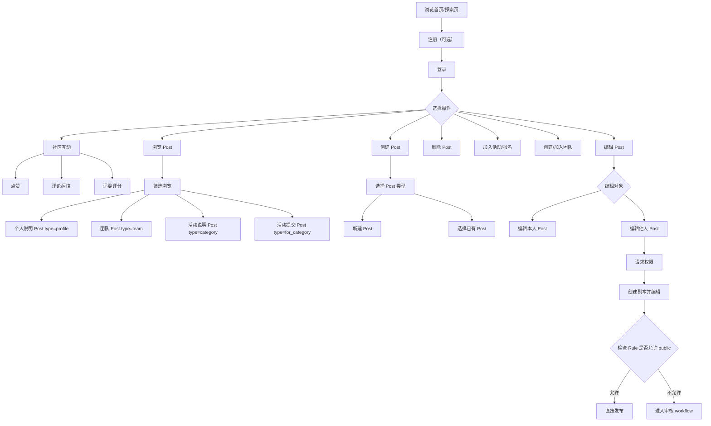
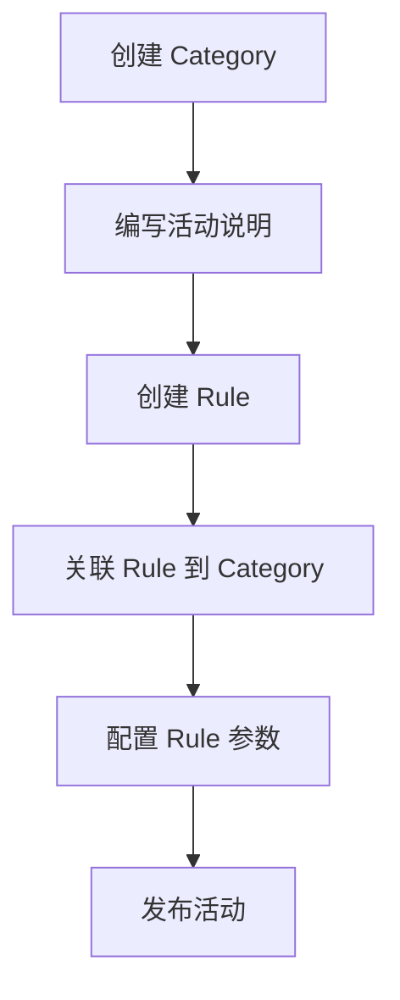
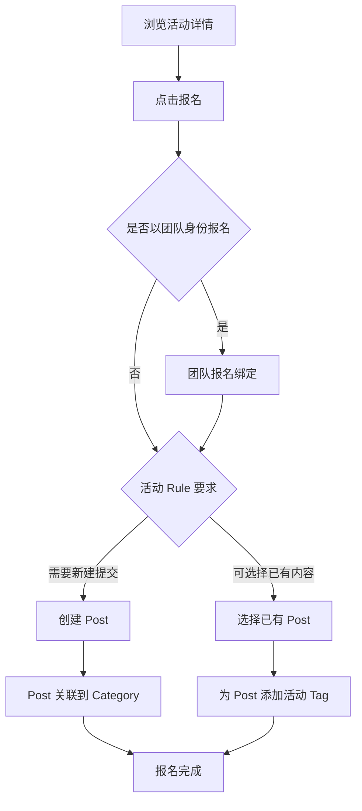
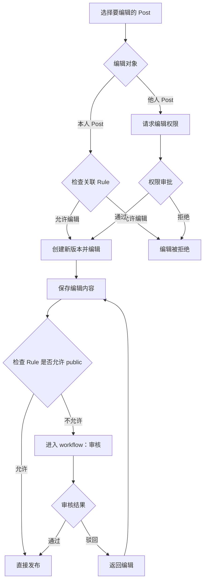
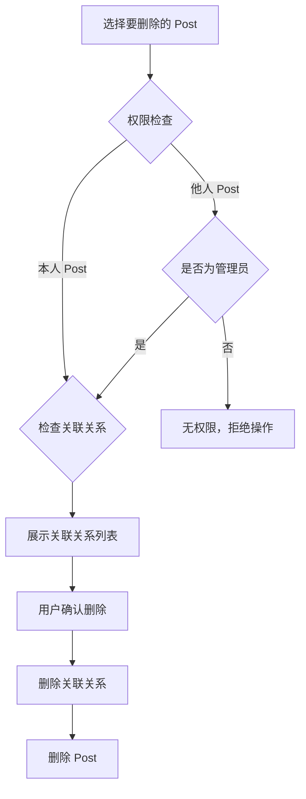
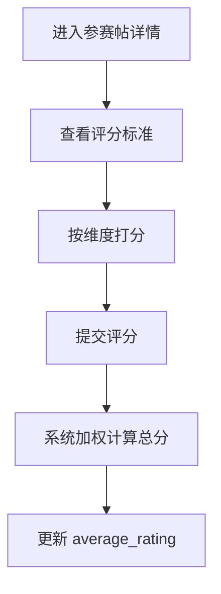
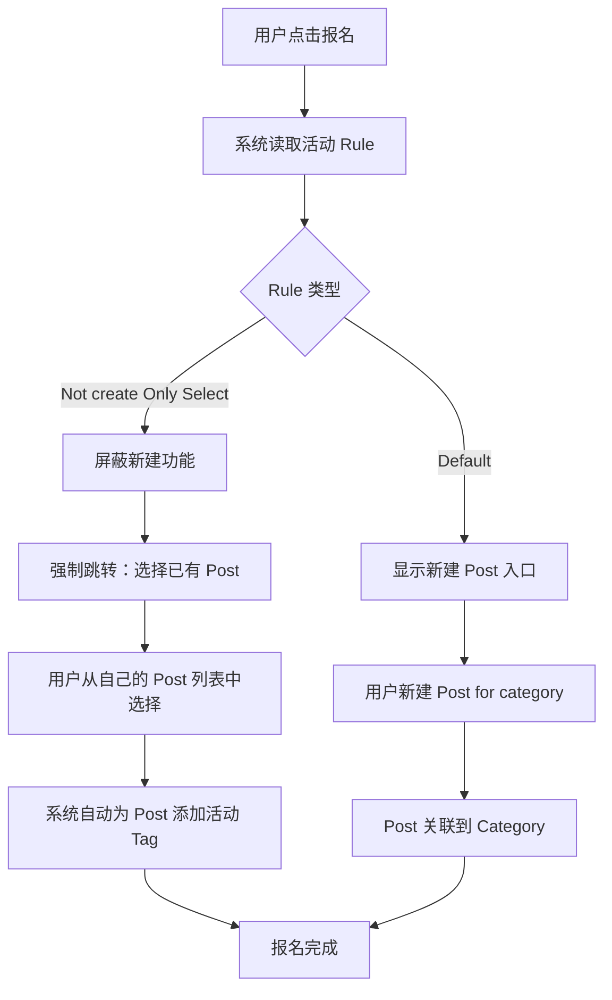

# User Journey

本文档描述 Synnovator 平台的核心用户旅程，面向开发团队，每个场景包含角色、前置条件、步骤序列及对应的数据操作（CRUD）。

## 目录

- [角色定义](#角色定义)
- [数据模型速览](#数据模型速览)
- [1. User Lifetime 总览](#1-user-lifetime-总览)
- [2. 浏览探索页](#2-浏览探索页)
- [3. 注册](#3-注册)
- [4. 登录](#4-登录)
- [5. 用户登录与加入组](#5-用户登录与加入组)
- [6. 创建活动](#6-创建活动)
- [7. 加入活动（报名参赛）](#7-加入活动报名参赛)
- [8. 创建团队](#8-创建团队)
- [9. 发送帖子](#9-发送帖子)
- [10. 获得证书](#10-获得证书)
- [11. 编辑 Post（版本管理与发布审核）](#11-编辑-post版本管理与发布审核)
- [12. 删除 Post](#12-删除-post)
- [13. 社区互动（点赞、评论、评分）](#13-社区互动点赞评论评分)
- [附录：报名规则定义（Rule Definition）](#附录报名规则定义rule-definition)

---

## 角色定义

| 角色 | 说明 | 核心权限范围 |
|------|------|-------------|
| **参赛者（Participant）** | 普通用户，参与活动 | 浏览、注册、报名、创建/编辑自己的 Post、组队 |
| **组织者（Organizer）** | 活动发起人，管理活动 | 创建/管理 Category 和 Rule、审核活动内容、管理活动相关 Post |
| **管理员（Admin）** | 平台运营，管理平台 | 平台级用户管理、全局内容管理、系统配置 |

## 数据模型速览

**七种内容类型：**

| 类型 | 格式 | 说明 |
|------|------|------|
| `category` | YAML + Markdown | 比赛活动或运营活动，关联不同的 Rule |
| `post` | Markdown | 用户提交的帖子，支持标签和自定义渲染 |
| `resource` | 文件 | 上传的附件/文件资源 |
| `rule` | YAML + Markdown | 活动规则，由组织者创建 |
| `user` | YAML | 用户信息 |
| `group` | YAML | 团队/分组，可用于参赛组队、组织方团队、权限分组等 |
| `interaction` | YAML | 交互记录（点赞、评论、评分），可指向任意内容类型 |

**七种关系：**

| 关系 | 说明 |
|------|------|
| `category : rule` | 活动关联其规则 |
| `category : post` | 活动关联帖子（报名内容、提交作品等） |
| `category : group` | 团队在特定活动中的报名绑定 |
| `post : post` | 帖子间关联（引用、回复等） |
| `post : resource` | 帖子关联附件资源 |
| `group : user` | 分组关联成员 |
| `target : interaction` | 内容对象关联其交互记录（点赞、评论、评分） |

---

## 1. User Lifetime 总览



---

## 2. 浏览探索页

- **角色：** 任何人（含未登录用户）
- **前置条件：** 无

| 步骤 | 用户操作 | 数据操作 | 说明 |
|------|---------|---------|------|
| 1 | 访问平台首页 | `READ category`（公开列表） | 获取公开活动列表 |
| 2 | 浏览活动卡片 | `READ category` + `READ rule`（摘要） | 展示活动名称、简介、关联规则摘要 |
| 3 | 浏览公开帖子 | `READ post`（公开列表，带 tag 筛选） | 按标签筛选帖子（提案帖、日常帖等） |
| 4 | 点击查看详情 | `READ post` / `READ category` | 查看单条内容详情 |

- **结果：** 用户了解平台活动内容，可决定是否注册参与

---

## 3. 注册

- **角色：** 未注册用户
- **前置条件：** 无

| 步骤 | 用户操作 | 数据操作 | 说明 |
|------|---------|---------|------|
| 1 | 点击注册 | — | 进入注册流程 |
| 2 | 填写基本信息 | — | 用户名、邮箱、密码等 |
| 3 | 提交注册 | `CREATE user` | 创建用户记录 |
| 4 | （可选）完善个人资料 | `CREATE post`（type: profile） | 创建个人说明帖 |

- **结果：** 用户获得账号，默认角色为参赛者

---

## 4. 登录

- **角色：** 已注册用户
- **前置条件：** 已完成注册

| 步骤 | 用户操作 | 数据操作 | 说明 |
|------|---------|---------|------|
| 1 | 输入凭证 | `READ user`（验证） | 验证用户身份 |
| 2 | 登录成功 | — | 返回会话令牌 |
| 3 | 进入主页 | `READ category`（个性化列表） | 展示用户相关的活动和内容 |

- **结果：** 用户进入已登录状态，解锁完整功能

---

## 5. 用户登录与加入组

- **角色：** 参赛者
- **前置条件：** 已登录

| 步骤 | 用户操作 | 数据操作 | 说明 |
|------|---------|---------|------|
| 1 | 浏览可加入的 Group | `READ group`（公开列表） | 查看可加入的团队/分组 |
| 2 | 选择目标 Group | `READ group`（详情） | 查看 Group 详情和成员列表 |
| 3 | 申请加入 | `CREATE group:user`（关联，role=member） | 将 user 关联到 group；`require_approval=true` 时 status 初始为 `pending`，否则自动为 `accepted` |
| 4 | （若需审批）等待审批 | — | Group Owner/Admin 批准：`UPDATE group:user`（status → accepted） |
| 5 | 加入成功 | `READ group`（成员列表） | 用户成为 Group 成员 |

- **结果：** 用户成为某个 Group 的成员，可以以团队身份参与活动

---

## 6. 创建活动

- **角色：** 组织者（Organizer）
- **前置条件：** 已登录，拥有组织者权限



| 步骤 | 用户操作 | 数据操作 | 说明 |
|------|---------|---------|------|
| 1 | 创建活动 | `CREATE category` | 填写活动基本信息（YAML + Markdown） |
| 2 | 编写活动说明 | `UPDATE category` | 补充活动详细说明（Markdown） |
| 3 | 创建活动规则 | `CREATE rule` | 定义活动规则（提交要求、评分标准、审核配置等） |
| 4 | 关联规则到活动 | `CREATE category : rule`（关联） | 将 Rule 绑定到 Category |
| 5 | 配置规则参数 | `UPDATE rule` | 设置是否允许 public、审核人配置、提交截止时间等 |
| 6 | 发布活动 | `UPDATE category`（状态变更） | 活动对外可见，参赛者可报名 |

- **结果：** 一个完整的活动已创建并发布，包含关联的规则配置

---

## 7. 加入活动（报名参赛）

- **角色：** 参赛者
- **前置条件：** 已登录，目标活动已发布



| 步骤 | 用户操作 | 数据操作 | 说明 |
|------|---------|---------|------|
| 1 | 浏览活动详情 | `READ category` + `READ rule` | 查看活动说明和规则要求 |
| 2 | 点击报名 | — | 系统自动读取该活动关联的 Rule |
| 3 | （若团队参赛）团队报名绑定 | `CREATE category:group`（关联） | 将团队绑定到活动；同一 group 在同一 category 中只能注册一次 |
| 4a | （路径A）新建 Post | `CREATE post`（type: for_category） | 按 Rule 要求创建提交内容 |
| 4b | （路径B）选择已有 Post | `READ post`（用户自己的列表） | 从自己的帖子中选择 |
| 5a | 关联 Post 到活动 | `CREATE category:post`（关联，relation_type: submission） | 将新建的 Post 关联到 Category |
| 5b | 为 Post 打活动标签 | `UPDATE post`（添加 tag `#for_<category>`） | 为已有 Post 添加活动标签 |
| 6 | 报名完成 | — | 用户成为活动参与者 |

- **结果：** 用户（或团队）成功报名活动，其 Post 作为参赛内容与活动关联

---

## 8. 创建团队

- **角色：** 参赛者
- **前置条件：** 已登录

| 步骤 | 用户操作 | 数据操作 | 说明 |
|------|---------|---------|------|
| 1 | 创建团队 | `CREATE group` | 填写团队名称、简介等信息 |
| 2 | 创建者自动成为组长 | `CREATE group : user`（关联，role=owner） | 创建者关联为团队 owner |
| 3 | 邀请成员 / 分享链接 | — | 生成邀请链接或直接邀请 |
| 4 | 成员接受邀请 | `CREATE group : user`（关联，role=member） | 新成员关联到团队 |
| 5 | （可选）创建团队介绍帖 | `CREATE post`（type: team） | 创建团队介绍帖，可在活动中展示 |

- **结果：** 团队创建完成，成员可以以团队身份参与活动

---

## 9. 发送帖子

- **角色：** 参赛者
- **前置条件：** 已登录

帖子类型包括**提案帖**和**日常帖**，均支持标签系统和自定义渲染。

### 9.1 发送日常帖

| 步骤 | 用户操作 | 数据操作 | 说明 |
|------|---------|---------|------|
| 1 | 新建帖子 | `CREATE post` | 编写 Markdown 内容 |
| 2 | （可选）上传附件 | `CREATE resource` | 上传文件资源 |
| 3 | （可选）关联附件 | `CREATE post : resource`（关联） | 将资源关联到帖子 |
| 4 | （可选）关联其他帖子 | `CREATE post : post`（关联） | 引用/关联其他帖子 |
| 5 | 添加标签 | `UPDATE post`（添加 tag） | 运营人员或用户打标签 |
| 6 | 发布 | `UPDATE post`（状态变更） | 帖子公开可见 |

### 9.2 发送提案帖（含团队卡片）

| 步骤 | 用户操作 | 数据操作 | 说明 |
|------|---------|---------|------|
| 1 | 新建帖子 | `CREATE post` | 编写提案内容（Markdown） |
| 2 | 插入团队卡片 | `CREATE post : post`（关联 `#team` Post） | 在帖子中嵌入团队介绍帖 |
| 3 | （可选）插入提案卡片 | `CREATE post : post`（关联提案 Post） | 嵌入已有提案内容 |
| 4 | 编写文字描述 | `UPDATE post` | 补充文字说明 |
| 5 | 添加标签 | `UPDATE post`（添加 tag） | 添加相关标签（如 `#找队友`） |
| 6 | 发布 | `UPDATE post`（状态变更） | 帖子公开可见 |

- **结果：** 帖子发布成功，在探索页和活动页可被其他用户浏览

---

## 10. 获得证书

- **角色：** 参赛者
- **前置条件：** 已登录，活动已结束，用户有参赛记录

| 步骤 | 用户操作 | 数据操作 | 说明 |
|------|---------|---------|------|
| 1 | 活动结束 | `UPDATE category`（状态变更） | 组织者关闭活动 |
| 2 | 组织者发布证书/结果 | `CREATE resource`（证书文件） | 生成证书资源 |
| 3 | 关联证书到用户 Post | `CREATE post : resource`（关联） | 将证书关联到用户的参赛 Post |
| 4 | 用户查看证书 | `READ resource` | 用户在个人页面查看/下载证书 |
| 5 | （可选）分享证书 | `CREATE post`（type: certificate） | 用户发帖分享获得的证书 |

- **结果：** 用户获得活动证书，可查看和分享

---

## 11. 编辑 Post（版本管理与发布审核）

- **角色：** 参赛者 / 组织者
- **前置条件：** 已登录，目标 Post 已存在



### 11.1 编辑本人 Post

| 步骤 | 用户操作 | 数据操作 | 说明 |
|------|---------|---------|------|
| 1 | 进入 Post 编辑页 | `READ post` + `READ rule` | 读取 Post 内容及关联的 Rule |
| 2 | 检查编辑权限 | `READ rule`（权限校验） | 系统检查 Rule 是否允许编辑（如活动截止后不可编辑） |
| 3 | 创建新版本 | `CREATE post`（新版本，关联旧版本） | 基于当前内容创建版本副本，旧版本保留 |
| 4 | 编辑内容 | `UPDATE post`（新版本） | 在新版本上进行修改 |
| 5 | 提交发布 | — | 触发发布检查 |
| 6a | （路径 A）直接发布 | `UPDATE post`（状态 → published） | Rule 允许 public 时直接发布 |
| 6b | （路径 B）进入审核 | `UPDATE post`（状态 → pending_review） | Rule 不允许直接 public，进入组织者审核 |
| 7 | （若审核）等待审核结果 | — | 组织者审核 |
| 8 | 审核通过/驳回 | `UPDATE post`（状态 → published / rejected） | 审核结果决定是否发布 |

- **结果：** Post 新版本发布成功或进入审核流程；旧版本保留可追溯

### 11.2 编辑他人 Post

> **注意：** 编辑权限请求目前依赖系统级通知机制，不直接映射到 command.md 中定义的内容类型。具体实现可通过 `interaction`（type: comment，附带权限请求语义）或独立的系统通知模块承载。

| 步骤 | 用户操作 | 数据操作 | 说明 |
|------|---------|---------|------|
| 1 | 浏览他人 Post | `READ post` | 查看目标 Post 内容 |
| 2 | 请求编辑权限 | （系统级通知） | 向 Post 作者发起编辑权限申请 |
| 3 | 等待作者审批 | — | 作者收到通知并决定是否授权 |
| 4 | 获得授权 | （系统级通知 → approved） | 权限请求通过 |
| 5 | 创建新版本并编辑 | `CREATE post`（新版本） + `UPDATE post` | 同 11.1 步骤 3-4 |
| 6 | 提交发布 | 同 11.1 步骤 5-8 | 走相同的发布流程 |

- **结果：** 协作编辑完成，版本历史记录完整

---

## 12. 删除 Post

- **角色：** 参赛者（删除本人 Post） / 管理员（删除任意 Post）
- **前置条件：** 已登录，目标 Post 存在



| 步骤 | 用户操作 | 数据操作 | 说明 |
|------|---------|---------|------|
| 1 | 选择要删除的 Post | `READ post` | 查看 Post 详情 |
| 2 | 点击删除 | `READ category : post` + `READ post : post` + `READ post : resource` | 系统查询所有关联关系 |
| 3 | 查看关联关系提示 | — | 系统展示该 Post 的关联信息（所属活动、引用的帖子、附件等） |
| 4 | 确认删除 | — | 用户确认删除操作 |
| 5 | 删除关联关系 | `DELETE category:post` + `DELETE post:post` + `DELETE post:resource` | 移除 Post 与 Category、其他 Post、Resource 的关联 |
| 6 | 删除关联 interaction | `DELETE target:interaction`（目标为该 Post 的所有交互记录） | 级联删除所有点赞、评论、评分；若为父评论则级联删除子回复 |
| 7 | 删除 Post | `DELETE post` | 删除 Post 本体 |
| 8 | （可选）清理孤立资源 | `DELETE resource`（无关联的资源） | 若关联的 Resource 不再被其他 Post 引用，可选择清理 |

- **结果：** Post 及其关联关系和交互记录被彻底删除，关联的资源视情况保留或清理

---

## 13. 社区互动（点赞、评论、评分）

- **角色：** 已登录用户（点赞/评论）；评委/组织者（评分）
- **前置条件：** 已登录，目标内容对当前用户可见

### 13.1 点赞

| 步骤 | 用户操作 | 数据操作 | 说明 |
|------|---------|---------|------|
| 1 | 浏览目标内容 | `READ post` / `READ category` | 查看帖子或活动 |
| 2 | 点击点赞 | `CREATE interaction`（type: like） | 创建点赞交互记录 |
| 3 | 关联到目标 | `CREATE target:interaction` | 将点赞关联到目标内容 |
| 4 | （系统自动）更新计数 | `UPDATE post`（like_count +1） | 系统自动维护缓存统计 |

- **结果：** 点赞成功，目标内容的 like_count 实时更新

### 13.2 发表评论与回复

| 步骤 | 用户操作 | 数据操作 | 说明 |
|------|---------|---------|------|
| 1 | 浏览目标内容 | `READ post` / `READ category` | 查看帖子或活动 |
| 2 | 编写评论 | `CREATE interaction`（type: comment, value: 评论文本） | 创建评论交互记录（Markdown 格式） |
| 3 | 关联到目标 | `CREATE target:interaction` | 将评论关联到目标内容 |
| 4 | （系统自动）更新计数 | `UPDATE post`（comment_count +1） | 系统自动维护缓存统计 |
| 5 | （可选）回复评论 | `CREATE interaction`（type: comment, parent_id: 父评论 ID） | 创建嵌套回复，通过 parent_id 指向被回复的评论 |

- **结果：** 评论发布成功，支持嵌套回复，comment_count 实时更新

### 13.3 评委多维度评分

- **角色：** 评委 / 组织者
- **前置条件：** 已登录，拥有评审权限（在 Rule.reviewers 列表中）



| 步骤 | 用户操作 | 数据操作 | 说明 |
|------|---------|---------|------|
| 1 | 进入参赛帖详情 | `READ post` + `READ category:rule` | 查看帖子内容及关联的评分标准 |
| 2 | 查看评分标准 | `READ rule`（scoring_criteria） | 获取各维度名称、权重、说明 |
| 3 | 按维度打分 | — | 评委对每个维度独立评分（0-100） |
| 4 | 提交评分 | `CREATE interaction`（type: rating, value: 多维度评分对象） | value 为对象，Key 与 scoring_criteria.name 一一对应 |
| 5 | 关联到目标 | `CREATE target:interaction` | 将评分关联到参赛帖 |
| 6 | （系统自动）更新均分 | `UPDATE post`（average_rating 重算） | 系统按 weight 加权计算总分，更新所有评分的均值 |

**rating value 示例：**

```yaml
value:
  创新性: 87        # 0-100，weight=30
  技术实现: 82      # 0-100，weight=30
  实用价值: 78      # 0-100，weight=25
  演示效果: 91      # 0-100，weight=15
  _comment: "架构设计清晰，建议完善错误处理"
# 系统加权总分: 87×0.30 + 82×0.30 + 78×0.25 + 91×0.15 = 83.85
```

- **结果：** 评分提交成功，参赛帖的 average_rating 实时更新，支持排行榜展示

---

## 附录：报名规则定义（Rule Definition）

本节详细说明活动报名环节中 Rule 的定义方式与执行逻辑。Rule 由组织者在创建活动时定义，系统在用户报名时自动执行。

### 规则类型

| 规则名称 | 说明 | 用户行为约束 |
|---------|------|-------------|
| **Default**（默认） | 允许用户自由创建新 Post 参赛 | 无特殊限制 |
| **Not create Only Select** | 仅允许选择已有 Post，不可新建 | 屏蔽"新建"入口，强制跳转"选择 Post" |
| （可扩展更多规则） | — | — |

### 规则执行流程：Not create Only Select
该规则约束了用户只能选择已有的Post，而不允许新建Post。



### 规则执行细节

| 步骤 | 系统行为 | 数据操作 | 说明 |
|------|---------|---------|------|
| 1 | 读取活动 Rule | `READ category : rule` | 获取活动关联的 Rule 配置 |
| 2 | 判断 Rule 类型 | — | 解析 Rule 中的约束条件 |
| 3a | （Default）展示创建入口 | — | 用户可自由新建 Post |
| 3b | （Not create Only Select）屏蔽创建入口 | — | 前端隐藏"新建 Post"按钮 |
| 4b | 展示已有 Post 列表 | `READ post`（用户自己的 Post 列表） | 用户只能从已有 Post 中选择 |
| 5b | 用户选择 Post | — | 用户点选目标 Post |
| 6b | 自动添加活动 Tag | `UPDATE post`（添加 `#for_<category>` tag） | 系统自动执行 "Add Tag for category" |
| 7b | 关联 Post 到 Category | `CREATE category : post`（关联） | 建立 Post 与活动的关联 |

### 组织者配置 Rule

| 步骤 | 用户操作 | 数据操作 | 说明 |
|------|---------|---------|------|
| 1 | 进入 Rule 编辑页 | `READ rule` | 查看当前 Rule 配置 |
| 2 | 选择规则类型 | `UPDATE rule`（type 字段） | 设置为 Default / Not create Only Select 等 |
| 3 | 配置附加参数 | `UPDATE rule` | 如：是否允许 public、审核人列表、提交截止时间 |
| 4 | 保存并关联到活动 | `UPDATE category : rule` | Rule 生效，影响后续所有报名用户 |

- **结果：** 活动规则配置完成，系统将根据 Rule 自动约束用户的报名行为
