# 用户旅程

本文档描述 Synnovator 平台的完整用户旅程，面向开发团队，涵盖从内容浏览到活动参与、团队协作、内容创作、社交互动等全流程场景。

> 角色定义详见 [data-types.md](./data-types.md#角色定义)，数据类型详见 [data-types.md](./data-types.md)，关系详见 [relationships.md](./relationships.md)。

## 目录

- [1. User Lifetime 总览](#1-user-lifetime-总览)
- [2. 浏览探索页](#2-浏览探索页)
- [3. 注册](#3-注册)
- [4. 登录](#4-登录)
- [5. 用户登录与加入组](#5-用户登录与加入组)
- [6. 创建活动](#6-创建活动)
- [7. 加入活动（报名参赛）](#7-加入活动报名参赛)
- [8. 创建团队](#8-创建团队)
- [9. 发送帖子](#9-发送帖子)
- [10. 活动结束与颁奖](#10-活动结束与颁奖)
- [11. 编辑 Post（版本管理与发布审核）](#11-编辑-post版本管理与发布审核)
- [12. 删除 Post](#12-删除-post)
- [13. 社区互动（点赞、评论、评分）](#13-社区互动点赞评论评分)
- [14. 关注与好友](#14-关注与好友)
- [15. 多阶段/多赛道活动](#15-多阶段多赛道活动)
- [16. 资产转移](#16-资产转移)
- [附录 A：报名规则定义（Rule Definition）](#附录-a报名规则定义rule-definition)
- [附录 B：声明式规则引擎](#附录-b声明式规则引擎)
=======
- [1. 内容浏览](#1-内容浏览)
- [2. 设立活动相关](#2-设立活动相关)
- [3. 团队相关](#3-团队相关)
- [4. 参与活动与提交](#4-参与活动与提交)
- [5. 内容创作与迭代](#5-内容创作与迭代)
- [6. 社交互动与反馈](#6-社交互动与反馈)
- [7. 活动结算与奖励发放](#7-活动结算与奖励发放)
- [8. 悬赏与企业出题](#8-悬赏与企业出题)
- [9. 个性化相关](#9-个性化相关)
- [10. 星球和营地页面](#10-星球和营地页面)
- [附录 A：User Lifetime 总览](#附录-a-user-lifetime-总览)
- [附录 B：报名规则定义（Rule Definition）](#附录-b-报名规则定义rule-definition)


---

## 1. 内容浏览


```mermaid
flowchart TD
    A[浏览首页/探索页] --> B[注册（可选）]
    B --> C[登录]
    C --> D{选择操作}
    D --> E[浏览 Post]
    D --> F[创建 Post]
    D --> G[编辑 Post]
    D --> H[删除 Post]
    D --> I[加入活动/报名]
    D --> J[创建/加入团队]
    D --> K[社区互动]
    D --> L[关注用户]
    D --> M[参与多阶段活动]
=======
- **角色：** 任何人（含未登录用户）
- **前置条件：** 无

### 1.1 基础浏览

    L --> L1[关注]
    L --> L2[互关成为好友]
    L --> L3[拉黑]

    E --> E1[筛选浏览]
    E1 --> E2[个人说明 Post type=profile]
    E1 --> E3[团队 Post type=team]
    E1 --> E4[活动说明 Post type=category]
    E1 --> E5[活动提交 Post type=for_category]
=======
| 用户旅程 | 说明 | 数据操作 |
|---------|------|---------|
| 浏览首页/探索页 | 查看当前热门或推荐的活动和帖子 | `READ category`（公开列表）, `READ post`（推荐列表） |
| 筛选内容 | 根据标签或详情界面搜索或设置内容类型筛选感兴趣的帖子 | `READ post`（带 tag/type 筛选） |
| 查看详情 | 点击并阅读活动说明帖或参赛提案 | `READ post` / `READ category` |
| 浏览热门帖子 | 点击右侧热点榜对应帖子跳转 | `READ post`（按热度排序） |


### 1.2 账号与登录

    G --> G1{编辑对象}
    G1 --> G2[编辑本人 Post]
    G1 --> G3[编辑他人 Post]
    G3 --> G4[请求权限]
    G4 --> G5[创建副本并编辑]
    G5 --> G6{检查 Rule 是否允许 public}
    G6 -->|允许| G7[直接发布]
    G6 -->|不允许| G8[进入审核 workflow]

    I --> I1{活动类型}
    I1 -->|单阶段| I2[常规报名]
    I1 -->|多阶段| I3[按赛段顺序参与]
    I1 -->|多赛道| I4[选择赛道参与]
```

### 1.3 导航与页面跳转

| 用户旅程 | 说明 | 数据操作 |
|---------|------|---------|
| 浏览内容时点击作者进入作者个人主页 | 点击帖子作者名跳转至个人空间 | `READ user`（详情） |
| 浏览团队内容时点击团队进入团队主页 | 通过团队展示卡片跳转 | `READ group`（详情） |
| 浏览团队页面时查看队友信息 | 点击具体用户进入对应个人主页 | `READ user`（详情） |
| 通过左侧多功能栏的链接进入对应页面 | 使用快捷侧边栏进行导航 | — |
| 点击左侧多功能栏寻求信息支持和人工协助 | 点击左侧多功能栏下方个人用户图标后，点击相应栏目 | — |

### 1.4 通知系统

| 用户旅程 | 说明 | 数据操作 |
|---------|------|---------|
| 点击通知提示查看通知 | 点击顶部或侧边的通知图标 | `READ notification`（列表） |
| 点击通知中的页面进入对应页面 | 从具体通知条目跳转至目标内容 | `READ post` / `READ category` / `READ group` |
| 点击通知中的按钮完成批准 | 直接在通知中心处理申请 | `UPDATE group:user` / `UPDATE` 相关关联 |

### 2.1 可见性规则

> 基于 TC-PERM-020 至 TC-PERM-025 测试用例

| 内容类型 | 可见性条件 | 说明 |
|---------|-----------|------|
| Category（活动） | `status=published` | draft 状态的活动对访客不可见 |
| Post（帖子） | `status=published` + `visibility=public` | draft 帖子、private 帖子对非作者不可见 |
| Group（团队） | `visibility=public` | private 团队仅成员可见 |
| Resource（资源） | 继承关联 Post 的可见性 | 若关联帖子不可见，则资源也不可见 |

- **结果：** 用户了解平台活动内容，可决定是否注册参与

---

## 2. 设立活动相关

- **角色：** 组织者（Organizer）
- **前置条件：** 已登录，拥有组织者权限

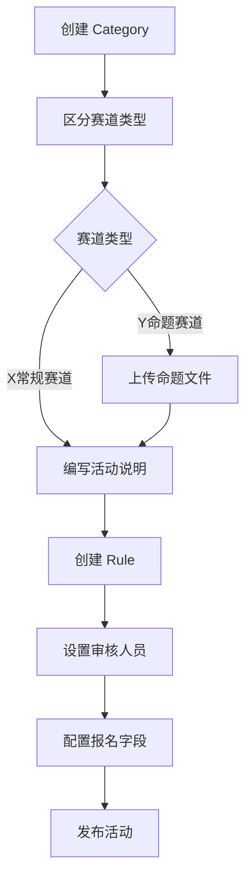

### 2.1 活动创建与配置

| 用户旅程 | 说明 | 数据操作 |
|---------|------|---------|
| 发起活动 | 组织者创建新的活动类别，区分X常规赛道和Y命题赛道 | `CREATE category` |
| 编写活动说明 | 详细描述活动的背景、目标、开始和结束时间和奖励 | `UPDATE category` |
| 设定活动规则 | 定义报名限制、提交截止日期及评审标准，包括任务要求、团队人数限制、提案内容合规性等 | `CREATE rule` + `CREATE category:rule` |
| 管理活动状态 | 将活动从草稿发布为正式，或在结束后关闭活动 | `UPDATE category`（状态变更） |
| 设置审核人员 | 指定哪些用户拥有对该活动提交内容的审核权限 | `UPDATE rule`（reviewers 配置） |
| 配置报名字段 | 每个活动的组织者可以设置希望报名用户填写哪些信息 | `UPDATE rule`（registration_fields） |

### 2.2 Y命题赛道特殊配置

Y命题赛道包含**企业命题活动**和**悬赏组队活动**，区别在于：
- 企业方和悬赏人可以上传个人文件（资产-文件）作为参赛命题
- 在活动页面让参赛者可以看到命题文件

| 用户旅程 | 说明 | 数据操作 |
|---------|------|---------|
| 上传命题文件 | 企业方/悬赏人上传资产文件作为参赛命题 | `CREATE resource` + `CREATE category:resource` |

### 2.3 活动评审与关联

| 用户旅程 | 说明 | 数据操作 |
|---------|------|---------|
| 评委给参赛内容打分 | 评委执行打分操作 | `CREATE interaction`（type: rating） |
| 活动之间可以互相关联 | 在活动页面建立与其他活动的连接 | `CREATE category:category` |
| 互相关联的活动可以使用同一个提案参赛 | 一个提案同时投递至多个关联活动 | `CREATE category:post`（多个关联） |

---

## 3. 团队相关

- **角色：** 参赛者
- **前置条件：** 已登录

| 步骤 | 用户操作 | 数据操作 | 说明 |
|------|---------|---------|------|
| 1 | 浏览可加入的 Group | `READ group`（公开列表） | 查看可加入的团队/分组 |
| 2 | 选择目标 Group | `READ group`（详情） | 查看 Group 详情和成员列表 |
| 3 | 申请加入 | `CREATE group:user`（关联，role=member） | 将 user 关联到 group；`require_approval=true` 时 status 初始为 `pending`，否则自动为 `accepted` |
| 4 | （若需审批）等待审批 | — | Group Owner/Admin 批准：`UPDATE group:user`（status → accepted） |
| 5 | 加入成功 | `READ group`（成员列表） | 用户成为 Group 成员 |

- **结果：** 用户成为某个 Group 的成员，可以以团队身份参与活动

---

## 6. 创建活动

- **角色：** 组织者（Organizer）
- **前置条件：** 已登录，拥有组织者权限
- **权限约束：** participant 不能创建 category 或 rule（TC-PERM-001/002）

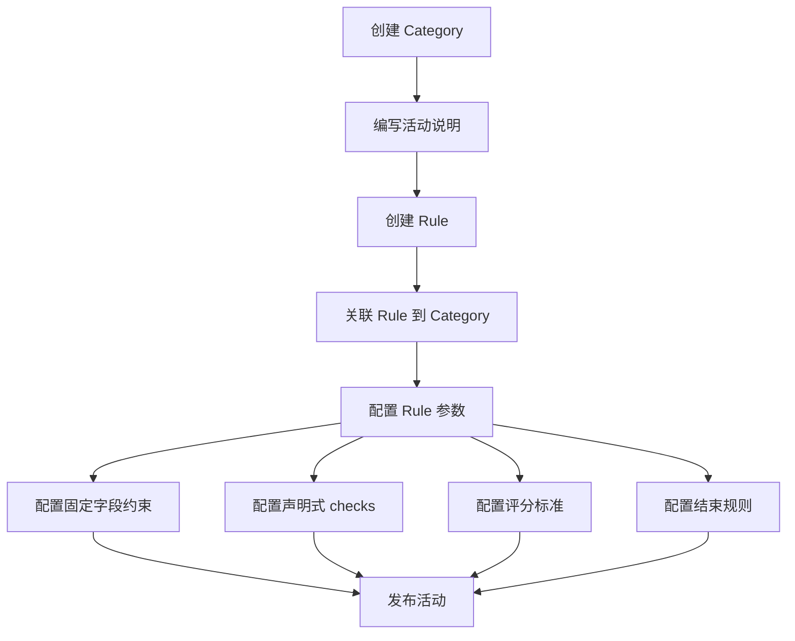

### 3.1 团队创建与管理

| 用户旅程 | 说明 | 数据操作 |
|---------|------|---------|
| 创建团队 | 发起并命名一个新的团队，添加团队简介 | `CREATE group` |
| 关联团队提案 | 将个人提案作为团队提案与团队进行关联 | `CREATE group:post`（关联） |
| 邀请成员 | 在团队中搜索并邀请他人，等待对方批准 | `CREATE group:user`（status: pending） |
| 成员批准 | 被邀请成员可在通知界面选择加入/拒绝 | `UPDATE group:user`（status: accepted/rejected） |
| 申请加入团队 | 在目标团队主页点击申请，等待队长批准 | `CREATE group:user`（status: pending） |
| 审批成员申请 | 队长在通知或管理后台通过或拒绝他人的申请 | `UPDATE group:user`（status: accepted/rejected） |
| 成员退出/移除 | 成员主动退出或被队长移除出组 | `DELETE group:user` |

### 3.2 团队资产管理

### 6.1 Rule 配置详解

> 基于 TC-ENTRY、TC-CLOSE、TC-ENGINE 测试用例

#### 6.1.1 固定字段约束

| 字段 | 类型 | 说明 | 示例 |
|------|------|------|------|
| `max_submissions` | int | 每用户最大提交数 | `1`（每人只能提交一次） |
| `min_team_size` | int | 团队最小人数 | `2`（至少 2 人） |
| `max_team_size` | int | 团队最大人数 | `5`（最多 5 人） |
| `submission_format` | string[] | 允许的附件格式 | `["pdf", "zip"]` |
| `allow_public` | bool | 是否允许直接发布 | `false`（需审核） |

#### 6.1.2 声明式 checks 配置

```yaml
checks:
  # 报名前置条件：必须已有 profile 帖子
  - trigger: create_relation(category_group)
    phase: pre
    condition:
      type: exists
      params:
        entity: post
        scope: user
        filter: { type: profile, status: published }
        require: true
    on_fail: deny
    message: "请先完善个人资料"

  # 提交前置条件：帖子必须包含 PDF 附件
  - trigger: create_relation(category_post)
    phase: pre
    condition:
      type: resource_required
      params:
        min_count: 1
        formats: ["pdf"]
    on_fail: deny
    message: "提案必须包含 PDF 附件"

  # 活动关闭后：自动计算排名
  - trigger: update_content(category.status)
    phase: post
    condition:
      type: field_match
      params: { field: status, op: "==", value: closed }
    action: compute_ranking
    action_params:
      source_field: average_rating
      order: desc
      output_tag_prefix: "rank_"

  # 活动关闭后：自动颁发证书
  - trigger: update_content(category.status)
    phase: post
    condition:
      type: field_match
      params: { field: status, op: "==", value: closed }
    action: award_certificate
    action_params:
      awards:
        - rank_range: [1, 1]
          name: "一等奖"
        - rank_range: [2, 3]
          name: "二等奖"
        - rank_range: [4, 10]
          name: "优秀奖"
```

- **结果：** 一个完整的活动已创建并发布，包含关联的规则配置

---

## 4. 参与活动与提交

- **角色：** 参赛者
- **前置条件：** 已登录，目标活动已发布

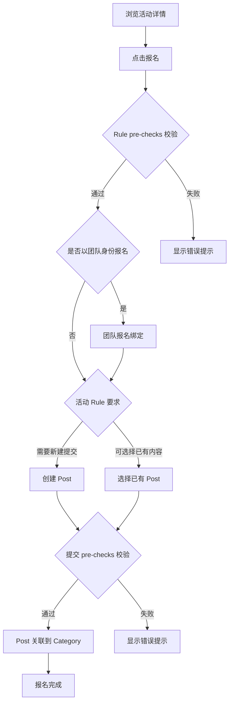

### 4.1 报名参赛

### 7.1 报名规则校验（Entry Rule Enforcement）

> 基于 TC-ENTRY 测试用例

报名和提交操作会触发 Rule 的 `checks` 校验，校验在 `pre` 阶段执行：

| 触发点 | 校验内容 | 失败处理 |
|-------|---------|---------|
| `create_relation(category_group)` | 团队报名前置条件 | `on_fail: deny` 拒绝操作 |
| `create_relation(category_post)` | 帖子提交前置条件 | `on_fail: deny` 拒绝操作 |

#### 常见校验场景

| 场景 | condition type | 说明 |
|------|---------------|------|
| 必须已有 profile 帖子 | `exists` | 用户需先完善个人资料 |
| 必须已有团队报名 | `exists` | 提交前需先报名活动 |
| 必须包含附件 | `resource_required` | 提案需包含指定数量/格式的附件 |
| 限制提交次数 | `count` | 每用户在同一活动中只能提交一次 |
| 时间窗口限制 | `time_window` | 在指定时间范围内才能提交 |
| 团队人数限制 | `count` | 团队成员数满足 min/max 要求 |

#### 校验失败示例

```
❌ 报名失败：请先完善个人资料（TC-ENTRY-003）
❌ 提交失败：提案必须包含至少一个 PDF 附件（TC-ENTRY-011）
❌ 提交失败：每个用户只能提交一个参赛提案（TC-ENTRY-020）
```

- **结果：** 用户（或团队）成功报名活动，其 Post 作为参赛内容与活动关联

---

## 5. 内容创作与迭代

- **角色：** 参赛者
- **前置条件：** 已登录

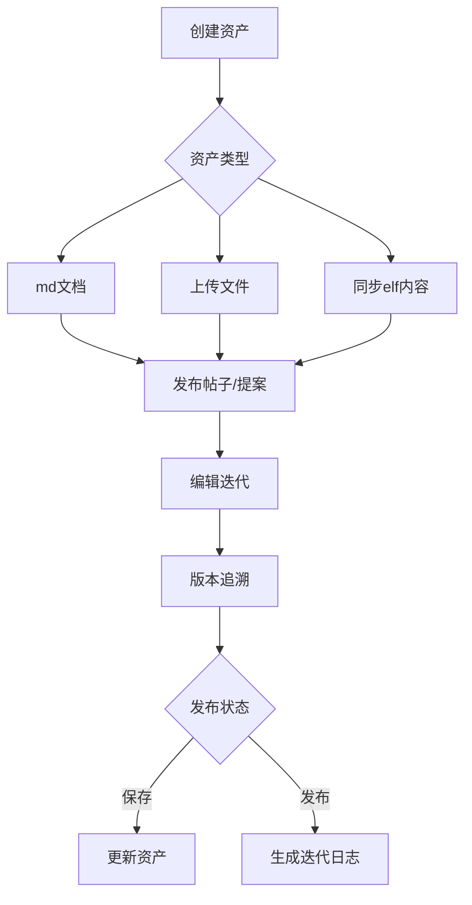

### 5.1 资产创建

| 用户旅程 | 说明 | 数据操作 |
|---------|------|---------|
| 创建个人资产 | 创作属于自己的文件资产（md文档，上传的各类文件视频图片等） | `CREATE resource` |
| 创建资产方式 | 通过系统自带的md编辑器；通过同步elf内容；本地上传文档 | `CREATE resource`（多种来源） |
| 创建资产文件 | 用户可以创建自己的文件作为自己的资产 | `CREATE resource` |

### 5.2 帖子与提案

| 用户旅程 | 说明 | 数据操作 |
|---------|------|---------|
| 发布帖子 | 使用自己的资产发布帖子 | `CREATE post` + `CREATE post:resource` |
| 发布提案 | 可以发布提案然后在提案中创建资产和放入自己的已有资产 | `CREATE post`（type: proposal） |
| 引用内容 | 在帖子中通过卡片形式嵌入团队信息或引用其他帖子 | `CREATE post:post`（关联） |

### 5.3 编辑与版本管理

| 用户旅程 | 说明 | 数据操作 |
|---------|------|---------|
| 编辑帖子 | 对自己已发布的帖子进行内容修改 | `UPDATE post` / `CREATE post`（新版本） |
| 编辑提案 | 对自己的提案标题和简介进行编辑，对提案中的资产进行编辑或创建新资产关联 | `UPDATE post` + `UPDATE resource` |
| 版本追溯 | 编辑帖子或提案后产生新版本，可查看历史修改记录 | `READ post`（版本历史） |
| 请求协作编辑 | 请求编辑他人的帖子或接受他人的协作请求 | 系统级通知机制 |
| 删除内容 | 删除不再需要的帖子、评论或资源（执行软删除） | `DELETE post` / `DELETE interaction` / `DELETE resource` |

### 5.4 提案资产更新与发布

| 用户旅程 | 说明 | 数据操作 |
|---------|------|---------|
| 资产更新 | 提案中的文件是用户的资产文件关联到提案。用户编辑提案中的文件相当于编辑自己的资产。资产可以在编辑时保存 | `UPDATE resource` |
| 提案发布 | 用户在提案中编辑资产后保存可以同步更新关联资产。但此时提案相当于更新了但还没有发布。用户可以多次更新提案中文件后选择发布 | `UPDATE post`（状态变更） |
| 提案发布版本更新历史 | 提案发布后版本更新。系统自动检测上一版本和当前版本的更新内容并生成迭代日志。迭代日志不可被用户更改，会展示在提案页面中 | `CREATE` 迭代日志（系统自动） |

---

## 6. 社交互动与反馈

- **角色：** 已登录用户（点赞/评论/关注）；评委/组织者（评分）
- **前置条件：** 已登录，目标内容对当前用户可见

## 10. 活动结束与颁奖

- **角色：** 组织者（关闭活动）/ 参赛者（获得证书）
- **前置条件：** 活动已发布，有参赛团队和提交内容

> 基于 TC-CLOSE 测试用例

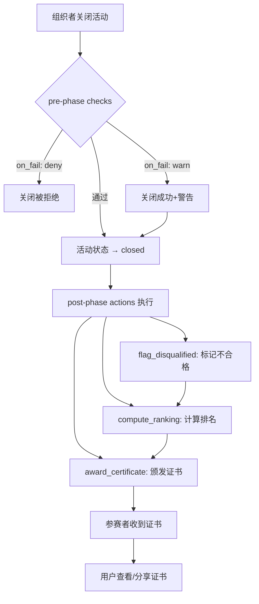

### 10.1 活动关闭流程

| 步骤 | 操作者 | 数据操作 | 说明 |
|------|-------|---------|------|
| 1 | 组织者 | `UPDATE category`（status → closed） | 触发关闭流程 |
| 2 | 系统 | 执行 pre-phase checks | 关闭前校验（如所有团队是否有提交） |
| 3 | 系统 | 执行 post-phase actions | 关闭后自动处理（终审、排名、颁奖） |

### 10.2 关闭前校验（pre phase）

| 校验类型 | on_fail | 说明 |
|---------|---------|------|
| 所有团队人数满足要求 | `warn` | 警告但允许关闭 |
| 所有团队有提交内容 | `deny` | 严格校验，不满足则拒绝关闭 |

### 10.3 关闭后自动处理（post phase）

#### 10.3.1 标记不合格（flag_disqualified）

| 步骤 | 系统行为 | 数据操作 | 说明 |
|------|---------|---------|------|
| 1 | 扫描所有报名团队 | `READ category:group` | 获取参赛团队列表 |
| 2 | 检查团队人数 | `READ group:user` | 验证 min_team_size 要求 |
| 3 | 标记不合格团队 | `UPDATE group`（添加 tag） | 如 "team_too_small" |
| 4 | 检查提交内容 | `READ category:post` | 验证提交要求 |
| 5 | 标记不合格提交 | `UPDATE post`（添加 tag） | 如 "missing_attachment" |

#### 10.3.2 计算排名（compute_ranking）

| 步骤 | 系统行为 | 数据操作 | 说明 |
|------|---------|---------|------|
| 1 | 获取合格提交 | `READ category:post`（排除已标记不合格） | 过滤有效参赛帖 |
| 2 | 按 average_rating 排序 | — | 降序排列 |
| 3 | 添加排名标签 | `UPDATE post`（添加 tag） | 如 "rank_1"、"rank_2"、"rank_3" |

**排名规则：**
- 相同分数并列排名（如两个 rank_1，下一个为 rank_3）
- `average_rating` 为 null 的帖子不参与排名

#### 10.3.3 自动颁发证书（award_certificate）

| 步骤 | 系统行为 | 数据操作 | 说明 |
|------|---------|---------|------|
| 1 | 根据排名确定奖项 | — | 按 rank_range 匹配奖项名称 |
| 2 | 生成证书文件 | `CREATE resource`（type: certificate） | 证书 PDF |
| 3 | 创建证书帖子 | `CREATE post`（type: certificate, status: published） | 公开可见 |
| 4 | 关联证书到帖子 | `CREATE post:resource`（display_type: attachment） | 挂载证书文件 |

**奖项配置示例：**

```yaml
awards:
  - rank_range: [1, 1]
    name: "一等奖"
  - rank_range: [2, 3]
    name: "二等奖"
  - rank_range: [4, 10]
    name: "优秀奖"
```

### 10.4 用户获取证书

| 步骤 | 用户操作 | 数据操作 | 说明 |
|------|---------|---------|------|
| 1 | 收到颁奖通知 | — | 系统推送通知 |
| 2 | 查看证书帖子 | `READ post`（type: certificate） | 证书帖子已自动创建 |
| 3 | 下载证书文件 | `READ resource` | 获取证书 PDF |
| 4 | （可选）分享证书 | `CREATE post`（引用证书帖） | 发帖展示荣誉 |

- **结果：** 活动正式关闭，排名和证书自动生成，获奖者可查看和分享证书

---

## 7. 活动结算与奖励发放

- **角色：** 参赛者 / 组织者
- **前置条件：** 活动已结束

### 7.1 结果查看与证书

| 用户旅程 | 说明 | 数据操作 |
|---------|------|---------|
| 查看评审结果 | 在活动结束后浏览获奖名单或排名榜单 | `READ post`（按 average_rating 排序） |
| 领取证书 | 在个人中心（个人资产）或活动页（资产）显示电子证书，并可点击下载 | `READ resource`（type: certificate） |
| 分享成就 | 将证书发布为新贴展示 | `CREATE post`（关联证书 resource） |
| 下载资源 | 下载官方资料或他人的公开分享资源 | `READ resource` |

### 7.2 运营活动与勋章

| 用户旅程 | 说明 | 数据操作 |
|---------|------|---------|
| 运营活动（任务） | 完成运营活动后用户也可以获得资产奖励。运营活动可以和其他活动绑定 | `CREATE resource`（奖励发放） |
| 资产使用 | 用户通过活动获得的勋章资产可以用于投票。在一些活动中会开启投票，投票会影响有些规则下的评分。有些投票只有关联活动的勋章才有效 | `READ resource` + `CREATE interaction`（type: vote） |
| 勋章投票 | 使用活动获得的勋章作为资产投票 | `CREATE interaction`（type: vote, requires: badge） |

---

## 8. 悬赏与企业出题

- **角色：** 悬赏发起方 / 企业出题方 / 参赛者
- **前置条件：** 已登录，拥有相应权限

### 8.1 悬赏活动流程

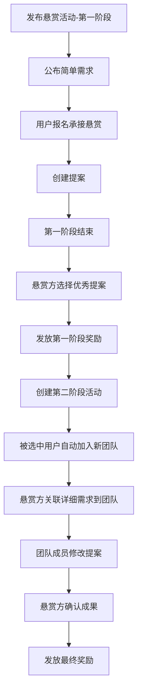

| 用户旅程 | 说明 | 数据操作 |
|---------|------|---------|
| 发布悬赏活动 | 可以发布一个活动作为悬赏任务 | `CREATE category`（type: bounty） |
| 承接悬赏 | 确认参加活动需要的规则要求，选择参加活动并成功报名即为承接悬赏 | `CREATE category:post` |
| 阶段性奖励发放 | 第一阶段结束后选择优秀提案，发放奖励并进入第二阶段 | `CREATE resource`（奖励） + `CREATE category`（第二阶段） |
| 自动组队 | 被选中晋级第二阶段的用户及其团队成员自动加入悬赏方新创建的团队 | `CREATE group` + `CREATE group:user`（批量） |
| 提案可见性控制 | 在悬赏活动中，参加用户的提案互相不可见 | `READ post`（权限控制） |

### 8.2 企业出题活动流程

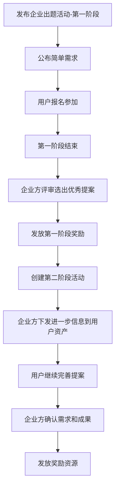

| 用户旅程 | 说明 | 数据操作 |
|---------|------|---------|
| 发布企业出题活动 | 可以发布一个企业出题活动 | `CREATE category`（type: enterprise_challenge） |
| 下发进一步信息 | 企业出题方可以把更进一步的信息作为文件直接发送到参加活动的用户的资产中 | `CREATE resource` + 关联到用户 |
| 提案可见性控制 | 在企业出题活动中，参加用户的提案互相不可见 | `READ post`（权限控制） |

---

## 9. 个性化相关

- **角色：** 已登录用户
- **前置条件：** 已登录

### 9.1 基本资料

| 用户旅程 | 说明 | 数据操作 |
|---------|------|---------|
| 更改头像 | 用户可以更改头像 | `UPDATE user`（avatar） |
| 更改个人简介 | 可以更改个人简介 | `UPDATE user`（bio） |
| 添加社交媒体 | 可以添加社交媒体链接可以让用户点击进入（作为一个帖子） | `CREATE post`（type: social_links） |
| 基本必要个人信息 | 用户的基本个人信息（ID，用户名等）会在个人主页中展示 | `READ user` |

### 9.2 扩展信息

| 用户旅程 | 说明 | 数据操作 |
|---------|------|---------|
| 完善选填个人信息 | 在各种活动中收集到的用户非基本个人信息也会显示在用户的个人主页。用户也可以在设置中添加完善自己的个人信息（学校、职业、性格、兴趣等） | `UPDATE user`（扩展字段） |
| 信息聚合展示 | 平台把这些信息聚合在个人主页或团队主页 | `READ user` / `READ group` |
| 隐私控制 | 用户有权自己决定哪些对外展示，哪些不对外展示 | `UPDATE user`（privacy_settings） |

---

## 10. 星球和营地页面

- **角色：** 已登录用户
- **前置条件：** 已登录

### 10.1 星球页面（活动入口整合）

| 功能 | 说明 | 数据操作 |
|------|------|---------|
| 展示所有活动入口 | 展示所有活动入口的整合页 | `READ category`（全列表） |
| 多种筛选方式 | 可以按照多种方式筛选活动分类，例如进行中、关联活动等 | `READ category`（带筛选条件） |

### 10.2 营地页面（个人内容整合）

| 功能 | 说明 | 数据操作 |
|------|------|---------|
| 展示个人提案 | 展示所有个人提案 | `READ post`（created_by: current_user, type: proposal） |
| 展示团队提案 | 展示所有团队提案 | `READ post`（group_id IN user_groups, type: proposal） |
| 展示参加的团队 | 展示参加的团队列表 | `READ group`（user_id: current_user） |

---

## 附录 A：User Lifetime 总览

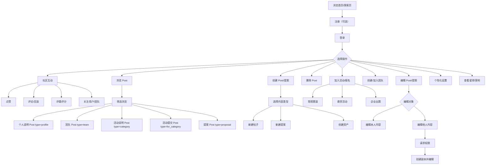

---

## 14. 关注与好友

- **角色：** 已登录用户
- **前置条件：** 已登录

> 基于 TC-FRIEND 测试用例。好友功能通过 `user:user` 关系实现，关注为单向关系，互关即好友。

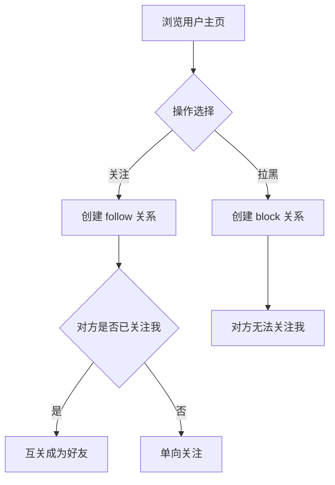

### 14.1 关注用户

| 步骤 | 用户操作 | 数据操作 | 说明 |
|------|---------|---------|------|
| 1 | 浏览目标用户主页 | `READ user` | 查看用户资料 |
| 2 | 点击关注 | `CREATE user:user`（relation_type: follow） | 建立单向关注关系 |
| 3 | 关注成功 | `READ user:user`（我的关注列表） | 目标用户出现在关注列表 |

**约束：**
- 不能关注自己（TC-FRIEND-900）
- 不能重复关注同一用户（TC-FRIEND-901）
- 被拉黑的用户无法关注你（TC-FRIEND-006）

### 14.2 互关成为好友

| 步骤 | 系统行为 | 数据操作 | 说明 |
|------|---------|---------|------|
| 1 | A 关注 B | `CREATE user:user`（A→B, follow） | A 的关注列表包含 B |
| 2 | B 回关 A | `CREATE user:user`（B→A, follow） | B 的关注列表包含 A |
| 3 | 系统判定好友 | 查询双向 follow 关系 | 互关状态 = true |

### 14.3 取消关注

| 步骤 | 用户操作 | 数据操作 | 说明 |
|------|---------|---------|------|
| 1 | 进入关注列表 | `READ user:user`（我的关注列表） | 查看已关注用户 |
| 2 | 点击取消关注 | `DELETE user:user`（relation_type: follow） | 解除单向关注 |
| 3 | 好友关系解除 | — | 若原为互关，降级为对方单向关注我 |

### 14.4 拉黑用户

| 步骤 | 用户操作 | 数据操作 | 说明 |
|------|---------|---------|------|
| 1 | 浏览目标用户主页 | `READ user` | 查看用户资料 |
| 2 | 点击拉黑 | `CREATE user:user`（relation_type: block） | 建立拉黑关系 |
| 3 | 拉黑生效 | — | 对方从好友列表移除，无法关注你 |

- **结果：** 用户可关注其他用户，互关成为好友；可拉黑用户阻止其关注

---

## 15. 多阶段/多赛道活动

- **角色：** 组织者（创建关联） / 参赛者（按阶段参与）
- **前置条件：** 已有多个活动

> 基于 TC-STAGE、TC-TRACK、TC-PREREQ、TC-CATREL 测试用例。活动关联功能通过 `category:category` 关系实现。

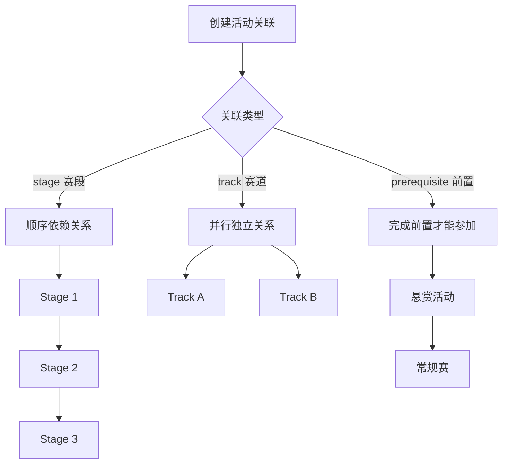

### 15.1 赛段（Stage）— 顺序依赖

| 步骤 | 操作者 | 数据操作 | 说明 |
|------|-------|---------|------|
| 1 | 组织者 | `CREATE category`（A、B、C） | 创建 3 个赛段活动 |
| 2 | 组织者 | `CREATE category:category`（A→B, stage, stage_order=1） | A 是 B 的前置赛段 |
| 3 | 组织者 | `CREATE category:category`（B→C, stage, stage_order=2） | B 是 C 的前置赛段 |
| 4 | 参赛者 | `CREATE category:group`（报名 B） | 若 A 未完成（未 closed），报名被拒绝 |
| 5 | 组织者 | `UPDATE category`（A status → closed） | 关闭赛段 A |
| 6 | 参赛者 | `CREATE category:group`（报名 B） | 现在可以报名赛段 B |

**约束：**
- 赛段链不能形成循环（TC-CATREL-902）
- 按 stage_order 升序排列赛段

### 15.2 赛道（Track）— 并行独立

| 步骤 | 操作者 | 数据操作 | 说明 |
|------|-------|---------|------|
| 1 | 组织者 | `CREATE category`（Main、Track1、Track2） | 创建主活动和 2 个赛道 |
| 2 | 组织者 | `CREATE category:category`（Main→Track1, track） | Track1 属于 Main |
| 3 | 组织者 | `CREATE category:category`（Main→Track2, track） | Track2 属于 Main |
| 4 | 参赛者 | `CREATE category:group`（报名 Track1） | 成功 |
| 5 | 参赛者 | `CREATE category:group`（报名 Track2） | 同一团队可同时参加不同赛道 |

**约束：**
- 同一赛道内仍受 Rule 约束（如 max_submissions）
- 不同赛道的约束相互独立

### 15.3 前置条件（Prerequisite）

| 步骤 | 操作者 | 数据操作 | 说明 |
|------|-------|---------|------|
| 1 | 组织者 | `CREATE category`（Bounty, Competition） | 创建悬赏活动和常规赛 |
| 2 | 组织者 | `CREATE category:category`（Bounty→Competition, prerequisite） | Bounty 是 Competition 的前置 |
| 3 | 参赛者 | `CREATE category:group`（报名 Competition） | 若未完成 Bounty，报名被拒绝 |
| 4 | 参赛者 | 完成 Bounty 活动 | Bounty 关闭且团队有 accepted 记录 |
| 5 | 参赛者 | `CREATE category:group`（报名 Competition） | 现在可以报名 |

**特性：**
- 前置活动中组建的团队保持完整进入目标活动
- 团队成员不因活动切换而变化

### 15.4 负向约束

| 约束 | 说明 |
|------|------|
| 不能自引用 | `source_category_id` ≠ `target_category_id`（TC-CATREL-901） |
| 唯一性约束 | 同一对活动只能有一条关联（TC-CATREL-900） |
| 枚举值限制 | relation_type 只能是 stage / track / prerequisite（TC-CATREL-903） |

- **结果：** 组织者可创建复杂的多阶段、多赛道活动结构，参赛者按规则顺序参与

---

## 16. 资产转移

- **角色：** 组织者 / 参赛者
- **前置条件：** 已有 resource 和 post

> 基于 TC-TRANSFER 测试用例。资产转移通过 `post:resource` 关系的解除和重建实现。

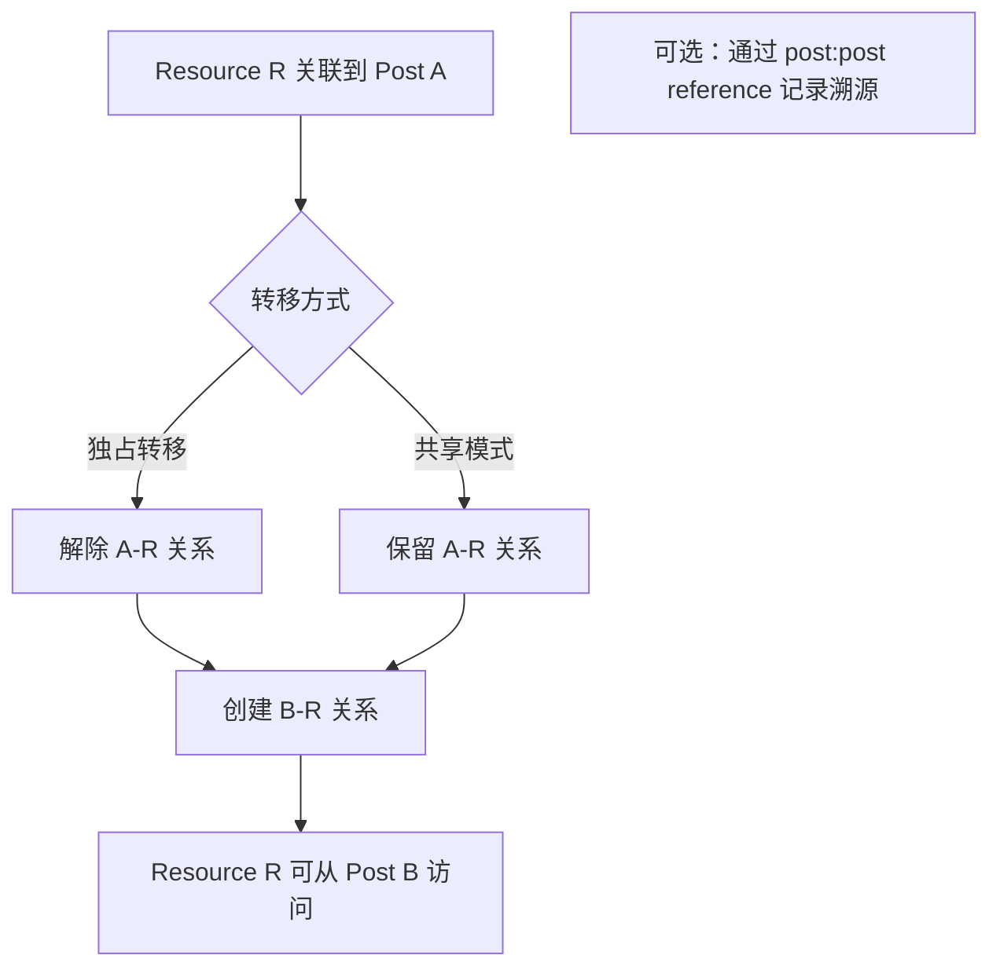

### 16.1 独占转移

| 步骤 | 用户操作 | 数据操作 | 说明 |
|------|---------|---------|------|
| 1 | 确认转移目标 | `READ post`（Post A、Post B） | 查看源和目标帖子 |
| 2 | 解除旧关联 | `DELETE post:resource`（A→R） | Post A 不再关联 R |
| 3 | 创建新关联 | `CREATE post:resource`（B→R） | Post B 关联 R |
| 4 | 验证转移结果 | `READ post:resource` | R 只出现在 Post B 的资源列表 |

**典型场景：**
- 证书从组织者管理帖转移到参赛帖（TC-TRANSFER-001）
- 提案附件在不同版本间转移（TC-TRANSFER-002）

### 16.2 共享模式

| 步骤 | 用户操作 | 数据操作 | 说明 |
|------|---------|---------|------|
| 1 | Post A 已关联 R | — | 现有关系 |
| 2 | 创建新关联 | `CREATE post:resource`（B→R） | Post B 也关联 R |
| 3 | 两个帖子共享 | `READ post:resource`（A 和 B） | R 同时出现在两个列表 |
| 4 | 删除其中一条 | `DELETE post:resource`（A→R） | 不影响 B→R 关系 |

**典型场景：**
- 同一附件在多个帖子中引用

### 16.3 转移溯源

| 步骤 | 用户操作 | 数据操作 | 说明 |
|------|---------|---------|------|
| 1 | 创建溯源关系 | `CREATE post:post`（B→A, reference） | Post B 引用 Post A |
| 2 | 执行转移 | DELETE + CREATE post:resource | R 从 A 转移到 B |
| 3 | 追溯来源 | `READ post:post`（B 的 reference） | 通过 B 可追溯到 A（R 的原始来源） |

- **结果：** 资源可在帖子间灵活转移，支持独占、共享和溯源模式

---

## 附录 A：报名规则定义（Rule Definition）

本节详细说明活动报名环节中 Rule 的定义方式与执行逻辑。Rule 由组织者在创建活动时定义，系统在用户报名时自动执行。

### 规则类型

| 规则名称 | 说明 | 用户行为约束 |
|---------|------|-------------|
| **Default**（默认） | 允许用户自由创建新 Post 参赛 | 无特殊限制 |
| **Not create Only Select** | 仅允许选择已有 Post，不可新建 | 屏蔽"新建"入口，强制跳转"选择 Post" |
| **Bounty** | 悬赏活动规则，提案互不可见 | 提案可见性受限 |
| **Enterprise Challenge** | 企业出题规则，提案互不可见 | 提案可见性受限 |
| （可扩展更多规则） | — | — |

### 规则执行流程

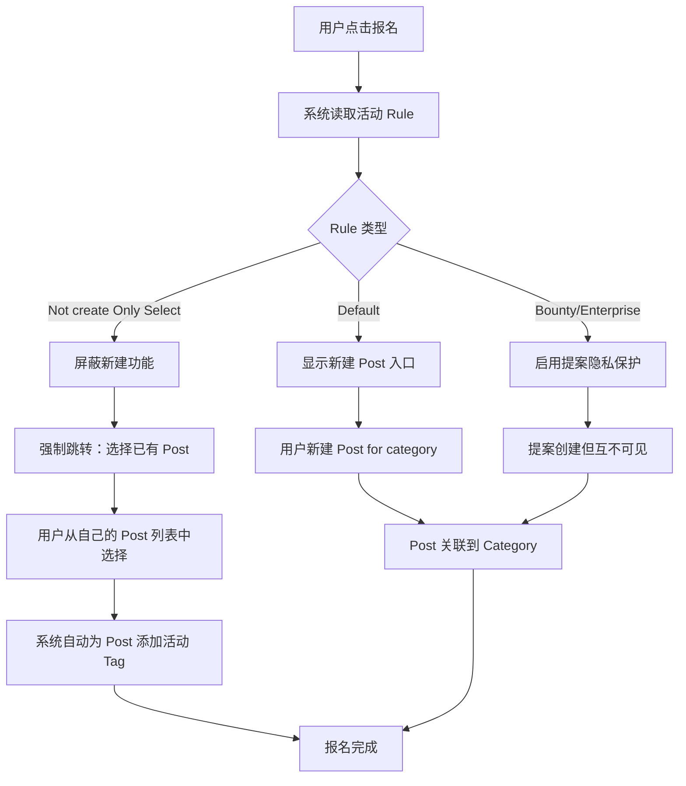

### 组织者配置 Rule

| 步骤 | 用户操作 | 数据操作 | 说明 |
|------|---------|---------|------|
| 1 | 进入 Rule 编辑页 | `READ rule` | 查看当前 Rule 配置 |
| 2 | 选择规则类型 | `UPDATE rule`（type 字段） | 设置为 Default / Not create Only Select / Bounty 等 |
| 3 | 配置附加参数 | `UPDATE rule` | 如：是否允许 public、审核人列表、提交截止时间、团队人数限制 |
| 4 | 配置报名字段 | `UPDATE rule`（registration_fields） | 设置报名时需要用户填写的信息字段 |
| 5 | 保存并关联到活动 | `UPDATE category:rule` | Rule 生效，影响后续所有报名用户 |

- **结果：** 活动规则配置完成，系统将根据 Rule 自动约束用户的报名行为

---

## 附录 B：声明式规则引擎

> 基于 TC-ENGINE 测试用例

规则引擎通过 Rule 的 `checks` 字段实现声明式约束，支持 pre（前置校验）和 post（后置动作）两个阶段。

### B.1 条件类型（Condition Types）

| 类型 | 说明 | 参数示例 |
|------|------|---------|
| `time_window` | 时间窗口限制 | `{ start: "2024-01-01", end: "2024-12-31" }` |
| `count` | 计数校验 | `{ entity: group_user, scope: group, filter: { status: accepted }, op: ">=", value: 2 }` |
| `exists` | 存在性检查 | `{ entity: post_resource, scope: post, require: true }` |
| `field_match` | 字段匹配 | `{ entity: category, field: status, op: "==", value: "published" }` |
| `resource_format` | 附件格式校验 | `{ formats: ["pdf", "zip"] }` |
| `resource_required` | 附件数量和格式 | `{ min_count: 2, formats: ["pdf"] }` |
| `aggregate` | 聚合计算 | `{ entity: group_user, agg_func: count, op: ">=", value: 2 }` |

### B.2 固定字段自动展开

Rule 的固定字段会自动展开为 checks：

| 固定字段 | 展开为 |
|---------|-------|
| `max_submissions=2` | `{ trigger: create_relation(category_post), phase: pre, condition: { type: count, ... } }` |
| `min_team_size=2` | `{ trigger: create_relation(category_group), phase: pre, condition: { type: count, ... } }` |

**执行顺序：** 固定字段展开的 check → 自定义 checks（TC-ENGINE-021）

### B.3 多 Rule 合并

当活动关联多条 Rule 时，所有 checks 合并后按 **AND 逻辑** 执行：

```
活动关联 Rule A + Rule B
→ Rule A 的 checks + Rule B 的 checks 全部执行
→ 任一 check 失败则操作被拒绝
```

### B.4 on_fail 行为

| 值 | 行为 | 说明 |
|----|------|------|
| `deny` | 拒绝操作 | 返回错误信息（默认） |
| `warn` | 允许并警告 | 操作成功但返回警告 |
| `flag` | 允许并标记 | 操作成功，对目标添加标记 |

### B.5 post phase 执行规则

- post phase 的 action 在主操作成功后执行
- 若 condition 不满足，action 不执行
- action 执行失败不回滚主操作（TC-ENGINE-042）

### B.6 空 checks 和无 Rule 场景

| 场景 | 行为 |
|------|------|
| Rule 的 checks 为空数组 | 无约束，所有操作通过 |
| 活动未关联任何 Rule | 无约束，所有操作通过 |
