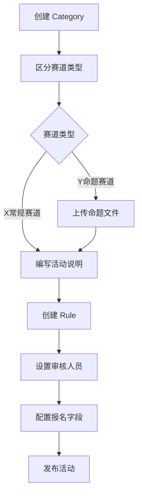
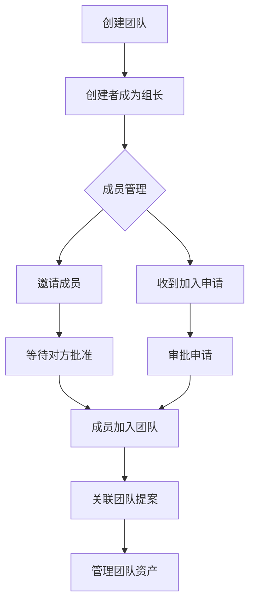
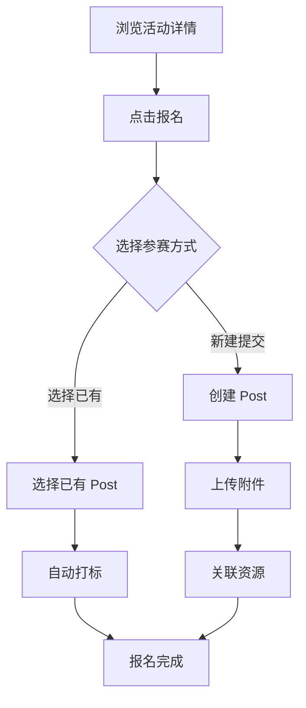
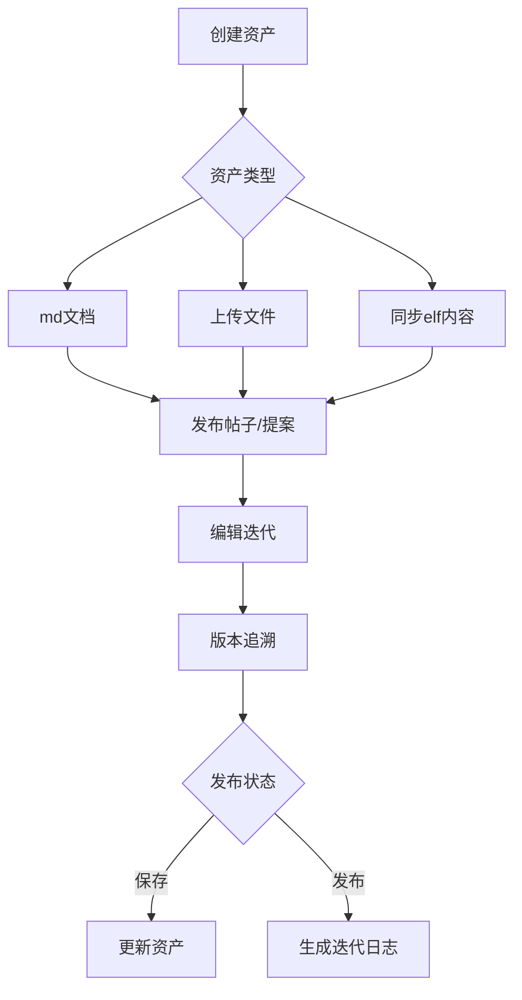
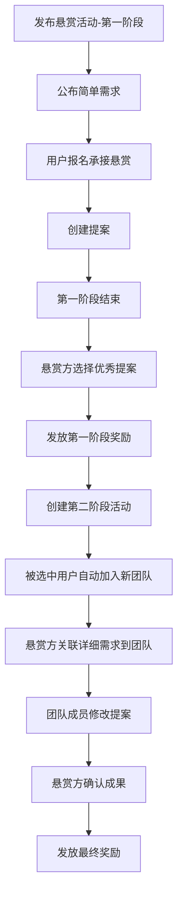
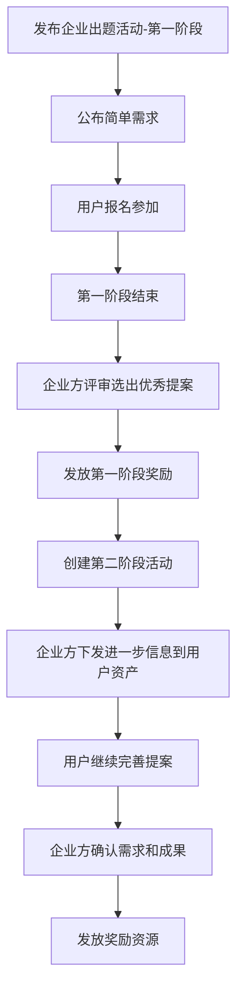
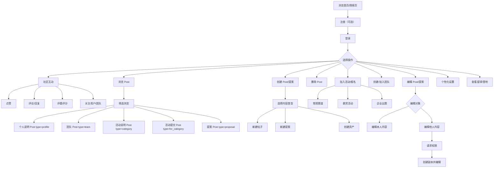
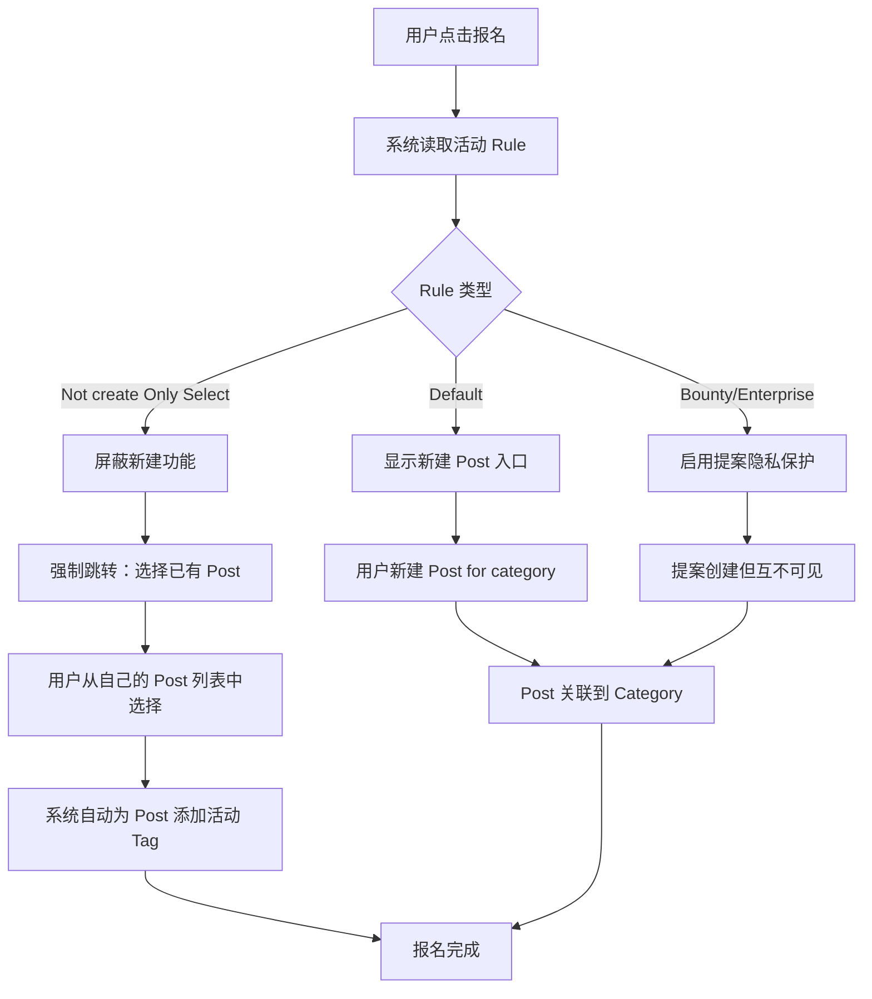

# 用户旅程

本文档描述 Synnovator 平台的完整用户旅程，面向开发团队，涵盖从内容浏览到活动参与、团队协作、内容创作、社交互动等全流程场景。

> 角色定义详见 [data-types.md](./data-types.md#角色定义)，数据类型详见 [data-types.md](./data-types.md)，关系详见 [relationships.md](./relationships.md)。

## 目录

- [1. 内容浏览](#1-内容浏览)
- [2. 设立活动相关](#2-设立活动相关)
- [3. 团队相关](#3-团队相关)
- [4. 参与活动与提交](#4-参与活动与提交)
- [5. 内容创作与迭代](#5-内容创作与迭代)
- [6. 社交互动与反馈](#6-社交互动与反馈)
- [7. 活动结算与奖励发放](#7-活动结算与奖励发放)
- [8. 悬赏与企业出题](#8-悬赏与企业出题)
- [9. 个性化相关](#9-个性化相关)
- [10. 星球和营地页面](#10-星球和营地页面)
- [附录 A：User Lifetime 总览](#附录-a-user-lifetime-总览)
- [附录 B：报名规则定义（Rule Definition）](#附录-b-报名规则定义rule-definition)

---

## 1. 内容浏览

- **角色：** 任何人（含未登录用户）
- **前置条件：** 无

### 1.1 基础浏览

| 用户旅程 | 说明 | 数据操作 |
|---------|------|---------|
| 浏览首页/探索页 | 查看当前热门或推荐的活动和帖子 | `READ category`（公开列表）, `READ post`（推荐列表） |
| 筛选内容 | 根据标签或详情界面搜索或设置内容类型筛选感兴趣的帖子 | `READ post`（带 tag/type 筛选） |
| 查看详情 | 点击并阅读活动说明帖或参赛提案 | `READ post` / `READ category` |
| 浏览热门帖子 | 点击右侧热点榜对应帖子跳转 | `READ post`（按热度排序） |

### 1.2 账号与登录

| 用户旅程 | 说明 | 数据操作 |
|---------|------|---------|
| 注册账号 | 通过手机号/邮箱及登录密码设置或手机验证码创建新账户 | `CREATE user` |
| 登录系统 | 使用已注册凭证进入已登录状态 | `READ user`（验证） |
| 忘记密码 | 通过手机号或邮箱进行找回，并重设个人登录密码 | `UPDATE user`（密码重置） |
| 维护个人资料 | 创建或更新个人简介，展示技能与背景 | `UPDATE user` / `CREATE post`（type: profile） |
| 完善个人信息 | 创建或更新职业、学校、性格、兴趣等个人信息 | `UPDATE user`（扩展字段） |
| 在登录后继续浏览 | 登录完成后继续回到各个页面浏览内容 | `READ post` / `READ category` |

### 1.3 导航与页面跳转

| 用户旅程 | 说明 | 数据操作 |
|---------|------|---------|
| 浏览内容时点击作者进入作者个人主页 | 点击帖子作者名跳转至个人空间 | `READ user`（详情） |
| 浏览团队内容时点击团队进入团队主页 | 通过团队展示卡片跳转 | `READ group`（详情） |
| 浏览团队页面时查看队友信息 | 点击具体用户进入对应个人主页 | `READ user`（详情） |
| 通过左侧多功能栏的链接进入对应页面 | 使用快捷侧边栏进行导航 | — |
| 点击左侧多功能栏寻求信息支持和人工协助 | 点击左侧多功能栏下方个人用户图标后，点击相应栏目 | — |

### 1.4 通知系统

| 用户旅程 | 说明 | 数据操作 |
|---------|------|---------|
| 点击通知提示查看通知 | 点击顶部或侧边的通知图标 | `READ notification`（列表） |
| 点击通知中的页面进入对应页面 | 从具体通知条目跳转至目标内容 | `READ post` / `READ category` / `READ group` |
| 点击通知中的按钮完成批准 | 直接在通知中心处理申请 | `UPDATE group:user` / `UPDATE` 相关关联 |

### 1.5 页面交互

上方搜索栏、左侧导航栏和右侧多功能栏在每个页面都显示：
- **搜索栏：** 点击上方搜索栏可以进行全局搜索
- **左侧导航栏：** 点击（探索、营地、星球、资产）分别进入对应页面
- **右侧多功能栏：** 常态显示日历和热度榜，点击消息后展示通知页面，点击发布后展示发布页面

---

## 2. 设立活动相关

- **角色：** 组织者（Organizer）
- **前置条件：** 已登录，拥有组织者权限

### 2.1 活动创建与配置

| 用户旅程 | 说明 | 数据操作 |
|---------|------|---------|
| 发起活动 | 组织者创建新的活动类别，区分X常规赛道和Y命题赛道 | `CREATE category` |
| 编写活动说明 | 详细描述活动的背景、目标、开始和结束时间和奖励 | `UPDATE category` |
| 设定活动规则 | 定义报名限制、提交截止日期及评审标准，包括任务要求、团队人数限制、提案内容合规性等 | `CREATE rule` + `CREATE category:rule` |
| 管理活动状态 | 将活动从草稿发布为正式，或在结束后关闭活动 | `UPDATE category`（状态变更） |
| 设置审核人员 | 指定哪些用户拥有对该活动提交内容的审核权限 | `UPDATE rule`（reviewers 配置） |
| 配置报名字段 | 每个活动的组织者可以设置希望报名用户填写哪些信息 | `UPDATE rule`（registration_fields） |

### 2.2 Y命题赛道特殊配置

Y命题赛道包含**企业命题活动**和**悬赏组队活动**，区别在于：
- 企业方和悬赏人可以上传个人文件（资产-文件）作为参赛命题
- 在活动页面让参赛者可以看到命题文件

| 用户旅程 | 说明 | 数据操作 |
|---------|------|---------|
| 上传命题文件 | 企业方/悬赏人上传资产文件作为参赛命题 | `CREATE resource` + `CREATE category:resource` |

### 2.3 活动评审与关联

| 用户旅程 | 说明 | 数据操作 |
|---------|------|---------|
| 评委给参赛内容打分 | 评委执行打分操作 | `CREATE interaction`（type: rating） |
| 活动之间可以互相关联 | 在活动页面建立与其他活动的连接 | `CREATE category:category` |
| 互相关联的活动可以使用同一个提案参赛 | 一个提案同时投递至多个关联活动 | `CREATE category:post`（多个关联） |

---

## 3. 团队相关

- **角色：** 参赛者
- **前置条件：** 已登录

### 3.1 团队创建与管理

| 用户旅程 | 说明 | 数据操作 |
|---------|------|---------|
| 创建团队 | 发起并命名一个新的团队，添加团队简介 | `CREATE group` |
| 关联团队提案 | 将个人提案作为团队提案与团队进行关联 | `CREATE group:post`（关联） |
| 邀请成员 | 在团队中搜索并邀请他人，等待对方批准 | `CREATE group:user`（status: pending） |
| 成员批准 | 被邀请成员可在通知界面选择加入/拒绝 | `UPDATE group:user`（status: accepted/rejected） |
| 申请加入团队 | 在目标团队主页点击申请，等待队长批准 | `CREATE group:user`（status: pending） |
| 审批成员申请 | 队长在通知或管理后台通过或拒绝他人的申请 | `UPDATE group:user`（status: accepted/rejected） |
| 成员退出/移除 | 成员主动退出或被队长移除出组 | `DELETE group:user` |

### 3.2 团队资产管理

| 用户旅程 | 说明 | 数据操作 |
|---------|------|---------|
| 解除关联逻辑 | 用户离开团队后，其个人资产解除与团队的关联，且不再能使用团队资产 | `DELETE` 相关资产关联 |
| 团队提案中资产 | 用户可以把自己的资产添加到团队提案中 | `CREATE post:resource` |
| 申请复制他人资产 | 非作者无法编辑他人上传到团队提案中的资产，但可以向作者申请复制这个资产，副本的作者就是申请人 | `CREATE resource`（复制操作） |
| 离开的队员资产 | 队员离开团队后，此队员的资产会自动解除和这个团队的关联 | `DELETE post:resource`（级联解除） |

---

## 4. 参与活动与提交

- **角色：** 参赛者
- **前置条件：** 已登录，目标活动已发布

### 4.1 报名参赛

| 用户旅程 | 说明 | 数据操作 |
|---------|------|---------|
| 报名参赛 | 点击活动报名按钮，选择对应的团队和提案 | `CREATE category:post` / `CREATE category:group` |
| 执行报名约束 | 系统核对任务、人数及内容是否符合活动 Rule | `READ rule`（校验） |
| 新建提交 | 根据活动规则直接创建新的参赛作品贴 | `CREATE post`（type: for_category） |
| 关联已有作品 | 从自己已发布的帖子中选择符合要求的作品 | `UPDATE post`（添加活动 tag） |
| 自动打标 | 报名成功后，选定的帖子自动获得专属活动标签（#for_category） | `UPDATE post`（添加 tag） |

### 4.2 附件与资源

| 用户旅程 | 说明 | 数据操作 |
|---------|------|---------|
| 上传附件 | 为参赛作品上传演示视频、文档或代码包等资源 | `CREATE resource` |
| 关联资源 | 将上传的资源链接到特定的参赛帖中 | `CREATE post:resource` |

---

## 5. 内容创作与迭代

- **角色：** 参赛者
- **前置条件：** 已登录

### 5.1 资产创建

| 用户旅程 | 说明 | 数据操作 |
|---------|------|---------|
| 创建个人资产 | 创作属于自己的文件资产（md文档，上传的各类文件视频图片等） | `CREATE resource` |
| 创建资产方式 | 通过系统自带的md编辑器；通过同步elf内容；本地上传文档 | `CREATE resource`（多种来源） |
| 创建资产文件 | 用户可以创建自己的文件作为自己的资产 | `CREATE resource` |

### 5.2 帖子与提案

| 用户旅程 | 说明 | 数据操作 |
|---------|------|---------|
| 发布帖子 | 使用自己的资产发布帖子 | `CREATE post` + `CREATE post:resource` |
| 发布提案 | 可以发布提案然后在提案中创建资产和放入自己的已有资产 | `CREATE post`（type: proposal） |
| 引用内容 | 在帖子中通过卡片形式嵌入团队信息或引用其他帖子 | `CREATE post:post`（关联） |

### 5.3 编辑与版本管理

| 用户旅程 | 说明 | 数据操作 |
|---------|------|---------|
| 编辑帖子 | 对自己已发布的帖子进行内容修改 | `UPDATE post` / `CREATE post`（新版本） |
| 编辑提案 | 对自己的提案标题和简介进行编辑，对提案中的资产进行编辑或创建新资产关联 | `UPDATE post` + `UPDATE resource` |
| 版本追溯 | 编辑帖子或提案后产生新版本，可查看历史修改记录 | `READ post`（版本历史） |
| 请求协作编辑 | 请求编辑他人的帖子或接受他人的协作请求 | 系统级通知机制 |
| 删除内容 | 删除不再需要的帖子、评论或资源（执行软删除） | `DELETE post` / `DELETE interaction` / `DELETE resource` |

### 5.4 提案资产更新与发布

| 用户旅程 | 说明 | 数据操作 |
|---------|------|---------|
| 资产更新 | 提案中的文件是用户的资产文件关联到提案。用户编辑提案中的文件相当于编辑自己的资产。资产可以在编辑时保存 | `UPDATE resource` |
| 提案发布 | 用户在提案中编辑资产后保存可以同步更新关联资产。但此时提案相当于更新了但还没有发布。用户可以多次更新提案中文件后选择发布 | `UPDATE post`（状态变更） |
| 提案发布版本更新历史 | 提案发布后版本更新。系统自动检测上一版本和当前版本的更新内容并生成迭代日志。迭代日志不可被用户更改，会展示在提案页面中 | `CREATE` 迭代日志（系统自动） |

---

## 6. 社交互动与反馈

- **角色：** 已登录用户（点赞/评论/关注）；评委/组织者（评分）
- **前置条件：** 已登录，目标内容对当前用户可见

### 6.1 点赞与评论

| 用户旅程 | 说明 | 数据操作 |
|---------|------|---------|
| 点赞 | 对喜欢的活动、帖子或资源执行点赞操作 | `CREATE interaction`（type: like） + `CREATE target:interaction` |
| 取消点赞 | 撤回之前的点赞行为 | `DELETE interaction` + `DELETE target:interaction` |
| 发表评论 | 在帖子下方留言或提出建议 | `CREATE interaction`（type: comment） + `CREATE target:interaction` |
| 回复评论 | 对现有的评论进行嵌套回复 | `CREATE interaction`（type: comment, parent_id） |
| 删除评论 | 撤回自己发表的言论 | `DELETE interaction` |

### 6.2 评分

| 用户旅程 | 说明 | 数据操作 |
|---------|------|---------|
| 多维度评分 | 评委根据评分维度（如创新性、技术实现）对作品打分 | `CREATE interaction`（type: rating, value: 多维度对象） |
| 查看评分详情 | 查看作品的加权总分及具体评语 | `READ interaction`（type: rating） |

### 6.3 关注与社交

| 用户旅程 | 说明 | 数据操作 |
|---------|------|---------|
| 关注其他用户 | 点击关注其他参赛者或组织者 | `CREATE user:user`（relation_type: follow） |
| 关注提案 | 订阅特定提案的更新动态 | `CREATE` 用户订阅关系 |
| 关注团队 | 订阅特定团队的动态 | `CREATE` 用户订阅关系 |
| 形成好友关系 | 用户之间互相关注后自动转为好友关系 | `UPDATE user:user`（relation_type: friend） |
| 分享 | 对活动、通知或帖子进行社交媒体分享 | — |

---

## 7. 活动结算与奖励发放

- **角色：** 参赛者 / 组织者
- **前置条件：** 活动已结束

### 7.1 结果查看与证书

| 用户旅程 | 说明 | 数据操作 |
|---------|------|---------|
| 查看评审结果 | 在活动结束后浏览获奖名单或排名榜单 | `READ post`（按 average_rating 排序） |
| 领取证书 | 在个人中心（个人资产）或活动页（资产）显示电子证书，并可点击下载 | `READ resource`（type: certificate） |
| 分享成就 | 将证书发布为新贴展示 | `CREATE post`（关联证书 resource） |
| 下载资源 | 下载官方资料或他人的公开分享资源 | `READ resource` |

### 7.2 运营活动与勋章

| 用户旅程 | 说明 | 数据操作 |
|---------|------|---------|
| 运营活动（任务） | 完成运营活动后用户也可以获得资产奖励。运营活动可以和其他活动绑定 | `CREATE resource`（奖励发放） |
| 资产使用 | 用户通过活动获得的勋章资产可以用于投票。在一些活动中会开启投票，投票会影响有些规则下的评分。有些投票只有关联活动的勋章才有效 | `READ resource` + `CREATE interaction`（type: vote） |
| 勋章投票 | 使用活动获得的勋章作为资产投票 | `CREATE interaction`（type: vote, requires: badge） |

---

## 8. 悬赏与企业出题

- **角色：** 悬赏发起方 / 企业出题方 / 参赛者
- **前置条件：** 已登录，拥有相应权限

### 8.1 悬赏活动流程

| 用户旅程 | 说明 | 数据操作 |
|---------|------|---------|
| 发布悬赏活动 | 可以发布一个活动作为悬赏任务 | `CREATE category`（type: bounty） |
| 承接悬赏 | 确认参加活动需要的规则要求，选择参加活动并成功报名即为承接悬赏 | `CREATE category:post` |
| 阶段性奖励发放 | 第一阶段结束后选择优秀提案，发放奖励并进入第二阶段 | `CREATE resource`（奖励） + `CREATE category`（第二阶段） |
| 自动组队 | 被选中晋级第二阶段的用户及其团队成员自动加入悬赏方新创建的团队 | `CREATE group` + `CREATE group:user`（批量） |
| 提案可见性控制 | 在悬赏活动中，参加用户的提案互相不可见 | `READ post`（权限控制） |

### 8.2 企业出题活动流程

| 用户旅程 | 说明 | 数据操作 |
|---------|------|---------|
| 发布企业出题活动 | 可以发布一个企业出题活动 | `CREATE category`（type: enterprise_challenge） |
| 下发进一步信息 | 企业出题方可以把更进一步的信息作为文件直接发送到参加活动的用户的资产中 | `CREATE resource` + 关联到用户 |
| 提案可见性控制 | 在企业出题活动中，参加用户的提案互相不可见 | `READ post`（权限控制） |

---

## 9. 个性化相关

- **角色：** 已登录用户
- **前置条件：** 已登录

### 9.1 基本资料

| 用户旅程 | 说明 | 数据操作 |
|---------|------|---------|
| 更改头像 | 用户可以更改头像 | `UPDATE user`（avatar） |
| 更改个人简介 | 可以更改个人简介 | `UPDATE user`（bio） |
| 添加社交媒体 | 可以添加社交媒体链接可以让用户点击进入（作为一个帖子） | `CREATE post`（type: social_links） |
| 基本必要个人信息 | 用户的基本个人信息（ID，用户名等）会在个人主页中展示 | `READ user` |

### 9.2 扩展信息

| 用户旅程 | 说明 | 数据操作 |
|---------|------|---------|
| 完善选填个人信息 | 在各种活动中收集到的用户非基本个人信息也会显示在用户的个人主页。用户也可以在设置中添加完善自己的个人信息（学校、职业、性格、兴趣等） | `UPDATE user`（扩展字段） |
| 信息聚合展示 | 平台把这些信息聚合在个人主页或团队主页 | `READ user` / `READ group` |
| 隐私控制 | 用户有权自己决定哪些对外展示，哪些不对外展示 | `UPDATE user`（privacy_settings） |

---

## 10. 星球和营地页面

- **角色：** 已登录用户
- **前置条件：** 已登录

### 10.1 星球页面（活动入口整合）

| 功能 | 说明 | 数据操作 |
|------|------|---------|
| 展示所有活动入口 | 展示所有活动入口的整合页 | `READ category`（全列表） |
| 多种筛选方式 | 可以按照多种方式筛选活动分类，例如进行中、关联活动等 | `READ category`（带筛选条件） |

### 10.2 营地页面（个人内容整合）

| 功能 | 说明 | 数据操作 |
|------|------|---------|
| 展示个人提案 | 展示所有个人提案 | `READ post`（created_by: current_user, type: proposal） |
| 展示团队提案 | 展示所有团队提案 | `READ post`（group_id IN user_groups, type: proposal） |
| 展示参加的团队 | 展示参加的团队列表 | `READ group`（user_id: current_user） |

---

## 附录 A：User Lifetime 总览

---

## 附录 B：报名规则定义（Rule Definition）

本节详细说明活动报名环节中 Rule 的定义方式与执行逻辑。Rule 由组织者在创建活动时定义，系统在用户报名时自动执行。

### 规则类型

| 规则名称 | 说明 | 用户行为约束 |
|---------|------|-------------|
| **Default**（默认） | 允许用户自由创建新 Post 参赛 | 无特殊限制 |
| **Not create Only Select** | 仅允许选择已有 Post，不可新建 | 屏蔽"新建"入口，强制跳转"选择 Post" |
| **Bounty** | 悬赏活动规则，提案互不可见 | 提案可见性受限 |
| **Enterprise Challenge** | 企业出题规则，提案互不可见 | 提案可见性受限 |
| （可扩展更多规则） | — | — |

### 规则执行流程

### 组织者配置 Rule

| 步骤 | 用户操作 | 数据操作 | 说明 |
|------|---------|---------|------|
| 1 | 进入 Rule 编辑页 | `READ rule` | 查看当前 Rule 配置 |
| 2 | 选择规则类型 | `UPDATE rule`（type 字段） | 设置为 Default / Not create Only Select / Bounty 等 |
| 3 | 配置附加参数 | `UPDATE rule` | 如：是否允许 public、审核人列表、提交截止时间、团队人数限制 |
| 4 | 配置报名字段 | `UPDATE rule`（registration_fields） | 设置报名时需要用户填写的信息字段 |
| 5 | 保存并关联到活动 | `UPDATE category:rule` | Rule 生效，影响后续所有报名用户 |

- **结果：** 活动规则配置完成，系统将根据 Rule 自动约束用户的报名行为
