# 用户旅程

本文档描述 Synnovator 平台的核心用户旅程，面向开发团队，每个场景包含角色、前置条件、步骤序列及对应的数据操作（CRUD）。

> 角色定义详见 [data-types.md](./data-types.md#角色定义)，数据类型详见 [data-types.md](./data-types.md)，关系详见 [relationships.md](./relationships.md)。

## 目录

- [1. User Lifetime 总览](#1-user-lifetime-总览)
- [2. 浏览探索页](#2-浏览探索页)
- [3. 注册](#3-注册)
- [4. 登录](#4-登录)
- [5. 用户登录与加入组](#5-用户登录与加入组)
- [6. 创建活动](#6-创建活动)
- [7. 加入活动（报名参赛）](#7-加入活动报名参赛)
- [8. 创建团队](#8-创建团队)
- [9. 发送帖子](#9-发送帖子)
- [10. 活动结束与颁奖](#10-活动结束与颁奖)
- [11. 编辑 Post（版本管理与发布审核）](#11-编辑-post版本管理与发布审核)
- [12. 删除 Post](#12-删除-post)
- [13. 社区互动（点赞、评论、评分）](#13-社区互动点赞评论评分)
- [14. 关注与好友](#14-关注与好友)
- [15. 多阶段/多赛道活动](#15-多阶段多赛道活动)
- [16. 资产转移](#16-资产转移)
- [附录 A：报名规则定义（Rule Definition）](#附录-a报名规则定义rule-definition)
- [附录 B：声明式规则引擎](#附录-b声明式规则引擎)

---

## 1. User Lifetime 总览

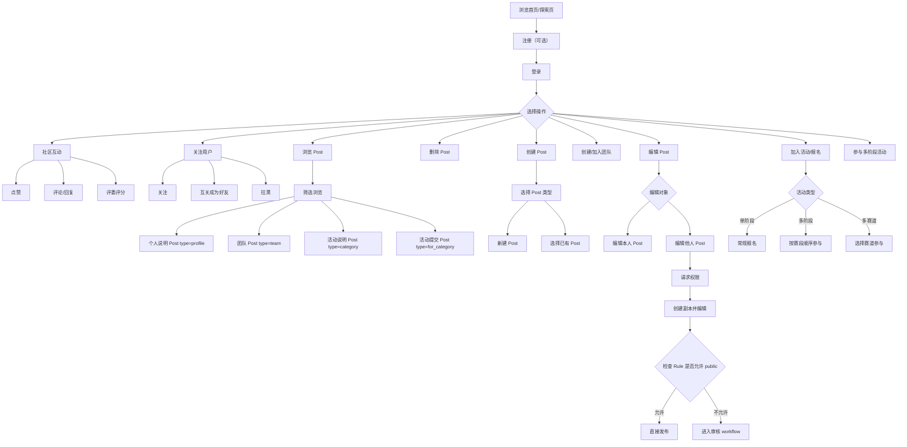

---

## 2. 浏览探索页

- **角色：** 任何人（含未登录用户）
- **前置条件：** 无

| 步骤 | 用户操作 | 数据操作 | 说明 |
|------|---------|---------|------|
| 1 | 访问平台首页 | `READ category`（公开列表） | 获取公开活动列表 |
| 2 | 浏览活动卡片 | `READ category` + `READ rule`（摘要） | 展示活动名称、简介、关联规则摘要 |
| 3 | 浏览公开帖子 | `READ post`（公开列表，带 tag 筛选） | 按标签筛选帖子（提案帖、日常帖等） |
| 4 | 点击查看详情 | `READ post` / `READ category` | 查看单条内容详情 |

### 2.1 可见性规则

> 基于 TC-PERM-020 至 TC-PERM-025 测试用例

| 内容类型 | 可见性条件 | 说明 |
|---------|-----------|------|
| Category（活动） | `status=published` | draft 状态的活动对访客不可见 |
| Post（帖子） | `status=published` + `visibility=public` | draft 帖子、private 帖子对非作者不可见 |
| Group（团队） | `visibility=public` | private 团队仅成员可见 |
| Resource（资源） | 继承关联 Post 的可见性 | 若关联帖子不可见，则资源也不可见 |

- **结果：** 用户了解平台活动内容，可决定是否注册参与

---

## 3. 注册

- **角色：** 未注册用户
- **前置条件：** 无

| 步骤 | 用户操作 | 数据操作 | 说明 |
|------|---------|---------|------|
| 1 | 点击注册 | — | 进入注册流程 |
| 2 | 填写基本信息 | — | 用户名、邮箱、密码等 |
| 3 | 提交注册 | `CREATE user` | 创建用户记录 |
| 4 | （可选）完善个人资料 | `CREATE post`（type: profile） | 创建个人说明帖 |

- **结果：** 用户获得账号，默认角色为参赛者

---

## 4. 登录

- **角色：** 已注册用户
- **前置条件：** 已完成注册

| 步骤 | 用户操作 | 数据操作 | 说明 |
|------|---------|---------|------|
| 1 | 输入凭证 | `READ user`（验证） | 验证用户身份 |
| 2 | 登录成功 | — | 返回会话令牌 |
| 3 | 进入主页 | `READ category`（个性化列表） | 展示用户相关的活动和内容 |

- **结果：** 用户进入已登录状态，解锁完整功能

---

## 5. 用户登录与加入组

- **角色：** 参赛者
- **前置条件：** 已登录

| 步骤 | 用户操作 | 数据操作 | 说明 |
|------|---------|---------|------|
| 1 | 浏览可加入的 Group | `READ group`（公开列表） | 查看可加入的团队/分组 |
| 2 | 选择目标 Group | `READ group`（详情） | 查看 Group 详情和成员列表 |
| 3 | 申请加入 | `CREATE group:user`（关联，role=member） | 将 user 关联到 group；`require_approval=true` 时 status 初始为 `pending`，否则自动为 `accepted` |
| 4 | （若需审批）等待审批 | — | Group Owner/Admin 批准：`UPDATE group:user`（status → accepted） |
| 5 | 加入成功 | `READ group`（成员列表） | 用户成为 Group 成员 |

- **结果：** 用户成为某个 Group 的成员，可以以团队身份参与活动

---

## 6. 创建活动

- **角色：** 组织者（Organizer）
- **前置条件：** 已登录，拥有组织者权限
- **权限约束：** participant 不能创建 category 或 rule（TC-PERM-001/002）

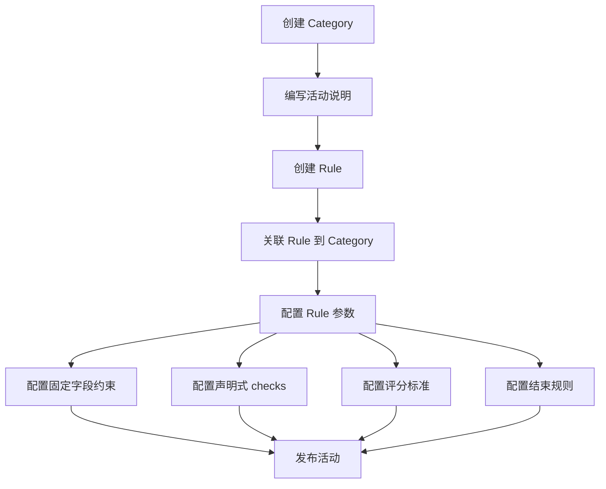

| 步骤 | 用户操作 | 数据操作 | 说明 |
|------|---------|---------|------|
| 1 | 创建活动 | `CREATE category` | 填写活动基本信息（YAML + Markdown） |
| 2 | 编写活动说明 | `UPDATE category` | 补充活动详细说明（Markdown） |
| 3 | 创建活动规则 | `CREATE rule` | 定义活动规则（提交要求、评分标准、审核配置等） |
| 4 | 关联规则到活动 | `CREATE category : rule`（关联） | 将 Rule 绑定到 Category |
| 5 | 配置规则参数 | `UPDATE rule` | 设置是否允许 public、审核人配置、提交截止时间等 |
| 6 | 发布活动 | `UPDATE category`（状态变更） | 活动对外可见，参赛者可报名 |

### 6.1 Rule 配置详解

> 基于 TC-ENTRY、TC-CLOSE、TC-ENGINE 测试用例

#### 6.1.1 固定字段约束

| 字段 | 类型 | 说明 | 示例 |
|------|------|------|------|
| `max_submissions` | int | 每用户最大提交数 | `1`（每人只能提交一次） |
| `min_team_size` | int | 团队最小人数 | `2`（至少 2 人） |
| `max_team_size` | int | 团队最大人数 | `5`（最多 5 人） |
| `submission_format` | string[] | 允许的附件格式 | `["pdf", "zip"]` |
| `allow_public` | bool | 是否允许直接发布 | `false`（需审核） |

#### 6.1.2 声明式 checks 配置

```yaml
checks:
  # 报名前置条件：必须已有 profile 帖子
  - trigger: create_relation(category_group)
    phase: pre
    condition:
      type: exists
      params:
        entity: post
        scope: user
        filter: { type: profile, status: published }
        require: true
    on_fail: deny
    message: "请先完善个人资料"

  # 提交前置条件：帖子必须包含 PDF 附件
  - trigger: create_relation(category_post)
    phase: pre
    condition:
      type: resource_required
      params:
        min_count: 1
        formats: ["pdf"]
    on_fail: deny
    message: "提案必须包含 PDF 附件"

  # 活动关闭后：自动计算排名
  - trigger: update_content(category.status)
    phase: post
    condition:
      type: field_match
      params: { field: status, op: "==", value: closed }
    action: compute_ranking
    action_params:
      source_field: average_rating
      order: desc
      output_tag_prefix: "rank_"

  # 活动关闭后：自动颁发证书
  - trigger: update_content(category.status)
    phase: post
    condition:
      type: field_match
      params: { field: status, op: "==", value: closed }
    action: award_certificate
    action_params:
      awards:
        - rank_range: [1, 1]
          name: "一等奖"
        - rank_range: [2, 3]
          name: "二等奖"
        - rank_range: [4, 10]
          name: "优秀奖"
```

- **结果：** 一个完整的活动已创建并发布，包含关联的规则配置

---

## 7. 加入活动（报名参赛）

- **角色：** 参赛者
- **前置条件：** 已登录，目标活动已发布

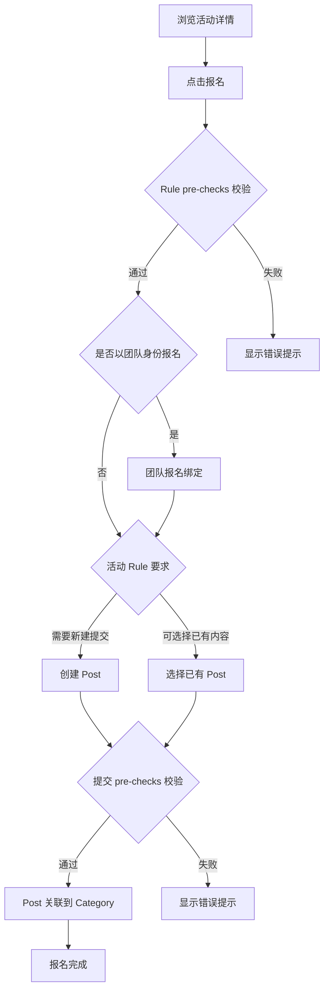

| 步骤 | 用户操作 | 数据操作 | 说明 |
|------|---------|---------|------|
| 1 | 浏览活动详情 | `READ category` + `READ rule` | 查看活动说明和规则要求 |
| 2 | 点击报名 | — | 系统自动读取该活动关联的 Rule |
| 3 | （若团队参赛）团队报名绑定 | `CREATE category:group`（关联） | 将团队绑定到活动；同一 group 在同一 category 中只能注册一次 |
| 4a | （路径A）新建 Post | `CREATE post`（type: for_category） | 按 Rule 要求创建提交内容 |
| 4b | （路径B）选择已有 Post | `READ post`（用户自己的列表） | 从自己的帖子中选择 |
| 5a | 关联 Post 到活动 | `CREATE category:post`（关联，relation_type: submission） | 将新建的 Post 关联到 Category |
| 5b | 为 Post 打活动标签 | `UPDATE post`（添加 tag `#for_<category>`） | 为已有 Post 添加活动标签 |
| 6 | 报名完成 | — | 用户成为活动参与者 |

### 7.1 报名规则校验（Entry Rule Enforcement）

> 基于 TC-ENTRY 测试用例

报名和提交操作会触发 Rule 的 `checks` 校验，校验在 `pre` 阶段执行：

| 触发点 | 校验内容 | 失败处理 |
|-------|---------|---------|
| `create_relation(category_group)` | 团队报名前置条件 | `on_fail: deny` 拒绝操作 |
| `create_relation(category_post)` | 帖子提交前置条件 | `on_fail: deny` 拒绝操作 |

#### 常见校验场景

| 场景 | condition type | 说明 |
|------|---------------|------|
| 必须已有 profile 帖子 | `exists` | 用户需先完善个人资料 |
| 必须已有团队报名 | `exists` | 提交前需先报名活动 |
| 必须包含附件 | `resource_required` | 提案需包含指定数量/格式的附件 |
| 限制提交次数 | `count` | 每用户在同一活动中只能提交一次 |
| 时间窗口限制 | `time_window` | 在指定时间范围内才能提交 |
| 团队人数限制 | `count` | 团队成员数满足 min/max 要求 |

#### 校验失败示例

```
❌ 报名失败：请先完善个人资料（TC-ENTRY-003）
❌ 提交失败：提案必须包含至少一个 PDF 附件（TC-ENTRY-011）
❌ 提交失败：每个用户只能提交一个参赛提案（TC-ENTRY-020）
```

- **结果：** 用户（或团队）成功报名活动，其 Post 作为参赛内容与活动关联

---

## 8. 创建团队

- **角色：** 参赛者
- **前置条件：** 已登录

| 步骤 | 用户操作 | 数据操作 | 说明 |
|------|---------|---------|------|
| 1 | 创建团队 | `CREATE group` | 填写团队名称、简介等信息 |
| 2 | 创建者自动成为组长 | `CREATE group : user`（关联，role=owner） | 创建者关联为团队 owner |
| 3 | 邀请成员 / 分享链接 | — | 生成邀请链接或直接邀请 |
| 4 | 成员接受邀请 | `CREATE group : user`（关联，role=member） | 新成员关联到团队 |
| 5 | （可选）创建团队介绍帖 | `CREATE post`（type: team） | 创建团队介绍帖，可在活动中展示 |

- **结果：** 团队创建完成，成员可以以团队身份参与活动

---

## 9. 发送帖子

- **角色：** 参赛者
- **前置条件：** 已登录

帖子类型包括**提案帖**和**日常帖**，均支持标签系统和自定义渲染。

### 9.1 发送日常帖

| 步骤 | 用户操作 | 数据操作 | 说明 |
|------|---------|---------|------|
| 1 | 新建帖子 | `CREATE post` | 编写 Markdown 内容 |
| 2 | （可选）上传附件 | `CREATE resource` | 上传文件资源 |
| 3 | （可选）关联附件 | `CREATE post : resource`（关联） | 将资源关联到帖子 |
| 4 | （可选）关联其他帖子 | `CREATE post : post`（关联） | 引用/关联其他帖子 |
| 5 | 添加标签 | `UPDATE post`（添加 tag） | 运营人员或用户打标签 |
| 6 | 发布 | `UPDATE post`（状态变更） | 帖子公开可见 |

### 9.2 发送提案帖（含团队卡片）

| 步骤 | 用户操作 | 数据操作 | 说明 |
|------|---------|---------|------|
| 1 | 新建帖子 | `CREATE post` | 编写提案内容（Markdown） |
| 2 | 插入团队卡片 | `CREATE post : post`（关联 `#team` Post） | 在帖子中嵌入团队介绍帖 |
| 3 | （可选）插入提案卡片 | `CREATE post : post`（关联提案 Post） | 嵌入已有提案内容 |
| 4 | 编写文字描述 | `UPDATE post` | 补充文字说明 |
| 5 | 添加标签 | `UPDATE post`（添加 tag） | 添加相关标签（如 `#找队友`） |
| 6 | 发布 | `UPDATE post`（状态变更） | 帖子公开可见 |

- **结果：** 帖子发布成功，在探索页和活动页可被其他用户浏览

---

## 10. 活动结束与颁奖

- **角色：** 组织者（关闭活动）/ 参赛者（获得证书）
- **前置条件：** 活动已发布，有参赛团队和提交内容

> 基于 TC-CLOSE 测试用例

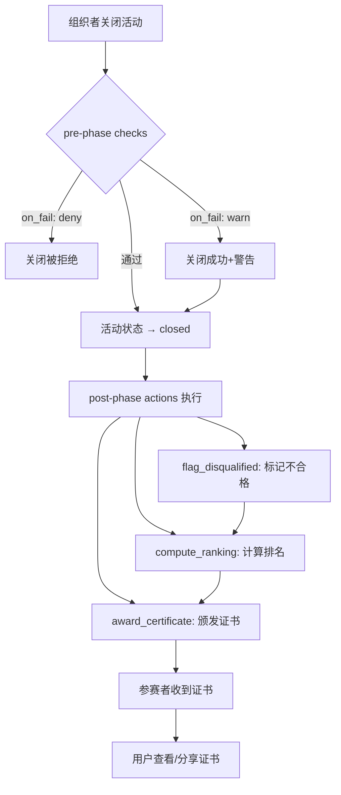

### 10.1 活动关闭流程

| 步骤 | 操作者 | 数据操作 | 说明 |
|------|-------|---------|------|
| 1 | 组织者 | `UPDATE category`（status → closed） | 触发关闭流程 |
| 2 | 系统 | 执行 pre-phase checks | 关闭前校验（如所有团队是否有提交） |
| 3 | 系统 | 执行 post-phase actions | 关闭后自动处理（终审、排名、颁奖） |

### 10.2 关闭前校验（pre phase）

| 校验类型 | on_fail | 说明 |
|---------|---------|------|
| 所有团队人数满足要求 | `warn` | 警告但允许关闭 |
| 所有团队有提交内容 | `deny` | 严格校验，不满足则拒绝关闭 |

### 10.3 关闭后自动处理（post phase）

#### 10.3.1 标记不合格（flag_disqualified）

| 步骤 | 系统行为 | 数据操作 | 说明 |
|------|---------|---------|------|
| 1 | 扫描所有报名团队 | `READ category:group` | 获取参赛团队列表 |
| 2 | 检查团队人数 | `READ group:user` | 验证 min_team_size 要求 |
| 3 | 标记不合格团队 | `UPDATE group`（添加 tag） | 如 "team_too_small" |
| 4 | 检查提交内容 | `READ category:post` | 验证提交要求 |
| 5 | 标记不合格提交 | `UPDATE post`（添加 tag） | 如 "missing_attachment" |

#### 10.3.2 计算排名（compute_ranking）

| 步骤 | 系统行为 | 数据操作 | 说明 |
|------|---------|---------|------|
| 1 | 获取合格提交 | `READ category:post`（排除已标记不合格） | 过滤有效参赛帖 |
| 2 | 按 average_rating 排序 | — | 降序排列 |
| 3 | 添加排名标签 | `UPDATE post`（添加 tag） | 如 "rank_1"、"rank_2"、"rank_3" |

**排名规则：**
- 相同分数并列排名（如两个 rank_1，下一个为 rank_3）
- `average_rating` 为 null 的帖子不参与排名

#### 10.3.3 自动颁发证书（award_certificate）

| 步骤 | 系统行为 | 数据操作 | 说明 |
|------|---------|---------|------|
| 1 | 根据排名确定奖项 | — | 按 rank_range 匹配奖项名称 |
| 2 | 生成证书文件 | `CREATE resource`（type: certificate） | 证书 PDF |
| 3 | 创建证书帖子 | `CREATE post`（type: certificate, status: published） | 公开可见 |
| 4 | 关联证书到帖子 | `CREATE post:resource`（display_type: attachment） | 挂载证书文件 |

**奖项配置示例：**

```yaml
awards:
  - rank_range: [1, 1]
    name: "一等奖"
  - rank_range: [2, 3]
    name: "二等奖"
  - rank_range: [4, 10]
    name: "优秀奖"
```

### 10.4 用户获取证书

| 步骤 | 用户操作 | 数据操作 | 说明 |
|------|---------|---------|------|
| 1 | 收到颁奖通知 | — | 系统推送通知 |
| 2 | 查看证书帖子 | `READ post`（type: certificate） | 证书帖子已自动创建 |
| 3 | 下载证书文件 | `READ resource` | 获取证书 PDF |
| 4 | （可选）分享证书 | `CREATE post`（引用证书帖） | 发帖展示荣誉 |

- **结果：** 活动正式关闭，排名和证书自动生成，获奖者可查看和分享证书

---

## 11. 编辑 Post（版本管理与发布审核）

- **角色：** 参赛者 / 组织者
- **前置条件：** 已登录，目标 Post 已存在

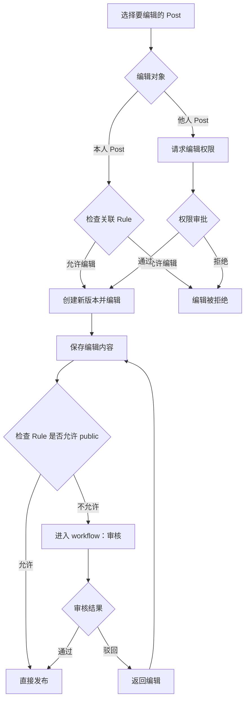

### 11.1 编辑本人 Post

| 步骤 | 用户操作 | 数据操作 | 说明 |
|------|---------|---------|------|
| 1 | 进入 Post 编辑页 | `READ post` + `READ rule` | 读取 Post 内容及关联的 Rule |
| 2 | 检查编辑权限 | `READ rule`（权限校验） | 系统检查 Rule 是否允许编辑（如活动截止后不可编辑） |
| 3 | 创建新版本 | `CREATE post`（新版本，关联旧版本） | 基于当前内容创建版本副本，旧版本保留 |
| 4 | 编辑内容 | `UPDATE post`（新版本） | 在新版本上进行修改 |
| 5 | 提交发布 | — | 触发发布检查 |
| 6a | （路径 A）直接发布 | `UPDATE post`（状态 → published） | Rule 允许 public 时直接发布 |
| 6b | （路径 B）进入审核 | `UPDATE post`（状态 → pending_review） | Rule 不允许直接 public，进入组织者审核 |
| 7 | （若审核）等待审核结果 | — | 组织者审核 |
| 8 | 审核通过/驳回 | `UPDATE post`（状态 → published / rejected） | 审核结果决定是否发布 |

- **结果：** Post 新版本发布成功或进入审核流程；旧版本保留可追溯

### 11.2 编辑他人 Post

> **注意：** 编辑权限请求目前依赖系统级通知机制，不直接映射到 data-types.md 中定义的内容类型。具体实现可通过 `interaction`（type: comment，附带权限请求语义）或独立的系统通知模块承载。

| 步骤 | 用户操作 | 数据操作 | 说明 |
|------|---------|---------|------|
| 1 | 浏览他人 Post | `READ post` | 查看目标 Post 内容 |
| 2 | 请求编辑权限 | （系统级通知） | 向 Post 作者发起编辑权限申请 |
| 3 | 等待作者审批 | — | 作者收到通知并决定是否授权 |
| 4 | 获得授权 | （系统级通知 → approved） | 权限请求通过 |
| 5 | 创建新版本并编辑 | `CREATE post`（新版本） + `UPDATE post` | 同 11.1 步骤 3-4 |
| 6 | 提交发布 | 同 11.1 步骤 5-8 | 走相同的发布流程 |

- **结果：** 协作编辑完成，版本历史记录完整

---

## 12. 删除 Post

- **角色：** 参赛者（删除本人 Post） / 管理员（删除任意 Post）
- **前置条件：** 已登录，目标 Post 存在

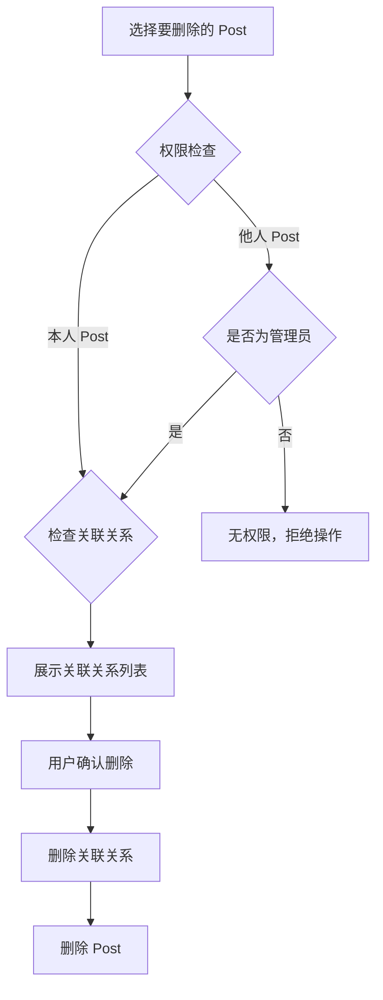

| 步骤 | 用户操作 | 数据操作 | 说明 |
|------|---------|---------|------|
| 1 | 选择要删除的 Post | `READ post` | 查看 Post 详情 |
| 2 | 点击删除 | `READ category : post` + `READ post : post` + `READ post : resource` | 系统查询所有关联关系 |
| 3 | 查看关联关系提示 | — | 系统展示该 Post 的关联信息（所属活动、引用的帖子、附件等） |
| 4 | 确认删除 | — | 用户确认删除操作 |
| 5 | 删除关联关系 | `DELETE category:post` + `DELETE post:post` + `DELETE post:resource` | 移除 Post 与 Category、其他 Post、Resource 的关联 |
| 6 | 删除关联 interaction | 通过 `target:interaction` 关系查找并软删除所有交互记录，然后解除 `target:interaction` 关系 | 级联软删除所有点赞、评论、评分；若为父评论则级联删除子回复 |
| 7 | 删除 Post | `DELETE post` | 删除 Post 本体 |
| 8 | （可选）清理孤立资源 | `DELETE resource`（无关联的资源） | 若关联的 Resource 不再被其他 Post 引用，可选择清理 |

- **结果：** Post 及其关联关系和交互记录被彻底删除，关联的资源视情况保留或清理

---

## 13. 社区互动（点赞、评论、评分）

- **角色：** 已登录用户（点赞/评论）；评委/组织者（评分）
- **前置条件：** 已登录，目标内容对当前用户可见

### 13.1 点赞

| 步骤 | 用户操作 | 数据操作 | 说明 |
|------|---------|---------|------|
| 1 | 浏览目标内容 | `READ post` / `READ category` | 查看帖子或活动 |
| 2 | 点击点赞 | `CREATE interaction`（type: like） | 创建点赞交互记录（不含目标信息） |
| 3 | 关联到目标 | `CREATE target:interaction` | 将点赞关联到目标内容（触发去重校验 + 缓存更新） |
| — | （系统自动）更新计数 | `UPDATE post`（like_count +1） | 由步骤 3 自动触发缓存统计重算 |

- **结果：** 点赞成功，目标内容的 like_count 实时更新

### 13.2 发表评论与回复

| 步骤 | 用户操作 | 数据操作 | 说明 |
|------|---------|---------|------|
| 1 | 浏览目标内容 | `READ post` / `READ category` | 查看帖子或活动 |
| 2 | 编写评论 | `CREATE interaction`（type: comment, value: 评论文本） | 创建评论交互记录（不含目标信息） |
| 3 | 关联到目标 | `CREATE target:interaction` | 将评论关联到目标内容（触发缓存更新） |
| — | （系统自动）更新计数 | `UPDATE post`（comment_count +1） | 由步骤 3 自动触发缓存统计重算 |
| 4 | （可选）回复评论 | `CREATE interaction`（type: comment, parent_id: 父评论 ID） + `CREATE target:interaction` | 创建嵌套回复并关联到同一目标 |

- **结果：** 评论发布成功，支持嵌套回复，comment_count 实时更新

### 13.3 评委多维度评分

- **角色：** 评委 / 组织者
- **前置条件：** 已登录，拥有评审权限（在 Rule.reviewers 列表中）

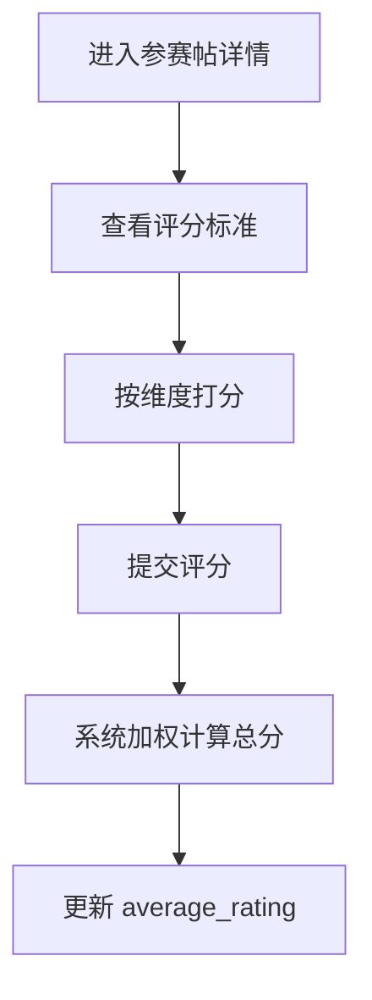

| 步骤 | 用户操作 | 数据操作 | 说明 |
|------|---------|---------|------|
| 1 | 进入参赛帖详情 | `READ post` + `READ category:rule` | 查看帖子内容及关联的评分标准 |
| 2 | 查看评分标准 | `READ rule`（scoring_criteria） | 获取各维度名称、权重、说明 |
| 3 | 按维度打分 | — | 评委对每个维度独立评分（0-100） |
| 4 | 提交评分 | `CREATE interaction`（type: rating, value: 多维度评分对象） | value 为对象，Key 与 scoring_criteria.name 一一对应（不含目标信息） |
| 5 | 关联到目标 | `CREATE target:interaction` | 将评分关联到参赛帖（触发 average_rating 重算） |
| — | （系统自动）更新均分 | `UPDATE post`（average_rating 重算） | 由步骤 5 自动触发，按 weight 加权计算总分均值 |

**rating value 示例：**

```yaml
value:
  创新性: 87        # 0-100，weight=30
  技术实现: 82      # 0-100，weight=30
  实用价值: 78      # 0-100，weight=25
  演示效果: 91      # 0-100，weight=15
  _comment: "架构设计清晰，建议完善错误处理"
# 系统加权总分: 87×0.30 + 82×0.30 + 78×0.25 + 91×0.15 = 83.85
```

- **结果：** 评分提交成功，参赛帖的 average_rating 实时更新，支持排行榜展示

---

## 14. 关注与好友

- **角色：** 已登录用户
- **前置条件：** 已登录

> 基于 TC-FRIEND 测试用例。好友功能通过 `user:user` 关系实现，关注为单向关系，互关即好友。

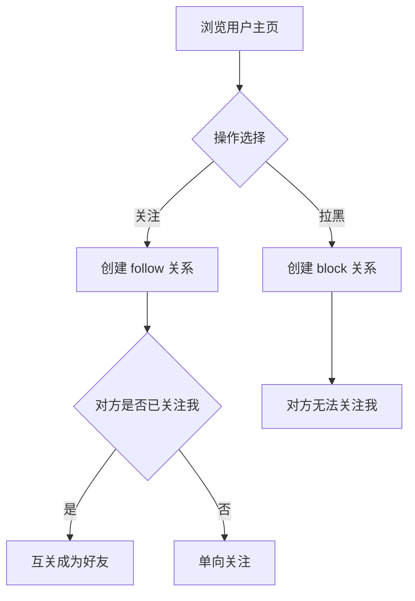

### 14.1 关注用户

| 步骤 | 用户操作 | 数据操作 | 说明 |
|------|---------|---------|------|
| 1 | 浏览目标用户主页 | `READ user` | 查看用户资料 |
| 2 | 点击关注 | `CREATE user:user`（relation_type: follow） | 建立单向关注关系 |
| 3 | 关注成功 | `READ user:user`（我的关注列表） | 目标用户出现在关注列表 |

**约束：**
- 不能关注自己（TC-FRIEND-900）
- 不能重复关注同一用户（TC-FRIEND-901）
- 被拉黑的用户无法关注你（TC-FRIEND-006）

### 14.2 互关成为好友

| 步骤 | 系统行为 | 数据操作 | 说明 |
|------|---------|---------|------|
| 1 | A 关注 B | `CREATE user:user`（A→B, follow） | A 的关注列表包含 B |
| 2 | B 回关 A | `CREATE user:user`（B→A, follow） | B 的关注列表包含 A |
| 3 | 系统判定好友 | 查询双向 follow 关系 | 互关状态 = true |

### 14.3 取消关注

| 步骤 | 用户操作 | 数据操作 | 说明 |
|------|---------|---------|------|
| 1 | 进入关注列表 | `READ user:user`（我的关注列表） | 查看已关注用户 |
| 2 | 点击取消关注 | `DELETE user:user`（relation_type: follow） | 解除单向关注 |
| 3 | 好友关系解除 | — | 若原为互关，降级为对方单向关注我 |

### 14.4 拉黑用户

| 步骤 | 用户操作 | 数据操作 | 说明 |
|------|---------|---------|------|
| 1 | 浏览目标用户主页 | `READ user` | 查看用户资料 |
| 2 | 点击拉黑 | `CREATE user:user`（relation_type: block） | 建立拉黑关系 |
| 3 | 拉黑生效 | — | 对方从好友列表移除，无法关注你 |

- **结果：** 用户可关注其他用户，互关成为好友；可拉黑用户阻止其关注

---

## 15. 多阶段/多赛道活动

- **角色：** 组织者（创建关联） / 参赛者（按阶段参与）
- **前置条件：** 已有多个活动

> 基于 TC-STAGE、TC-TRACK、TC-PREREQ、TC-CATREL 测试用例。活动关联功能通过 `category:category` 关系实现。

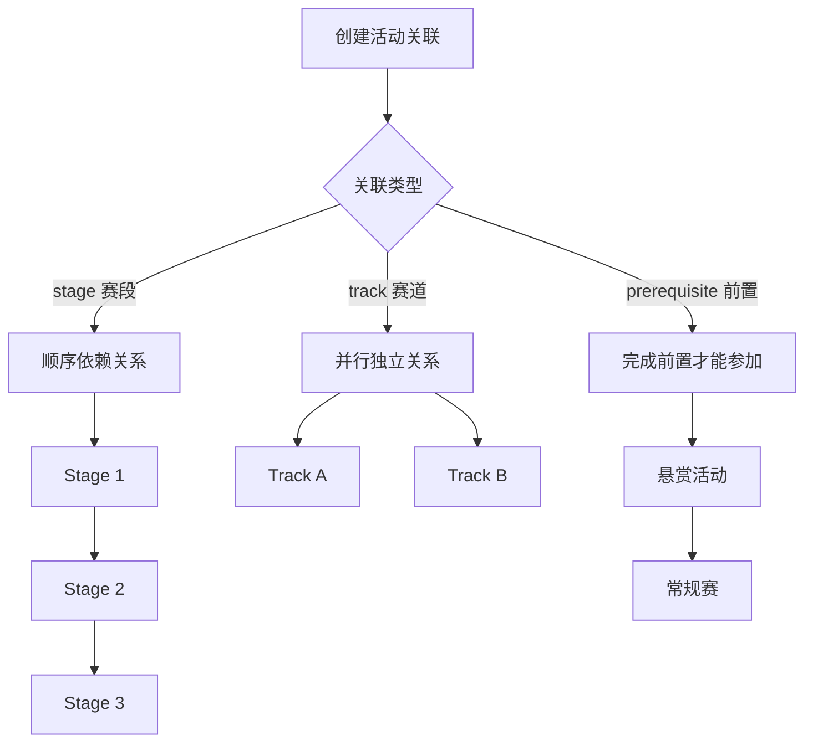

### 15.1 赛段（Stage）— 顺序依赖

| 步骤 | 操作者 | 数据操作 | 说明 |
|------|-------|---------|------|
| 1 | 组织者 | `CREATE category`（A、B、C） | 创建 3 个赛段活动 |
| 2 | 组织者 | `CREATE category:category`（A→B, stage, stage_order=1） | A 是 B 的前置赛段 |
| 3 | 组织者 | `CREATE category:category`（B→C, stage, stage_order=2） | B 是 C 的前置赛段 |
| 4 | 参赛者 | `CREATE category:group`（报名 B） | 若 A 未完成（未 closed），报名被拒绝 |
| 5 | 组织者 | `UPDATE category`（A status → closed） | 关闭赛段 A |
| 6 | 参赛者 | `CREATE category:group`（报名 B） | 现在可以报名赛段 B |

**约束：**
- 赛段链不能形成循环（TC-CATREL-902）
- 按 stage_order 升序排列赛段

### 15.2 赛道（Track）— 并行独立

| 步骤 | 操作者 | 数据操作 | 说明 |
|------|-------|---------|------|
| 1 | 组织者 | `CREATE category`（Main、Track1、Track2） | 创建主活动和 2 个赛道 |
| 2 | 组织者 | `CREATE category:category`（Main→Track1, track） | Track1 属于 Main |
| 3 | 组织者 | `CREATE category:category`（Main→Track2, track） | Track2 属于 Main |
| 4 | 参赛者 | `CREATE category:group`（报名 Track1） | 成功 |
| 5 | 参赛者 | `CREATE category:group`（报名 Track2） | 同一团队可同时参加不同赛道 |

**约束：**
- 同一赛道内仍受 Rule 约束（如 max_submissions）
- 不同赛道的约束相互独立

### 15.3 前置条件（Prerequisite）

| 步骤 | 操作者 | 数据操作 | 说明 |
|------|-------|---------|------|
| 1 | 组织者 | `CREATE category`（Bounty, Competition） | 创建悬赏活动和常规赛 |
| 2 | 组织者 | `CREATE category:category`（Bounty→Competition, prerequisite） | Bounty 是 Competition 的前置 |
| 3 | 参赛者 | `CREATE category:group`（报名 Competition） | 若未完成 Bounty，报名被拒绝 |
| 4 | 参赛者 | 完成 Bounty 活动 | Bounty 关闭且团队有 accepted 记录 |
| 5 | 参赛者 | `CREATE category:group`（报名 Competition） | 现在可以报名 |

**特性：**
- 前置活动中组建的团队保持完整进入目标活动
- 团队成员不因活动切换而变化

### 15.4 负向约束

| 约束 | 说明 |
|------|------|
| 不能自引用 | `source_category_id` ≠ `target_category_id`（TC-CATREL-901） |
| 唯一性约束 | 同一对活动只能有一条关联（TC-CATREL-900） |
| 枚举值限制 | relation_type 只能是 stage / track / prerequisite（TC-CATREL-903） |

- **结果：** 组织者可创建复杂的多阶段、多赛道活动结构，参赛者按规则顺序参与

---

## 16. 资产转移

- **角色：** 组织者 / 参赛者
- **前置条件：** 已有 resource 和 post

> 基于 TC-TRANSFER 测试用例。资产转移通过 `post:resource` 关系的解除和重建实现。

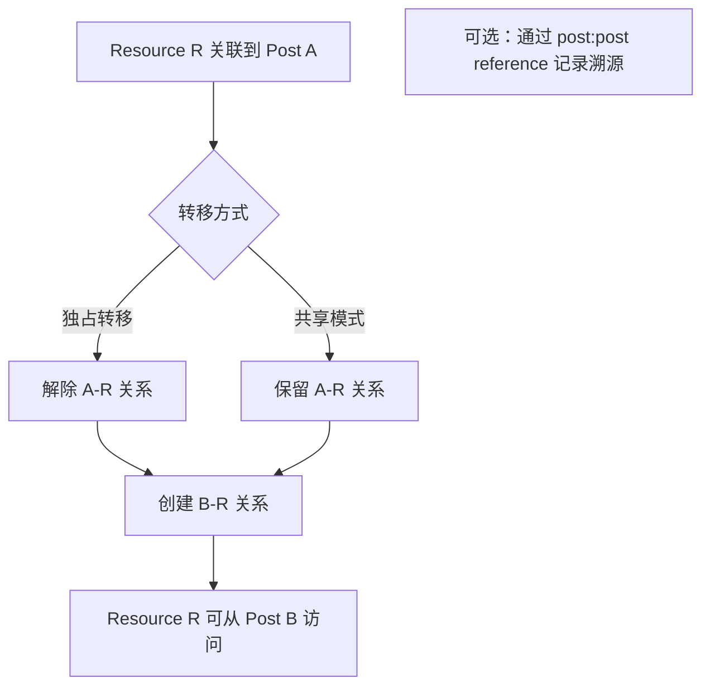

### 16.1 独占转移

| 步骤 | 用户操作 | 数据操作 | 说明 |
|------|---------|---------|------|
| 1 | 确认转移目标 | `READ post`（Post A、Post B） | 查看源和目标帖子 |
| 2 | 解除旧关联 | `DELETE post:resource`（A→R） | Post A 不再关联 R |
| 3 | 创建新关联 | `CREATE post:resource`（B→R） | Post B 关联 R |
| 4 | 验证转移结果 | `READ post:resource` | R 只出现在 Post B 的资源列表 |

**典型场景：**
- 证书从组织者管理帖转移到参赛帖（TC-TRANSFER-001）
- 提案附件在不同版本间转移（TC-TRANSFER-002）

### 16.2 共享模式

| 步骤 | 用户操作 | 数据操作 | 说明 |
|------|---------|---------|------|
| 1 | Post A 已关联 R | — | 现有关系 |
| 2 | 创建新关联 | `CREATE post:resource`（B→R） | Post B 也关联 R |
| 3 | 两个帖子共享 | `READ post:resource`（A 和 B） | R 同时出现在两个列表 |
| 4 | 删除其中一条 | `DELETE post:resource`（A→R） | 不影响 B→R 关系 |

**典型场景：**
- 同一附件在多个帖子中引用

### 16.3 转移溯源

| 步骤 | 用户操作 | 数据操作 | 说明 |
|------|---------|---------|------|
| 1 | 创建溯源关系 | `CREATE post:post`（B→A, reference） | Post B 引用 Post A |
| 2 | 执行转移 | DELETE + CREATE post:resource | R 从 A 转移到 B |
| 3 | 追溯来源 | `READ post:post`（B 的 reference） | 通过 B 可追溯到 A（R 的原始来源） |

- **结果：** 资源可在帖子间灵活转移，支持独占、共享和溯源模式

---

## 附录 A：报名规则定义（Rule Definition）

本节详细说明活动报名环节中 Rule 的定义方式与执行逻辑。Rule 由组织者在创建活动时定义，系统在用户报名时自动执行。

### 规则类型

| 规则名称 | 说明 | 用户行为约束 |
|---------|------|-------------|
| **Default**（默认） | 允许用户自由创建新 Post 参赛 | 无特殊限制 |
| **Not create Only Select** | 仅允许选择已有 Post，不可新建 | 屏蔽"新建"入口，强制跳转"选择 Post" |
| （可扩展更多规则） | — | — |

### 规则执行流程：Not create Only Select

该规则约束了用户只能选择已有的Post，而不允许新建Post。

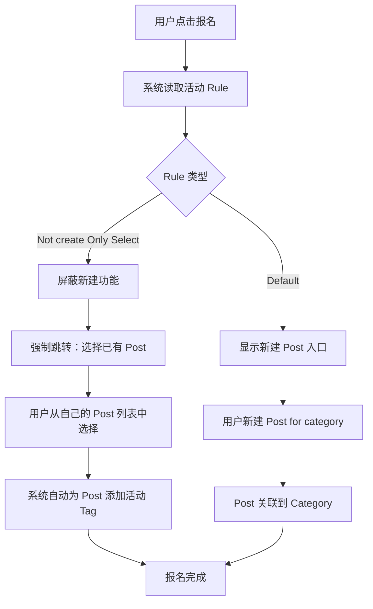

### 规则执行细节

| 步骤 | 系统行为 | 数据操作 | 说明 |
|------|---------|---------|------|
| 1 | 读取活动 Rule | `READ category : rule` | 获取活动关联的 Rule 配置 |
| 2 | 判断 Rule 类型 | — | 解析 Rule 中的约束条件 |
| 3a | （Default）展示创建入口 | — | 用户可自由新建 Post |
| 3b | （Not create Only Select）屏蔽创建入口 | — | 前端隐藏"新建 Post"按钮 |
| 4b | 展示已有 Post 列表 | `READ post`（用户自己的 Post 列表） | 用户只能从已有 Post 中选择 |
| 5b | 用户选择 Post | — | 用户点选目标 Post |
| 6b | 自动添加活动 Tag | `UPDATE post`（添加 `#for_<category>` tag） | 系统自动执行 "Add Tag for category" |
| 7b | 关联 Post 到 Category | `CREATE category : post`（关联） | 建立 Post 与活动的关联 |

### 组织者配置 Rule

| 步骤 | 用户操作 | 数据操作 | 说明 |
|------|---------|---------|------|
| 1 | 进入 Rule 编辑页 | `READ rule` | 查看当前 Rule 配置 |
| 2 | 选择规则类型 | `UPDATE rule`（type 字段） | 设置为 Default / Not create Only Select 等 |
| 3 | 配置附加参数 | `UPDATE rule` | 如：是否允许 public、审核人列表、提交截止时间 |
| 4 | 保存并关联到活动 | `UPDATE category : rule` | Rule 生效，影响后续所有报名用户 |

- **结果：** 活动规则配置完成，系统将根据 Rule 自动约束用户的报名行为

---

## 附录 B：声明式规则引擎

> 基于 TC-ENGINE 测试用例

规则引擎通过 Rule 的 `checks` 字段实现声明式约束，支持 pre（前置校验）和 post（后置动作）两个阶段。

### B.1 条件类型（Condition Types）

| 类型 | 说明 | 参数示例 |
|------|------|---------|
| `time_window` | 时间窗口限制 | `{ start: "2024-01-01", end: "2024-12-31" }` |
| `count` | 计数校验 | `{ entity: group_user, scope: group, filter: { status: accepted }, op: ">=", value: 2 }` |
| `exists` | 存在性检查 | `{ entity: post_resource, scope: post, require: true }` |
| `field_match` | 字段匹配 | `{ entity: category, field: status, op: "==", value: "published" }` |
| `resource_format` | 附件格式校验 | `{ formats: ["pdf", "zip"] }` |
| `resource_required` | 附件数量和格式 | `{ min_count: 2, formats: ["pdf"] }` |
| `aggregate` | 聚合计算 | `{ entity: group_user, agg_func: count, op: ">=", value: 2 }` |

### B.2 固定字段自动展开

Rule 的固定字段会自动展开为 checks：

| 固定字段 | 展开为 |
|---------|-------|
| `max_submissions=2` | `{ trigger: create_relation(category_post), phase: pre, condition: { type: count, ... } }` |
| `min_team_size=2` | `{ trigger: create_relation(category_group), phase: pre, condition: { type: count, ... } }` |

**执行顺序：** 固定字段展开的 check → 自定义 checks（TC-ENGINE-021）

### B.3 多 Rule 合并

当活动关联多条 Rule 时，所有 checks 合并后按 **AND 逻辑** 执行：

```
活动关联 Rule A + Rule B
→ Rule A 的 checks + Rule B 的 checks 全部执行
→ 任一 check 失败则操作被拒绝
```

### B.4 on_fail 行为

| 值 | 行为 | 说明 |
|----|------|------|
| `deny` | 拒绝操作 | 返回错误信息（默认） |
| `warn` | 允许并警告 | 操作成功但返回警告 |
| `flag` | 允许并标记 | 操作成功，对目标添加标记 |

### B.5 post phase 执行规则

- post phase 的 action 在主操作成功后执行
- 若 condition 不满足，action 不执行
- action 执行失败不回滚主操作（TC-ENGINE-042）

### B.6 空 checks 和无 Rule 场景

| 场景 | 行为 |
|------|------|
| Rule 的 checks 为空数组 | 无约束，所有操作通过 |
| 活动未关联任何 Rule | 无约束，所有操作通过 |
