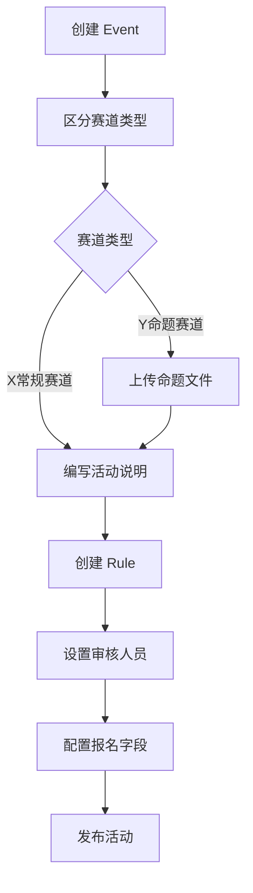

# 2. 设立活动相关

- **角色：** 组织者（Organizer）
- **前置条件：** 已登录，拥有组织者权限
- **权限约束：** participant 不能创建 event 或 rule（TC-PERM-001/002）



## 2.1 活动创建与配置

| 用户旅程 | 说明 | 数据操作 |
|---------|------|---------|
| 发起活动 | 组织者创建新的活动类别，区分X常规赛道和Y命题赛道 | `CREATE event` |
| 编写活动说明 | 详细描述活动的背景、目标、开始和结束时间和奖励 | `UPDATE event` |
| 设定活动规则 | 定义报名限制、提交截止日期及评审标准，包括任务要求、团队人数限制、提案内容合规性等 | `CREATE rule` + `CREATE event:rule` |
| 管理活动状态 | 将活动从草稿发布为正式，或在结束后关闭活动 | `UPDATE event`（状态变更） |
| 设置审核人员 | 指定哪些用户拥有对该活动提交内容的审核权限 | `UPDATE rule`（reviewers 配置） |
| 配置报名字段 | 每个活动的组织者可以设置希望报名用户填写哪些信息 | `UPDATE rule`（registration_fields） |

## 2.2 Y命题赛道特殊配置

Y命题赛道包含**企业命题活动**和**悬赏组队活动**，区别在于：
- 企业方和悬赏人可以上传个人文件（资产-文件）作为参赛命题
- 在活动页面让参赛者可以看到命题文件

| 用户旅程 | 说明 | 数据操作 |
|---------|------|---------|
| 上传命题文件 | 企业方/悬赏人上传资产文件作为参赛命题 | `CREATE resource` + `CREATE event:resource` |

## 2.3 活动评审与关联

| 用户旅程 | 说明 | 数据操作 |
|---------|------|---------|
| 评委给参赛内容打分 | 评委执行打分操作 | `CREATE interaction`（type: rating） |
| 活动之间可以互相关联 | 在活动页面建立与其他活动的连接 | `CREATE event:event` |
| 互相关联的活动可以使用同一个提案参赛 | 一个提案同时投递至多个关联活动 | `CREATE event:post`（多个关联） |

## 2.4 Rule 配置详解

> 基于 TC-ENTRY、TC-CLOSE、TC-ENGINE 测试用例

### 2.4.1 固定字段约束

| 字段 | 类型 | 说明 | 示例 |
|------|------|------|------|
| `max_submissions` | int | 每用户最大提交数 | `1`（每人只能提交一次） |
| `min_team_size` | int | 团队最小人数 | `2`（至少 2 人） |
| `max_team_size` | int | 团队最大人数 | `5`（最多 5 人） |
| `submission_format` | string[] | 允许的附件格式 | `["pdf", "zip"]` |
| `allow_public` | bool | 是否允许直接发布 | `false`（需审核） |

### 2.4.2 声明式 checks 配置

```yaml
checks:
  # 报名前置条件：必须已有 profile 帖子
  - trigger: create_relation(event_group)
    phase: pre
    condition:
      type: exists
      params:
        entity: post
        scope: user
        filter: { type: profile, status: published }
        require: true
    on_fail: deny
    message: "请先完善个人资料"

  # 提交前置条件：帖子必须包含 PDF 附件
  - trigger: create_relation(event_post)
    phase: pre
    condition:
      type: resource_required
      params:
        min_count: 1
        formats: ["pdf"]
    on_fail: deny
    message: "提案必须包含 PDF 附件"

  # 活动关闭后：自动计算排名
  - trigger: update_content(event.status)
    phase: post
    condition:
      type: field_match
      params: { field: status, op: "==", value: closed }
    action: compute_ranking
    action_params:
      source_field: average_rating
      order: desc
      output_tag_prefix: "rank_"

  # 活动关闭后：自动颁发证书
  - trigger: update_content(event.status)
    phase: post
    condition:
      type: field_match
      params: { field: status, op: "==", value: closed }
    action: award_certificate
    action_params:
      awards:
        - rank_range: [1, 1]
          name: "一等奖"
        - rank_range: [2, 3]
          name: "二等奖"
        - rank_range: [4, 10]
          name: "优秀奖"
```

- **结果：** 一个完整的活动已创建并发布，包含关联的规则配置
