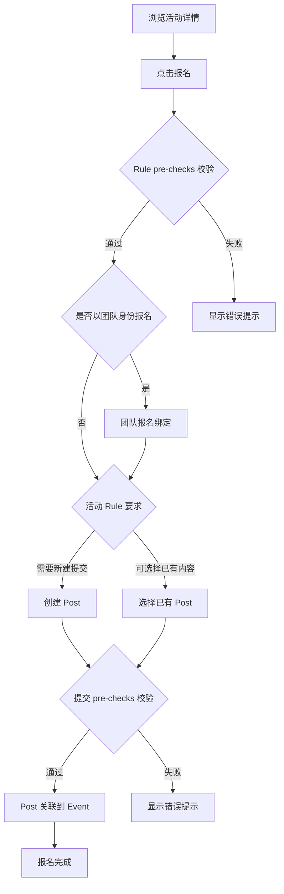

# 4. 参与活动与提交

- **角色：** 参赛者
- **前置条件：** 已登录，目标活动已发布



## 4.1 报名参赛与内容提交

| 用户旅程 | 说明 | 数据操作 |
|---------|------|---------|
| 浏览活动详情 | 查看活动说明、规则和奖励 | `READ event` + `READ rule` |
| 点击报名 | 发起报名请求 | 触发 Rule pre-checks |
| 团队报名 | 以团队身份报名活动 | `CREATE event:group` |
| 个人报名 | 以个人身份报名活动 | `CREATE event:user` |
| 提交参赛内容 | 将帖子关联到活动 | `CREATE event:post` |
| **自动打标** | 报名成功后，关联的提案 Post 会自动获得该活动的专属标签（如 `#for_category`），用于标识内容归属 | `UPDATE post` (tags append `#for_category`) |

## 4.2 报名规则校验（Entry Rule Enforcement）

> 基于 TC-ENTRY 测试用例

报名和提交操作会触发 Rule 的 `checks` 校验，校验在 `pre` 阶段执行：

| 触发点 | 校验内容 | 失败处理 |
|-------|---------|---------|
| `create_relation(event_group)` | 团队报名前置条件 | `on_fail: deny` 拒绝操作 |
| `create_relation(event_post)` | 帖子提交前置条件 | `on_fail: deny` 拒绝操作 |

### 常见校验场景

| 场景 | condition type | 说明 |
|------|---------------|------|
| **活动状态限制** | `status` | 已结束 (`ended`) 的活动**禁止报名**；未开始但处于报名期 (`enrollment_window`) 的活动允许报名 |
| **报名时间限制** | `time_window` | 必须在 `enrollment_start` 和 `enrollment_end` 之间提交，否则**禁止报名** |
| **重复报名校验** | `unique_enrollment` | 用户或其所在团队若已报名，**禁止重复报名** |
| 必须已有 profile 帖子 | `exists` | 用户需先完善个人资料 |
| 必须包含附件 | `resource_required` | 提案需包含指定数量/格式的附件 |
| 团队人数限制 | `count` | 团队成员数满足 min/max 要求 |

### 校验失败示例

```
❌ 报名失败：当前不在报名时间段内
❌ 报名失败：您或您的团队已经报名参加了该活动
❌ 提交失败：提案必须包含至少一个 PDF 附件（TC-ENTRY-011）
```

- **结果：** 用户（或团队）成功报名活动，其 Post 作为参赛内容与活动关联，并自动获得活动专属标签
