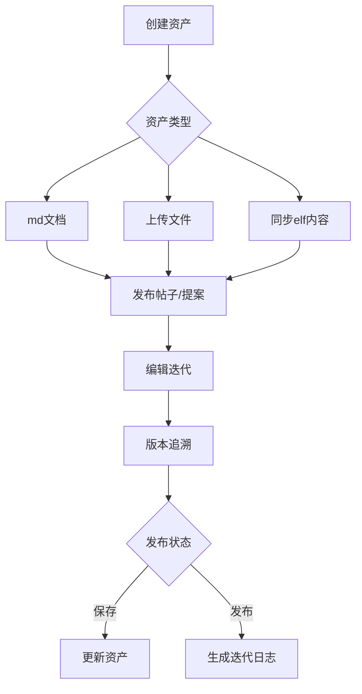

# 5. 内容创作与迭代

- **角色：** 参赛者
- **前置条件：** 已登录

## 5.1 资产创建

| 用户旅程 | 说明 | 数据操作 |
|---------|------|---------|
| 创建个人资产 | 创作属于自己的文件资产（md文档，上传的各类文件视频图片等） | `CREATE resource` |
| 创建资产方式 | 通过系统自带的md编辑器；通过同步elf内容；本地上传文档 | `CREATE resource`（多种来源） |
| 创建资产文件 | 用户可以创建自己的文件作为自己的资产 | `CREATE resource` |

## 5.2 帖子与提案

| 用户旅程 | 说明 | 数据操作 |
|---------|------|---------|
| 发布帖子 | 使用自己的资产发布帖子 | `CREATE post` + `CREATE post:resource` |
| 发布提案 | 可以发布提案然后在提案中创建资产和放入自己的已有资产 | `CREATE post`（type: proposal） |
| 引用内容 | 在帖子中通过卡片形式嵌入团队信息或引用其他帖子 | `CREATE post:post`（关联） |

## 5.3 编辑与版本管理

| 用户旅程 | 说明 | 数据操作 |
|---------|------|---------|
| 编辑帖子 | 对自己已发布的帖子进行内容修改 | `UPDATE post` / `CREATE post`（新版本） |
| 编辑提案 | 对自己的提案标题和简介进行编辑，对提案中的资产进行编辑或创建新资产关联 | `UPDATE post` + `UPDATE resource` |
| 版本追溯 | 编辑帖子或提案后产生新版本，可查看历史修改记录 | `READ post`（版本历史） |
| 请求协作编辑 | 请求编辑他人的帖子或接受他人的协作请求 | 系统级通知机制 |
| 删除内容 | 删除不再需要的帖子、评论或资源（执行软删除） | `DELETE post` / `DELETE interaction` / `DELETE resource` |

## 5.4 提案资产更新与发布

| 用户旅程 | 说明 | 数据操作 |
|---------|------|---------|
| 资产更新 | 提案中的文件是用户的资产文件关联到提案。用户编辑提案中的文件相当于编辑自己的资产。资产可以在编辑时保存 | `UPDATE resource` |
| 提案发布 | 用户在提案中编辑资产后保存可以同步更新关联资产。但此时提案相当于更新了但还没有发布。用户可以多次更新提案中文件后选择发布 | `UPDATE post`（状态变更） |
| 提案发布版本更新历史 | 提案发布后版本更新。系统自动检测上一版本和当前版本的更新内容并生成迭代日志。迭代日志不可被用户更改，会展示在提案页面中 | `CREATE` 迭代日志（系统自动） |
