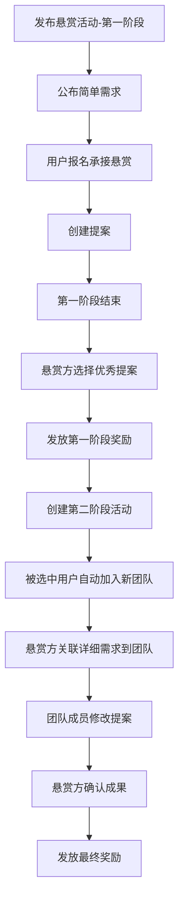
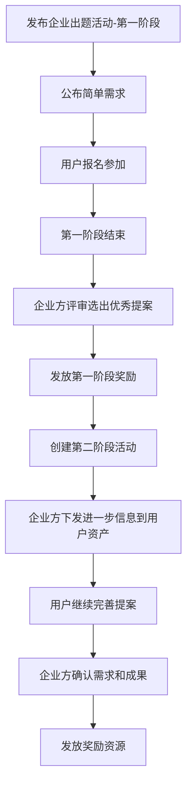

# 10. 悬赏与企业出题

- **角色：** 悬赏发起方 / 企业出题方 / 参赛者
- **前置条件：** 已登录，拥有相应权限

## 10.1 悬赏活动流程

| 用户旅程 | 说明 | 数据操作 |
|---------|------|---------|
| 发布悬赏活动 | 可以发布一个活动作为悬赏任务 | `CREATE event`（type: bounty） |
| 承接悬赏 | 确认参加活动需要的规则要求，选择参加活动并成功报名即为承接悬赏 | `CREATE event:post` |
| 阶段性奖励发放 | 第一阶段结束后选择优秀提案，发放奖励并进入第二阶段 | `CREATE resource`（奖励） + `CREATE event`（第二阶段） |
| 自动组队 | 被选中晋级第二阶段的用户及其团队成员自动加入悬赏方新创建的团队 | `CREATE group` + `CREATE group:user`（批量） |
| 提案可见性控制 | 在悬赏活动中，参加用户的提案互相不可见 | `READ post`（权限控制） |

## 10.2 企业出题活动流程

| 用户旅程 | 说明 | 数据操作 |
|---------|------|---------|
| 发布企业出题活动 | 可以发布一个企业出题活动 | `CREATE event`（type: enterprise_challenge） |
| 下发进一步信息 | 企业出题方可以把更进一步的信息作为文件直接发送到参加活动的用户的资产中 | `CREATE resource` + 关联到用户 |
| 提案可见性控制 | 在企业出题活动中，参加用户的提案互相不可见 | `READ post`（权限控制） |

## 10.3 悬赏与企业出题的共同特性

| 特性 | 说明 |
|------|------|
| 提案隐私 | 参赛者之间互相看不到对方的提案 |
| 多阶段结构 | 支持多阶段逐步筛选 |
| 命题文件 | 发起方可上传命题文件作为参赛要求 |
| 自动组队 | 晋级者可自动加入新团队 |
