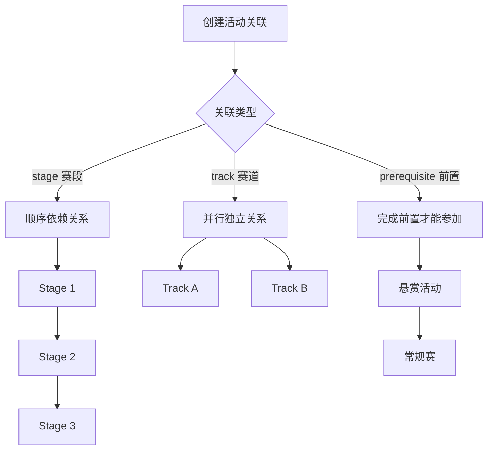

# 11. 多阶段/多赛道活动

- **角色：** 组织者（创建关联） / 参赛者（按阶段参与）
- **前置条件：** 已有多个活动

> 基于 TC-STAGE、TC-TRACK、TC-PREREQ、TC-CATREL 测试用例。活动关联功能通过 `event:event` 关系实现。

## 11.1 赛段（Stage）— 顺序依赖

| 步骤 | 操作者 | 数据操作 | 说明 |
|------|-------|---------|------|
| 1 | 组织者 | `CREATE event`（A、B、C） | 创建 3 个赛段活动 |
| 2 | 组织者 | `CREATE event:event`（A→B, stage, stage_order=1） | A 是 B 的前置赛段 |
| 3 | 组织者 | `CREATE event:event`（B→C, stage, stage_order=2） | B 是 C 的前置赛段 |
| 4 | 参赛者 | `CREATE event:group`（报名 B） | 若 A 未完成（未 closed），报名被拒绝 |
| 5 | 组织者 | `UPDATE event`（A status → closed） | 关闭赛段 A |
| 6 | 参赛者 | `CREATE event:group`（报名 B） | 现在可以报名赛段 B |

**约束：**
- 赛段链不能形成循环（TC-CATREL-902）
- 按 stage_order 升序排列赛段

## 11.2 赛道（Track）— 并行独立

| 步骤 | 操作者 | 数据操作 | 说明 |
|------|-------|---------|------|
| 1 | 组织者 | `CREATE event`（Main、Track1、Track2） | 创建主活动和 2 个赛道 |
| 2 | 组织者 | `CREATE event:event`（Main→Track1, track） | Track1 属于 Main |
| 3 | 组织者 | `CREATE event:event`（Main→Track2, track） | Track2 属于 Main |
| 4 | 参赛者 | `CREATE event:group`（报名 Track1） | 成功 |
| 5 | 参赛者 | `CREATE event:group`（报名 Track2） | 同一团队可同时参加不同赛道 |

**约束：**
- 同一赛道内仍受 Rule 约束（如 max_submissions）
- 不同赛道的约束相互独立

## 11.3 前置条件（Prerequisite）

| 步骤 | 操作者 | 数据操作 | 说明 |
|------|-------|---------|------|
| 1 | 组织者 | `CREATE event`（Bounty, Competition） | 创建悬赏活动和常规赛 |
| 2 | 组织者 | `CREATE event:event`（Bounty→Competition, prerequisite） | Bounty 是 Competition 的前置 |
| 3 | 参赛者 | `CREATE event:group`（报名 Competition） | 若未完成 Bounty，报名被拒绝 |
| 4 | 参赛者 | 完成 Bounty 活动 | Bounty 关闭且团队有 accepted 记录 |
| 5 | 参赛者 | `CREATE event:group`（报名 Competition） | 现在可以报名 |

**特性：**
- 前置活动中组建的团队保持完整进入目标活动
- 团队成员不因活动切换而变化

## 11.4 负向约束

| 约束 | 说明 |
|------|------|
| 不能自引用 | `source_category_id` ≠ `target_category_id`（TC-CATREL-901） |
| 唯一性约束 | 同一对活动只能有一条关联（TC-CATREL-900） |
| 枚举值限制 | relation_type 只能是 stage / track / prerequisite（TC-CATREL-903） |

- **结果：** 组织者可创建复杂的多阶段、多赛道活动结构，参赛者按规则顺序参与
