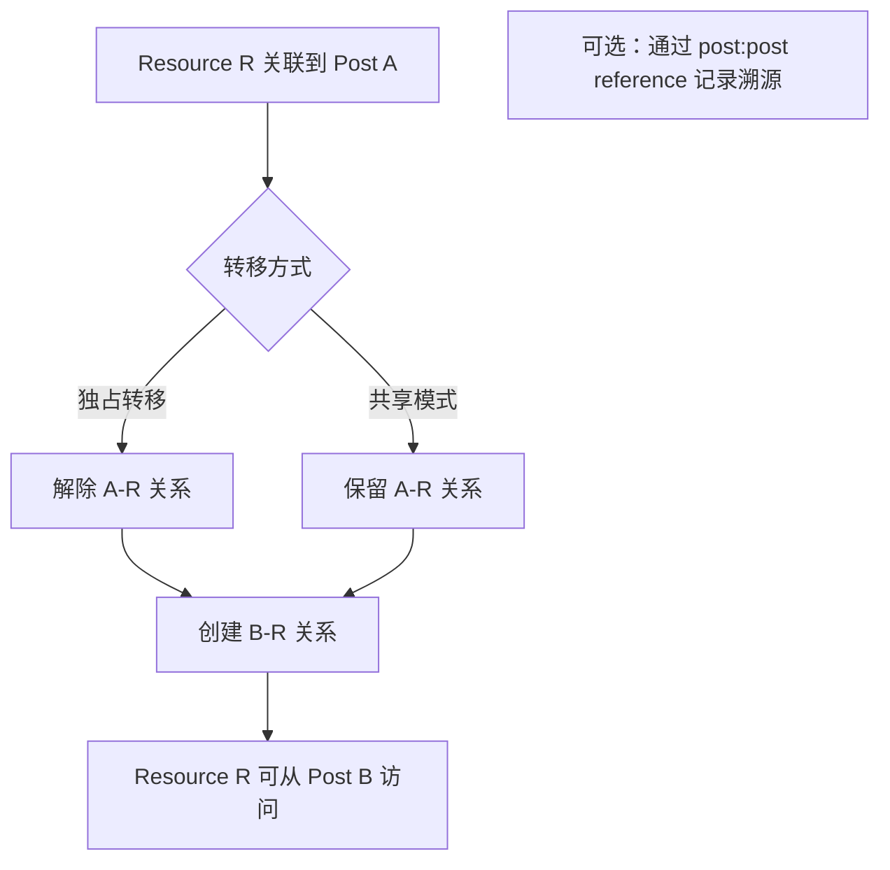

# 14. 资产转移

- **角色：** 组织者 / 参赛者
- **前置条件：** 已有 resource 和 post

> 基于 TC-TRANSFER 测试用例。资产转移通过 `post:resource` 关系的解除和重建实现。

## 14.1 独占转移

| 步骤 | 用户操作 | 数据操作 | 说明 |
|------|---------|---------|------|
| 1 | 确认转移目标 | `READ post`（Post A、Post B） | 查看源和目标帖子 |
| 2 | 解除旧关联 | `DELETE post:resource`（A→R） | Post A 不再关联 R |
| 3 | 创建新关联 | `CREATE post:resource`（B→R） | Post B 关联 R |
| 4 | 验证转移结果 | `READ post:resource` | R 只出现在 Post B 的资源列表 |

**典型场景：**
- 证书从组织者管理帖转移到参赛帖（TC-TRANSFER-001）
- 提案附件在不同版本间转移（TC-TRANSFER-002）

## 14.2 共享模式

| 步骤 | 用户操作 | 数据操作 | 说明 |
|------|---------|---------|------|
| 1 | Post A 已关联 R | — | 现有关系 |
| 2 | 创建新关联 | `CREATE post:resource`（B→R） | Post B 也关联 R |
| 3 | 两个帖子共享 | `READ post:resource`（A 和 B） | R 同时出现在两个列表 |
| 4 | 删除其中一条 | `DELETE post:resource`（A→R） | 不影响 B→R 关系 |

**典型场景：**
- 同一附件在多个帖子中引用

## 14.3 转移溯源

| 步骤 | 用户操作 | 数据操作 | 说明 |
|------|---------|---------|------|
| 1 | 创建溯源关系 | `CREATE post:post`（B→A, reference） | Post B 引用 Post A |
| 2 | 执行转移 | DELETE + CREATE post:resource | R 从 A 转移到 B |
| 3 | 追溯来源 | `READ post:post`（B 的 reference） | 通过 B 可追溯到 A（R 的原始来源） |

- **结果：** 资源可在帖子间灵活转移，支持独占、共享和溯源模式
