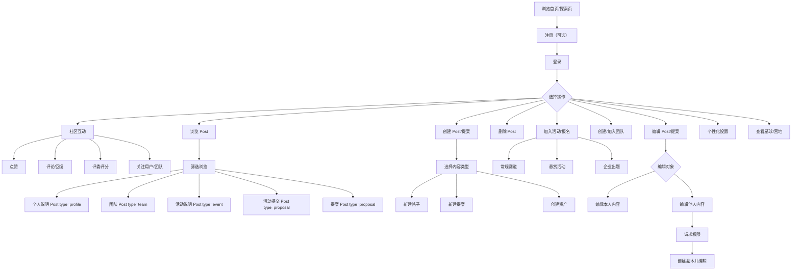

# 附录 A：User Lifetime 总览

```mermaid
flowchart TD
    A[浏览首页/探索页] --> B[注册（可选）]
    B --> C[登录]
    C --> D{选择操作}
    D --> E[浏览 Post]
    D --> F[创建 Post/提案]
    D --> G[编辑 Post/提案]
    D --> H[删除 Post]
    D --> I[加入活动/报名]
    D --> J[创建/加入团队]
    D --> K[社区互动]
    D --> L[个性化设置]
    D --> M[查看星球/营地]

    K --> K1[点赞]
    K --> K2[评论/回复]
    K --> K3[评委评分]
    K --> K4[关注用户/团队]

    E --> E1[筛选浏览]
    E1 --> E2[个人说明 Post type=profile]
    E1 --> E3[团队 Post type=team]
    E1 --> E4[活动说明 Post type=event]
    E1 --> E5[活动提交 Post type=proposal]
    E1 --> E6[提案 Post type=proposal]

    F --> F1[选择内容类型]
    F1 --> F2[新建帖子]
    F1 --> F3[新建提案]
    F1 --> F4[创建资产]

    I --> I1[常规赛道]
    I --> I2[悬赏活动]
    I --> I3[企业出题]

    G --> G1{编辑对象}
    G1 --> G2[编辑本人内容]
    G1 --> G3[编辑他人内容]
    G3 --> G4[请求权限]
    G4 --> G5[创建副本并编辑]
```
