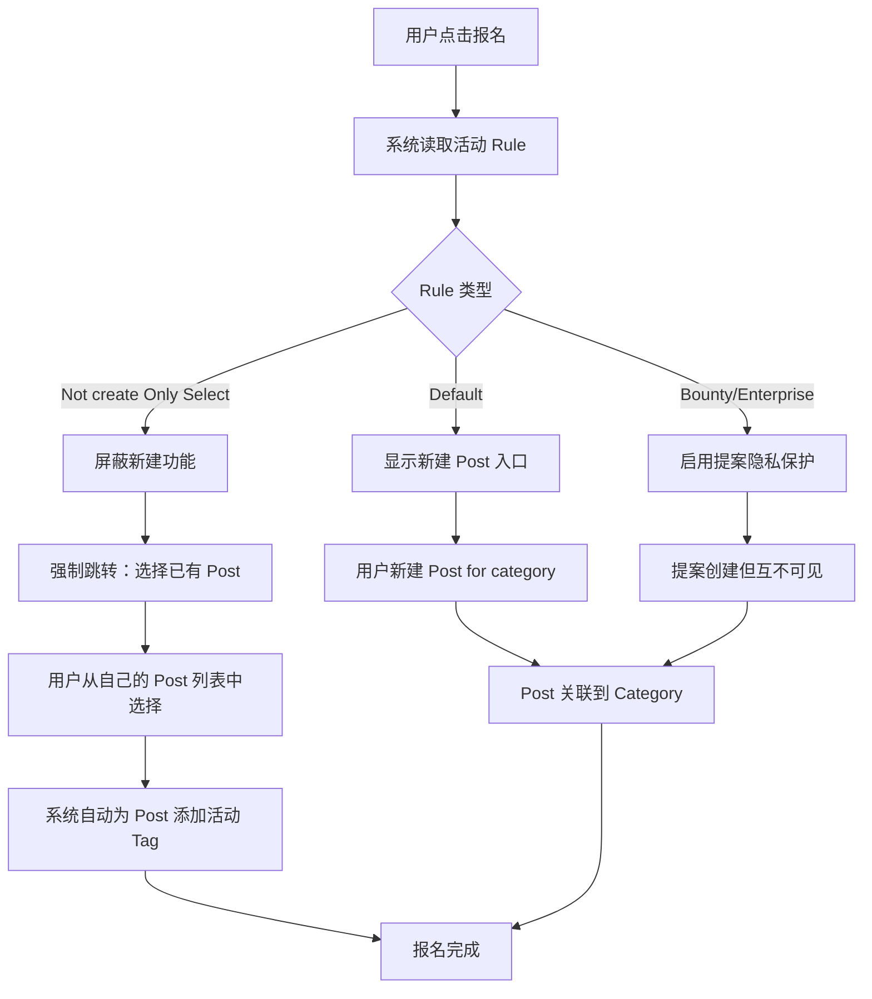

# 附录 B：报名规则定义（Rule Definition）

本节详细说明活动报名环节中 Rule 的定义方式与执行逻辑。Rule 由组织者在创建活动时定义，系统在用户报名时自动执行。

## B.1 规则类型

| 规则名称 | 说明 | 用户行为约束 |
|---------|------|-------------|
| **Default**（默认） | 允许用户自由创建新 Post 参赛 | 无特殊限制 |
| **Not create Only Select** | 仅允许选择已有 Post，不可新建 | 屏蔽"新建"入口，强制跳转"选择 Post" |
| **Bounty** | 悬赏活动规则，提案互不可见 | 提案可见性受限 |
| **Enterprise Challenge** | 企业出题规则，提案互不可见 | 提案可见性受限 |
| （可扩展更多规则） | — | — |

## B.2 规则执行流程

## B.3 组织者配置 Rule

| 步骤 | 用户操作 | 数据操作 | 说明 |
|------|---------|---------|------|
| 1 | 进入 Rule 编辑页 | `READ rule` | 查看当前 Rule 配置 |
| 2 | 选择规则类型 | `UPDATE rule`（type 字段） | 设置为 Default / Not create Only Select / Bounty 等 |
| 3 | 配置附加参数 | `UPDATE rule` | 如：是否允许 public、审核人列表、提交截止时间、团队人数限制 |
| 4 | 配置报名字段 | `UPDATE rule`（registration_fields） | 设置报名时需要用户填写的信息字段 |
| 5 | 保存并关联到活动 | `UPDATE category:rule` | Rule 生效，影响后续所有报名用户 |

- **结果：** 活动规则配置完成，系统将根据 Rule 自动约束用户的报名行为
