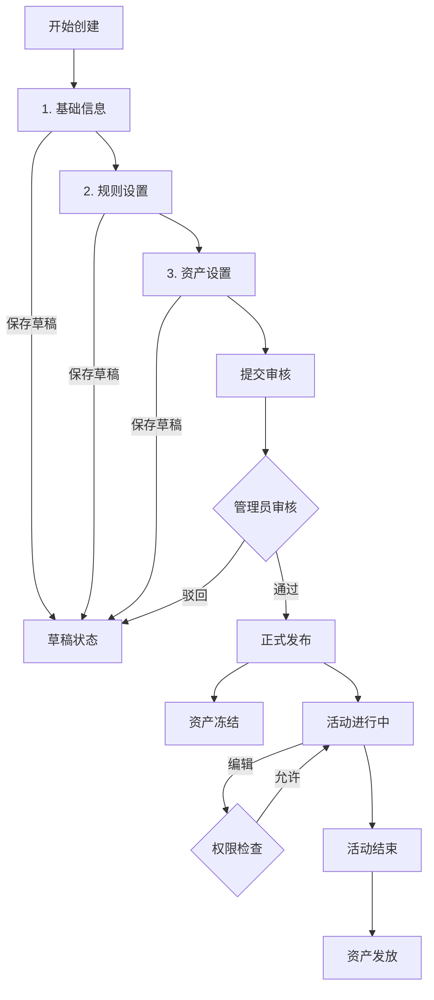

# 2. 设立活动相关

- **角色：** 组织者（Organizer）
- **前置条件：** 已登录，拥有组织者权限
- **权限约束：** participant 不能创建 event 或 rule（TC-PERM-001/002）



## 2.1 活动创建

活动创建流程被严格划分为三个步骤，支持随时保存草稿。

### 第一步：基础信息 (Basic Info)

定义活动的对外展示形象和核心人员架构。

| 信息项 | 说明 | 数据映射 |
|-------|------|---------|
| **活动基本资料** | 名称、简介、宣传海报/封面图 | `Event.name`, `Event.description`, `Event.cover_image` |
| **赛道类型** | 常规赛道 vs Y命题赛道 | `Event.type` |
| **组织者信息** | 展示活动的主办方/承办方详情 | `Event.created_by` (关联 User Profile) |
| **评委信息** | 指定活动的评审团成员 | `Rule.reviewers` (在 UI 上作为基础信息展示) |

### 第二步：规则设置 (Rule Settings)

配置活动的准入条件、时间节点和约束。每条规则作为独立的配置项呈现。

| 规则项 | 输入方式 | 数据映射 |
|-------|---------|---------|
| **时间安排** | 起止日期选择器 | `Event.start_date`, `Event.end_date` |
| **报名时间** | 提交起止时间选择器 | `Rule.submission_start`, `Rule.submission_deadline` |
| **团队规模** | 最小/最大人数输入框 | `Rule.min_team_size`, `Rule.max_team_size` |
| **提交格式** | 文件类型多选 (PDF, ZIP, MD) | `Rule.submission_format` |
| **自定义规则** | 声明式规则配置 (如"仅限队长报名") | `Rule.checks` |

### 第三步：资产设置 (Asset Settings)

注入活动资产并定义分配逻辑。

| 设置项 | 说明 | 数据操作 |
|-------|------|---------|
| **资产注入** | 组织者转入资金/积分到活动资金池 | `CREATE AssetPool`, `TRANSFER User->AssetPool` |
| **发放规则** | 设置获奖名额及对应奖金 (如: 一等奖 1 名 1000 积分) | `Rule.checks` (action: transfer_asset) |

> **注意：** 提交审核前，资产并未真正冻结，仅作为配置保存。

## 2.2 审核与发布流程

| 阶段 | 状态 (`Event.status`) | 说明 |
|------|---------------------|------|
| **草稿** | `draft` | 用户可随时保存，仅自己可见。 |
| **待审核** | `pending_review` | 用户提交后进入此状态，不可修改。管理员介入审核。 |
| **已发布** | `published` | 审核通过。**此时触发资产冻结** (`AssetPool` 状态变为 `frozen`)。 |
| **已驳回** | `rejected` | 审核不通过，退回草稿状态，用户修改后可再次提交。 |

## 2.3 活动运行与管理

### 资产冻结与发放
- **冻结**：活动正式发布 (`published`) 时，系统从组织者账户扣除承诺的资产，锁定在 `AssetPool` 中。
- **发放**：活动结束 (`closed`) 并完成结算后，系统根据 **发放规则** 自动从 `AssetPool` 批量转账给获奖用户。

### 活动编辑权限
- 活动进行中，组织者原则上**不可修改**核心规则（如奖金、核心时间节点）。
- 如需修改，需管理员在后台授予**临时编辑权限**或由管理员直接操作。
- 基础信息（如简介 typos、补充说明）通常允许直接编辑。

## 2.4 Y命题赛道特殊配置 (Legacy)

*(保留原有 Y 命题赛道逻辑，但在 UI 上融入"基础信息"或"规则设置"步骤)*

| 用户旅程 | 说明 | 数据操作 |
|---------|------|---------|
| 上传命题文件 | 在"基础信息"或"资源"板块上传 | `CREATE resource` + `CREATE event:resource` |

## 2.5 规则配置示例 (Asset Distribution)

在规则引擎中增加资产发放的 Action：

```yaml
checks:
  # 活动结束：发放奖金
  - trigger: update_content(event.status)
    phase: post
    condition:
      type: field_match
      params: { field: status, op: "==", value: closed }
    action: transfer_asset
    action_params:
      from_pool: true       # 从关联的 AssetPool 扣款
      awards:
        - rank_range: [1, 1]
          amount: 1000
          currency: "CNY"
        - rank_range: [2, 3]
          amount: 500
          currency: "CNY"
```
