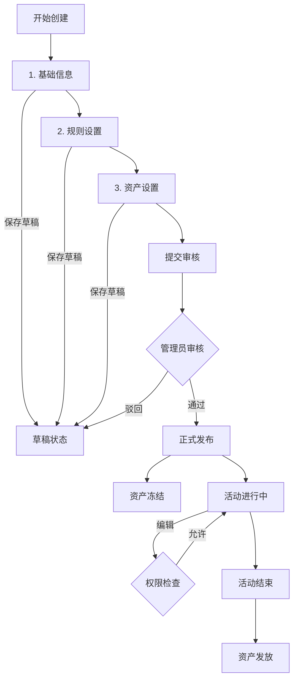

# 2. 设立活动相关

- **角色：** 组织者（Organizer）
- **前置条件：** 已登录，拥有组织者权限
- **权限约束：** participant 不能创建 event 或 rule（TC-PERM-001/002）


```mermaid
flowchart TD
    Start[开始创建] --> Step1[1. 基础信息]
    Step1 -->|保存草稿| Draft[草稿状态]
    Step1 --> Step2[2. 规则设置]
    Step2 -->|保存草稿| Draft
    Step2 --> Step3[3. 资产设置]
    Step3 -->|保存草稿| Draft
    Step3 --> Submit[提交审核]
    Submit --> Review{管理员审核}
    Review -->|通过| Published[正式发布]
    Review -->|驳回| Draft
    Published --> Frozen[资产冻结]
    Published --> Running[活动进行中]
    Running -->|编辑| EditCheck{权限检查}
    EditCheck -->|允许| Running
    Running --> End[活动结束]
    End --> Distribute[资产发放]
```

## 2.1 活动创建

活动创建流程被严格划分为三个步骤，支持随时保存草稿。

### 第一步：基础信息 (Basic Info)

定义活动的对外展示形象和核心人员架构。

| 信息项 | 说明 | 数据映射 |
|-------|------|---------|
| **活动基本资料** | 名称、简介、宣传海报/封面图 | `Event.name`, `Event.description`, `Event.cover_image` |
| **赛道类型** | 常规赛道 vs Y命题赛道 | `Event.type` |
| **组织者信息** | 展示活动的主办方/承办方详情 | `Event.created_by` (关联 User Profile) |
| **协同管理者** | 通过用户名搜索，邀请其他用户共同管理活动。 | `Event.managers` (Array of user_id) |
| **评委信息** | 指定活动的评审团成员 | `Rule.reviewers` (在 UI 上作为基础信息展示) |

#### 权限说明：
- **主创者 (`created_by`)**: 拥有活动的最高权限，包括**编辑**核心规则和邀请/移除协同管理者。
- **协同管理者 (`managers`)**: 拥有**查看**活动仪表盘所有数据的权限，但**不能**编辑活动。

### 第二步：规则设置 (Rule Settings)

配置活动的准入条件、时间节点和约束。所有规则均为标准化配置，**不支持**组织者添加自定义规则或报名问卷。

#### 时间与提交流程规则 (Timeline & Submission)

| 规则项 | 输入方式 | 规则说明与数据映射 |
|-------|---------|-----------------|
| **活动周期** | 起止日期选择器 | `Event.start_date`, `Event.end_date` |
| **报名周期** | 报名起止时间选择器 | `Rule.enrollment_start`, `Rule.enrollment_end` |
| **提案更新截止** | 提案更新截止时间选择器 | **关键时间点**。到达此时间 (`Rule.submission_deadline`) 时，系统将自动抓取参赛者关联提案的**最终版本**作为正式提交物。 |
| **提案模板** | 预设模板选择器 (如“商业计划书”、“技术文档”) | 定义了参赛者提案的结构和允许上传的文件类型 (如图片、视频、MD文档)。映射到 `Rule.submission_template`。 |

#### 报名与资格规则 (Enrollment & Qualification)

| 规则项 | 输入方式 | 规则说明 |
|-------|---------|-----------|
| **团队规模** | 最小/最大人数输入框 | 设置团队报名的人数上下限 (例如 3-4 人)。系统将在报名时严格校验。 |
| **赛道报名模式** | 单选按钮 (单选/多选) | - **主赛道 (X-Track)**: 用户只能选择一个主赛道参与。<br>- **子赛道 (Y-Track)**: 在主赛道下，可允许多选。 |

#### 评审机制规则 (Review Mechanism)

| 规则项 | 输入方式 | 规则说明 |
|-------|---------|-----------|
| **评审模式** | 单选按钮 (自动/人工) | - **自动合格**: 系统根据预设条件 (如“提交物包含PDF”) 自动判断 Pass/Fail。<br>- **人工评审**: 由评委进行多维度打分。 |
| **评审周期** | 评审起止时间选择器 | `Rule.review_start`, `Rule.review_end`。仅在“人工评审”模式下需要配置。 |
| **评分维度** | 动态键值对输入 (维度+分值) | 例如：创新性 (10分)、技术实现 (10分)、商业价值 (5分)。仅在“人工评审”模式下需要配置。|
| **自动合格条件** | 规则构建器 | 例如：`submission.files` CONTAINS `.pdf`。仅在“自动合格”模式下需要配置。 |

### 第三步：资产设置 (Asset Settings)

注入活动资产并定义分配逻辑。

| 设置项 | 说明 | 数据操作 |
|-------|------|---------|
| **资产注入** | 组织者转入资金/积分到活动资金池 | `CREATE AssetPool`, `TRANSFER User->AssetPool` |
| **发放规则** | 设置获奖名额及对应奖金 (如: 一等奖 1 名 1000 积分) | `Rule.checks` (action: transfer_asset) |

> **注意：** 提交审核前，资产并未真正冻结，仅作为配置保存。

## 2.2 审核与发布流程

| 阶段 | 状态 (`Event.status`) | 说明 |
|------|---------------------|------|
| **草稿** | `draft` | 用户可随时保存，仅自己可见。 |
| **待审核** | `pending_review` | 用户提交后进入此状态，不可修改。管理员介入审核。 |
| **已发布** | `published` | 审核通过。**此时触发资产冻结** (`AssetPool` 状态变为 `frozen`)。 |
| **已驳回** | `rejected` | 审核不通过，退回草稿状态，用户修改后可再次提交。 |

## 2.3 活动运行与管理

### 资产冻结与发放
- **冻结**：活动正式发布 (`published`) 时，系统从组织者账户扣除承诺的资产，锁定在 `AssetPool` 中。
- **发放**：活动结束 (`closed`) 并完成结算后，系统根据 **发放规则** 自动从 `AssetPool` 批量转账给获奖用户。

### 活动编辑与延期

对已发布 (`published`) 的活动进行修改（尤其是延期等核心时间点变更）需要经过管理员审批。

| 场景 | 用户操作 | 系统行为 | 管理员操作 |
|------|----------|----------|------------|
| **修改活动** | 组织者在活动管理页面点击“编辑”，修改内容（如 `Event.end_date`）并保存。 | - 系统创建一个指向当前活动版本的“修改草稿”。<br>- `UPDATE event` (status: `pending_update`) | - 管理员收到审核通知。<br>- 管理员可批准、驳回或与组织者沟通修改方案。 |

- **活动克隆**: 当前版本**不支持**克隆或复制活动功能。
- **基础信息编辑**: 对于非核心的基础信息（如简介文字、补充说明），通常允许组织者直接编辑而无需审批。

## 2.4 Y命题赛道特殊配置 (Legacy)

*(保留原有 Y 命题赛道逻辑，但在 UI 上融入"基础信息"或"规则设置"步骤)*

| 用户旅程 | 说明 | 数据操作 |
|---------|------|---------|
| 上传命题文件 | 在"基础信息"或"资源"板块上传 | `CREATE resource` + `CREATE event:resource` |

## 2.5 规则配置示例 (Asset Distribution)

在规则引擎中增加资产发放的 Action：

```yaml
checks:
  # 活动结束：发放奖金
  - trigger: update_content(event.status)
    phase: post
    condition:
      type: field_match
      params: { field: status, op: "==", value: closed }
    action: transfer_asset
    action_params:
      from_pool: true       # 从关联的 AssetPool 扣款
      awards:
        - rank_range: [1, 1]
          amount: 1000
          currency: "CNY"
        - rank_range: [2, 3]
          amount: 500
          currency: "CNY"
```
