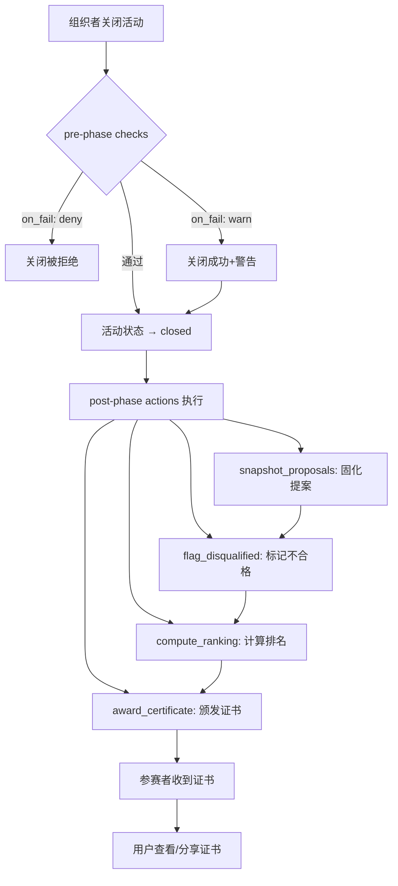

# 8. 活动结束与颁奖

- **角色：** 组织者（关闭活动）/ 参赛者（获得证书）
- **前置条件：** 活动已发布，有参赛团队和提交内容

> 基于 TC-CLOSE 测试用例



## 8.1 活动关闭流程

| 步骤 | 操作者 | 数据操作 | 说明 |
|------|-------|---------|------|
| 1 | 组织者 | `UPDATE event`（status → closed） | 触发关闭流程 |
| 2 | 系统 | 执行 pre-phase checks | 关闭前校验（如所有团队是否有提交） |
| 3 | 系统 | 执行 post-phase actions | 关闭后自动处理（**提案固化**、终审、排名、颁奖） |

## 8.2 关闭前校验（pre phase）

| 校验类型 | on_fail | 说明 |
|---------|---------|------|
| 所有团队人数满足要求 | `warn` | 警告但允许关闭 |
| 所有团队有提交内容 | `deny` | 严格校验，不满足则拒绝关闭 |

## 8.3 异常处理：活动取消 (Activity Cancellation)

在极端情况下（如不可抗力、严重违规），管理员可执行强制取消流程。

| 步骤 | 操作者 | 数据操作 | 说明 |
|------|-------|---------|------|
| 1 | 管理员 | `UPDATE event` (status → cancelled) | 标记活动为取消状态 |
| 2 | 系统 | `UPDATE event:group` (status → withdrawn) | 自动撤回所有报名记录 |
| 3 | 系统 | `UPDATE event:post` (status → unlinked) | 解除内容与活动的关联（内容本身保留） |
| 4 | 系统 | 发送全员通知 | 通知所有已报名用户活动已取消 |

> **注意：** 取消活动**不会**触发结算、排名或证书发放流程。

## 8.4 关闭后自动处理（post phase）

### 8.4.0 提案固化与存档（Snapshot Proposals）

活动结束时，系统会自动为所有有效提案生成**不可篡改的副本**，用于历史展示和审计。

| 步骤 | 系统行为 | 数据操作 | 说明 |
|------|---------|---------|------|
| 1 | 遍历参赛提案 | `READ event:post` | 获取所有已提交的提案 |
| 2 | **生成快照** | `CLONE post` (status=archived, immutable=true) | 创建“活动结束版本”副本，标记为不可修改 |
| 3 | 关联快照 | `UPDATE event:post` (replace original with snapshot) | 将活动页面的展示链接指向此快照版本 |
| 4 | 锁定原稿 | — | 原作者仍可编辑原提案，但**不再影响**已结束活动中的展示内容 |

> **关键规则：** 用户（包括创作者）**无法修改**已归档的活动结束版本副本。

### 8.4.1 标记不合格（flag_disqualified）

| 步骤 | 系统行为 | 数据操作 | 说明 |
|------|---------|---------|------|
| 1 | 扫描所有报名团队 | `READ event:group` | 获取参赛团队列表 |
| 2 | 检查团队人数 | `READ group:user` | 验证 min_team_size 要求 |
| 3 | 标记不合格团队 | `UPDATE group`（添加 tag） | 如 "team_too_small" |
| 4 | 检查提交内容 | `READ event:post` | 验证提交要求 |
| 5 | 标记不合格提交 | `UPDATE post`（添加 tag） | 如 "missing_attachment" |

### 8.4.2 计算排名（compute_ranking）

| 步骤 | 系统行为 | 数据操作 | 说明 |
|------|---------|---------|------|
| 1 | 获取合格提交 | `READ event:post`（排除已标记不合格） | 过滤有效参赛帖 |
| 2 | 按 average_rating 排序 | — | 降序排列 |
| 3 | 添加排名标签 | `UPDATE post`（添加 tag） | 如 "rank_1"、"rank_2"、"rank_3" |

**排名规则：**
- 相同分数并列排名（如两个 rank_1，下一个为 rank_3）
- `average_rating` 为 null 的帖子不参与排名

### 8.4.3 资金结算 (distribute_assets)

系统基于 AssetPool 和排名结果，执行资产划转。

| 步骤 | 系统行为 | 数据操作 | 说明 |
|------|---------|---------|------|
| 1 | 检查资金池状态 | `READ asset_pool` | 确认为 `frozen` 状态 |
| 2 | 计算分配方案 | `Rule.calculate_distribution(ranking)` | 根据排名和规则计算每个获奖者的金额 |
| 3 | 执行转账 | `CREATE transaction` (Pool -> User) | 批量创建转账记录 |
| 4 | 更新池状态 | `UPDATE asset_pool` (status=settled) | 标记结算完成 |
| 5 | 退还剩余资金 | `CREATE transaction` (Pool -> Organizer) | 若有剩余资金，退回给组织者 |

## 8.4.4 自动颁发证书 (award_certificate)

| 步骤 | 系统行为 | 数据操作 | 说明 |
|------|---------|---------|------|
| 1 | 根据排名确定奖项 | — | 按 rank_range 匹配奖项名称 |
| 2 | 生成证书文件 | `CREATE resource`（type: certificate） | 证书 PDF |
| 3 | 创建证书帖子 | `CREATE post`（type: certificate, status: published） | 公开可见 |
| 4 | 关联证书到帖子 | `CREATE post:resource`（display_type: attachment） | 挂载证书文件 |

**奖项配置示例：**

```yaml
awards:
  - rank_range: [1, 1]
    name: "一等奖"
  - rank_range: [2, 3]
    name: "二等奖"
  - rank_range: [4, 10]
    name: "优秀奖"
```

## 8.5 用户获取证书

| 步骤 | 用户操作 | 数据操作 | 说明 |
|------|---------|---------|------|
| 1 | 收到颁奖通知 | — | 系统推送通知 |
| 2 | 查看证书帖子 | `READ post`（type: certificate） | 证书帖子已自动创建 |
| 3 | 下载证书文件 | `READ resource` | 获取证书 PDF |
| 4 | （可选）分享证书 | `CREATE post`（引用证书帖） | 发帖展示荣誉 |

- **结果：** 活动正式关闭，**提案已固化存档**，排名和证书自动生成，获奖者可查看和分享证书
