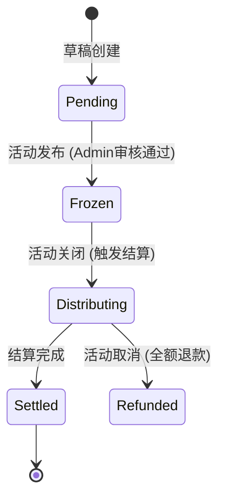

# 9. 活动结算与奖励发放

- **角色：** 参赛者 / 组织者
- **前置条件：** 活动已结束

## 9.1 结果查看与证书

| 用户旅程 | 说明 | 数据操作 |
|---------|------|---------|
| 查看评审结果 | 在活动结束后浏览获奖名单或排名榜单 | `READ post`（按 average_rating 排序） |
| 领取证书 | 在个人中心（个人资产）或活动页（资产）显示电子证书，并可点击下载 | `READ resource`（type: certificate） |
| 分享成就 | 将证书发布为新贴展示 | `CREATE post`（关联证书 resource） |
| 下载资源 | 下载官方资料或他人的公开分享资源 | `READ resource` |

## 9.2 运营活动与勋章

| 用户旅程 | 说明 | 数据操作 |
|---------|------|---------|
| 运营活动（任务） | 完成运营活动后用户也可以获得资产奖励。运营活动可以和其他活动绑定 | `CREATE resource`（奖励发放） |
| 资产使用 | 用户通过活动获得的勋章资产可以用于投票。在一些活动中会开启投票，投票会影响有些规则下的评分。有些投票只有关联活动的勋章才有效 | `READ resource` + `CREATE interaction`（type: vote） |
## 9.3 资金与奖金结算 (Financial Settlement)

对于包含奖金池 (AssetPool) 的活动，系统会在活动关闭后自动执行资金结算。

| 用户旅程 | 说明 | 数据操作 |
|---------|------|---------|
| 收到奖励通知 | 获奖者收到系统通知，告知奖金已到账 | `READ notification` |
| 查看交易明细 | 在个人资产页面查看具体的入账记录 (来自: 活动名称) | `READ transaction` |
| 组织者退款 | 若奖金未发完（如奖项轮空），组织者收到剩余资金退回 | `READ transaction` (refund) |

### 资产池生命周期

