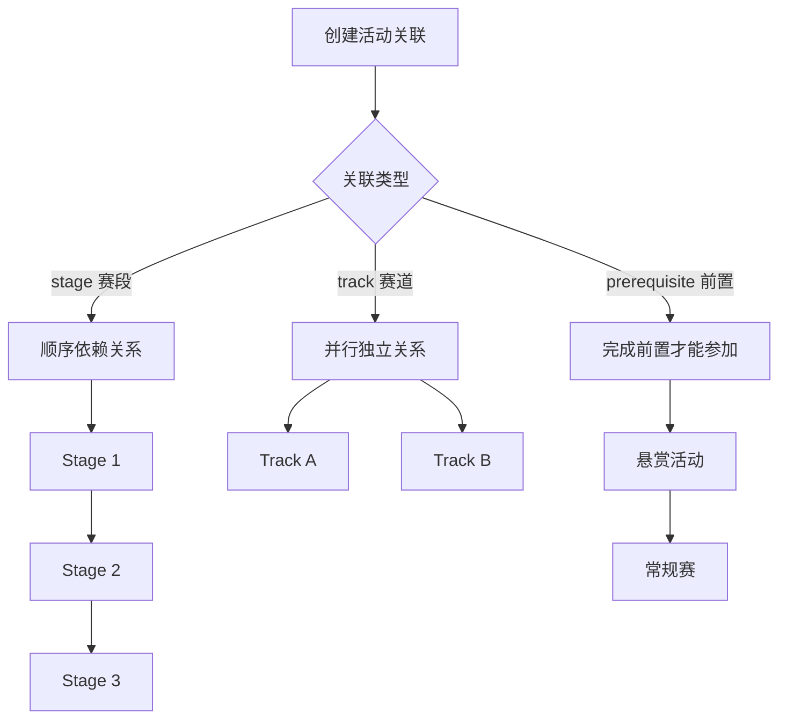

# 11. 多阶段/多赛道活动

- **角色：** 组织者（创建关联） / 参赛者（按阶段参与）
- **前置条件：** 已有多个活动

> 基于 TC-STAGE、TC-TRACK、TC-PREREQ、TC-CATREL 测试用例。活动关联功能通过 `event:event` 关系实现。

## 11.1 赛段（Stage）— 顺序依赖

| 步骤 | 操作者 | 数据操作 | 说明 |
|------|-------|---------|------|
| 1 | 组织者 | `CREATE event`（A、B、C） | 创建 3 个赛段活动 |
| 2 | 组织者 | `CREATE event:event`（A→B, stage, stage_order=1） | A 是 B 的前置赛段 |
| 3 | 组织者 | `CREATE event:event`（B→C, stage, stage_order=2） | B 是 C 的前置赛段 |
| 4 | 参赛者 | `CREATE event:group`（报名 B） | 若 A 未完成（未 closed），报名被拒绝 |
| 5 | 组织者 | `UPDATE event`（A status → closed） | 关闭赛段 A |
| 6 | 参赛者 | `CREATE event:group`（报名 B） | 现在可以报名赛段 B |

**约束：**
- 赛段链不能形成循环（TC-CATREL-902）
- 按 stage_order 升序排列赛段

## 11.2 赛道（Track）— 并行独立

| 步骤 | 操作者 | 数据操作 | 说明 |
|------|-------|---------|------|
| 1 | 组织者 | `CREATE event`（Main、Track1、Track2） | 创建主活动和 2 个赛道 |
| 2 | 组织者 | `CREATE event:event`（Main→Track1, track） | Track1 属于 Main |
| 3 | 组织者 | `CREATE event:event`（Main→Track2, track） | Track2 属于 Main |
| 4 | 参赛者 | `CREATE event:group`（报名 Track1） | 成功 |
| 5 | 参赛者 | `CREATE event:group`（报名 Track2） | 同一团队可同时参加不同赛道 |

**约束：**
- 同一赛道内仍受 Rule 约束（如 max_submissions）
- 不同赛道的约束相互独立

## 11.3 阶段间内容继承 (Content Inheritance)

当从一个赛段晋级到下一个赛段（如 Stage 1 -> Stage 2）时，参赛者通常基于前一阶段的成果继续开发。

| 步骤 | 操作者 | 数据操作 | 说明 |
|------|-------|---------|------|
| 1 | 参赛者 | 确认晋级资格 | `READ event:group` (status=accepted) | 确保已在上一阶段获得晋级资格 |
| 2 | 参赛者 | **克隆提案** | `CLONE post` (source=Stage1_Proposal) | 创建 Stage 1 提案的可编辑副本 |
| 3 | 参赛者 | 提交到新赛段 | `CREATE event:post` (Event=Stage2, Post=Cloned_Copy) | 将副本关联到 Stage 2 |
| 4 | 参赛者 | 迭代开发 | `UPDATE post` (Cloned_Copy) | 在 Stage 2 中继续修改副本，不影响 Stage 1 的历史版本 |

> **逻辑说明：** 此机制确保了 Stage 1 的提交记录（Snapshot）被永久保留，同时为 Stage 2 提供了干净的起步状态。

## 11.4 前置条件与规则依赖 (Prerequisite & Rule Dependency)

> **核心逻辑：** 通过 Rule Engine 的 `dependency` check 严格控制参与资格。

| 场景 | 规则配置 (Rule Template) | 校验逻辑 |
|------|-------------------------|---------|
| **晋级自动参加** | **Auto Advancement** | 检查用户/团队在 `source_event` 中是否获得 `promoted` 状态。若满足，自动通过报名检查；否则拒绝。 |
| **必须参加过 X** | **Prerequisite Participation** | 检查用户/团队在 `source_event` 中是否有 `accepted` 的报名记录。 |
| **赛道互斥** | **Mutual Exclusion** | 检查用户是否已报名互斥赛道（`count(events) where track_group=A == 0`）。 |

### 11.4.1 执行流程示例

| 步骤 | 操作者 | 数据操作 | 说明 |
|------|-------|---------|------|
| 1 | 组织者 | `CREATE event`（复赛） | 创建复赛活动 |
| 2 | 组织者 | `CREATE rule` | 配置规则：`dependency: { target_event_id: 初赛ID, status: "promoted" }` |
| 3 | 参赛者 | `CREATE event:group`（报名复赛） | **系统执行 Rule Check** |
| 4 | 系统 | 检查初赛状态 | 查询用户在初赛中是否标记为晋级 |
| 5 | 系统 | 返回结果 | 通过则允许报名，失败则提示“未获得晋级资格” |

## 11.5 负向约束

| 约束 | 说明 |
|------|------|
| 不能自引用 | `source_category_id` ≠ `target_category_id`（TC-CATREL-901） |
| 唯一性约束 | 同一对活动只能有一条关联（TC-CATREL-900） |
| 枚举值限制 | relation_type 只能是 stage / track / prerequisite（TC-CATREL-903） |

- **结果：** 组织者可创建复杂的多阶段、多赛道活动结构，参赛者按规则顺序参与
