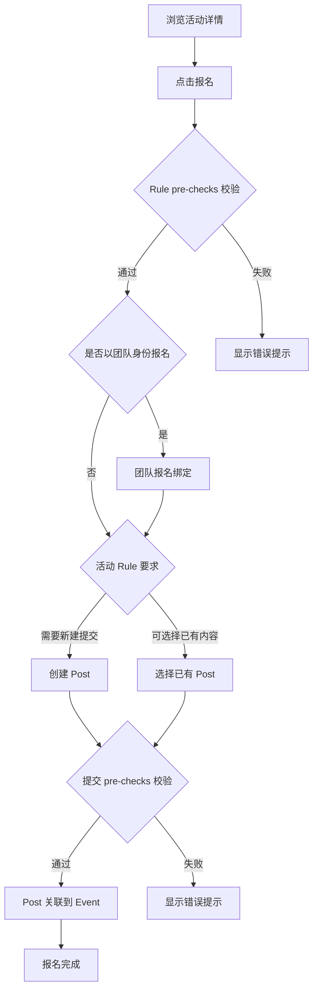

# 4. 参与活动与提交

- **角色：** 参赛者
- **前置条件：** 已登录，目标活动已发布

```mermaid
flowchart TD
    A[浏览活动详情] --> B[点击报名]
    B --> B0{Rule pre-checks 校验}
    B0 -->|通过| B1{是否以团队身份报名}
    B0 -->|失败| B00[显示错误提示]
    B1 -->|是| B2[团队报名绑定]
    B1 -->|否| C
    B2 --> C{活动 Rule 要求}
    C -->|需要新建提交| D[创建 Post]
    C -->|可选择已有内容| E[选择已有 Post]
    D --> F{提交 pre-checks 校验}
    E --> F
    F -->|通过| G[Post 关联到 Event]
    F -->|失败| F0[显示错误提示]
    G --> H[报名完成]
```

## 4.1 提交流程：关联、更新与自动快照

Synnovator 采用“动态提案”模式，参赛者无需在特定时间点执行“提交”操作。整个流程分为三个阶段：

| 阶段 | 用户旅程 | 说明 | 数据操作 |
|------|----------|------|----------|
| **1. 关联提案** | 在报名时，选择一个**已有的提案**或**新建一个提案**与活动进行关联。 | 这一步是“占位”，告诉系统“我将用这个提案参赛”。提案内容此时并非最终版。 | `CREATE event:post` |
| **2. 持续更新** | 在报名成功后，直到**提案更新截止时间** (`submission_deadline`) 之前，可以随时、无限次地编辑和更新已关联的提案。 | 每次保存都会更新提案内容。系统允许参赛者在整个创作周期内不断完善作品。 | `UPDATE post` |
| **3. 自动快照** | 当到达 `submission_deadline` 时，系统将**自动锁定**关联提案的**最终版本**。 | 这个“快照”版本将作为正式的、不可更改的提交物，用于后续评审。此后对原提案的任何修改都不会影响已提交的快照。 | `CREATE submission` (snapshot of post) |

- **结果：** 参赛者无需手动提交，系统在截止时间自动将其最新作品版本作为最终提交物，实现了灵活创作与公正评审的统一。

## 4.2 报名规则校验（Entry Rule Enforcement）

当用户点击“报名”时，系统会根据活动设定的规则进行严格的实时校验。

| 校验规则 | 校验逻辑 | 失败反馈 (示例) |
|----------|----------|-----------------|
| **团队人数限制** | 检查报名团队的当前成员数是否在组织者设定的 `min_team_size` 和 `max_team_size` 区间内。 | `❌ 报名失败：团队人数 (5人) 不符合活动要求 (3-4人)。` |
| **赛道选择** | - **主赛道 (X-Track)**: 校验用户/团队是否已报名其他主赛道。如是，则禁止报名。 - **子赛道 (Y-Track)**: 允许在同一主赛道下选择多个子赛道。 | `❌ 报名失败：您已报名“AI 赛道”，不可重复报名“游戏赛道”。` |
| **重复报名** | **最高优先级**。检查用户是否已个人报名，或是否属于任何已报名此活动的团队。 | `❌ 报名失败：您所在的团队 "Alpha Team" 已经报名了此活动。` |
| **报名时间窗口** | 检查当前时间是否在 `enrollment_start` 和 `enrollment_end` 之间。 | `❌ 报名失败：当前不在报名时间段内。` |
| **其他标准化规则** | 如“仅限队长报名”等平台预设规则。 | `❌ 报名失败：只有团队队长可以执行报名操作。` |

### 动态资格与恢复路径 (Dynamic Eligibility & Recovery)

用户的参赛资格是动态的。如果在报名后、活动开始前因某些操作（如退出团队）导致不满足参赛条件，其参赛资格会被**暂时取消**。

用户必须通过以下方式**重新获得资格**并**重新报名**：
1.  **重新加入一个符合条件的已报名团队**（需校验该团队是否已达人数上限）。
2.  **加入或创建一个新的团队**，并以新团队的身份重新报名。

- **结果：** 用户（或团队）成功报名活动，其 Post 作为参赛内容与活动关联，并自动获得活动专属标签
