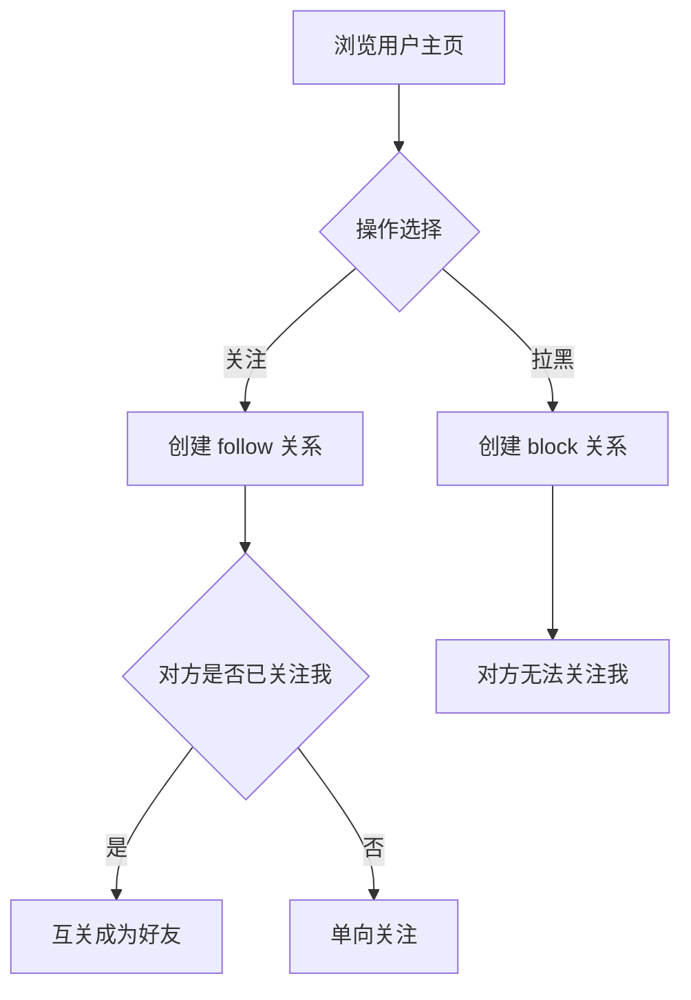

# 7. 关注与好友

- **角色：** 已登录用户
- **前置条件：** 已登录

> 基于 TC-FRIEND 测试用例。好友功能通过 `user:user` 关系实现，关注为单向关系，互关即好友。

## 7.1 关注用户

| 步骤 | 用户操作 | 数据操作 | 说明 |
|------|---------|---------|------|
| 1 | 浏览目标用户主页 | `READ user` | 查看用户资料 |
| 2 | 点击关注 | `CREATE user:user`（relation_type: follow） | 建立单向关注关系 |
| 3 | 关注成功 | `READ user:user`（我的关注列表） | 目标用户出现在关注列表 |

**约束：**
- 不能关注自己（TC-FRIEND-900）
- 不能重复关注同一用户（TC-FRIEND-901）
- 被拉黑的用户无法关注你（TC-FRIEND-006）

## 7.2 互关成为好友

| 步骤 | 系统行为 | 数据操作 | 说明 |
|------|---------|---------|------|
| 1 | A 关注 B | `CREATE user:user`（A→B, follow） | A 的关注列表包含 B |
| 2 | B 回关 A | `CREATE user:user`（B→A, follow） | B 的关注列表包含 A |
| 3 | 系统判定好友 | 查询双向 follow 关系 | 互关状态 = true |

## 7.3 取消关注

| 步骤 | 用户操作 | 数据操作 | 说明 |
|------|---------|---------|------|
| 1 | 进入关注列表 | `READ user:user`（我的关注列表） | 查看已关注用户 |
| 2 | 点击取消关注 | `DELETE user:user`（relation_type: follow） | 解除单向关注 |
| 3 | 好友关系解除 | — | 若原为互关，降级为对方单向关注我 |

## 7.4 拉黑用户

| 步骤 | 用户操作 | 数据操作 | 说明 |
|------|---------|---------|------|
| 1 | 浏览目标用户主页 | `READ user` | 查看用户资料 |
| 2 | 点击拉黑 | `CREATE user:user`（relation_type: block） | 建立拉黑关系 |
| 3 | 拉黑生效 | — | 对方从好友列表移除，无法关注你 |

- **结果：** 用户可关注其他用户，互关成为好友；可拉黑用户阻止其关注
